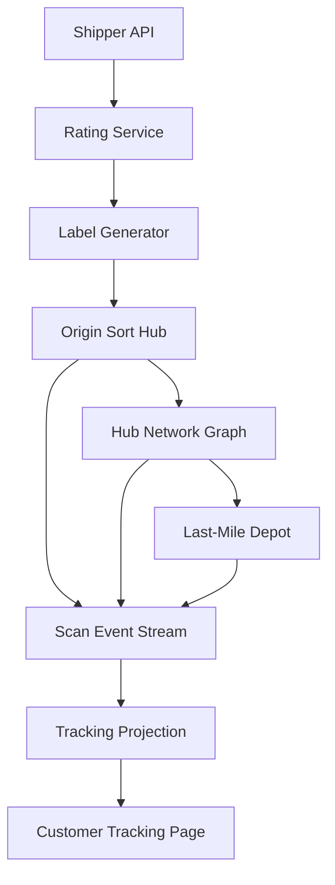

# Problem 46: Parcel Routing Network (FedEx / UPS-Style)

> **Porter Value Chain:** Outbound Logistics

## Business Problem
National carriers move millions of parcels through **sort hubs** daily. Each package gets a **label**, **tracking scans** at hubs, and **route optimization** across the network to meet delivery promises.

## Hard Requirements
- Generate shipping label in **< 500 ms**.
- Tracking updates within **minutes** of each scan.
- Route packages through optimal hub path.
- Handle mis-sorts and re-route dynamically.
- Peak season (holidays) 3× normal volume.

## Why One Pattern Is Not Enough
| If you only use… | What breaks |
| --- | --- |
| Point-to-point routing only | Inefficient; misses hub economies |
| Tracking in OLTP row per package | Write ceiling at peak |
| Static routes | Can't recover from hub outage |
| Label gen sync to rating API | Dock line stops |

You need **Hub graph routing**, **event stream for scans**, **materialized tracking view**, **async rating/label**, and **partition by region**.

## Architecture Overview


## Pattern Mix
| Concern | Patterns | Role |
| --- | --- | --- |
| Routing | [Graph routing](../Data_domain_patterns/), [Partitioning](../Scalability_patterns/02-partitioning.md) | Hub network |
| Scans | [Event Streaming](../Messaging_Integration_patterns/), [CQRS](../Scalability_patterns/06-cqrs.md) | Append scan; read track |
| Peak | [Queue-Based Load Leveling](../Scalability_patterns/09-queue-based-load-leveling.md) | Buffer label requests |
| Resilience | [Circuit Breaker](../Resilience_Pattern/01-circuit-breaker.md), reroute rules | Hub down |
| Scale | [Sharding](../Scalability_patterns/03-sharding.md) | Package ID hash |

## Happy-Path Flow
1. Shipper requests label → **rate** by weight/zone → barcode assigned.
2. Origin hub scan → event `ARRIVED_HUB` → routing decides next hop.
3. Each hub scan appends to **event stream** → tracking projection updates.
4. Last-mile depot → `OUT_FOR_DELIVERY` → customer sees ETA.

## Failure Scenarios
| Failure | Response |
| --- | --- |
| Mis-sort scan | Exception handler re-routes |
| Hub outage | Precomputed alternate path table |
| Lost package | Last-known-scan audit trail |
| Duplicate scan | Idempotent on scanId |

## TypeScript Sketch
```typescript
async function onHubScan(packageId: string, hubId: string, ts: number) {
  await scans.append({ packageId, hubId, ts, type: 'HUB_SCAN' });
  const nextHop = await router.nextHop(packageId, hubId);
  await tracking.project(packageId, { lastHub: hubId, nextHop, updatedAt: ts });
  return nextHop;
}
```

## Patterns Used (quick links)
[Event Streaming](../Messaging_Integration_patterns/) · [CQRS](../Scalability_patterns/06-cqrs.md) · [Partitioning](../Scalability_patterns/02-partitioning.md) · [Queue-Based Load Leveling](../Scalability_patterns/09-queue-based-load-leveling.md) · [Circuit Breaker](../Resilience_Pattern/01-circuit-breaker.md)
