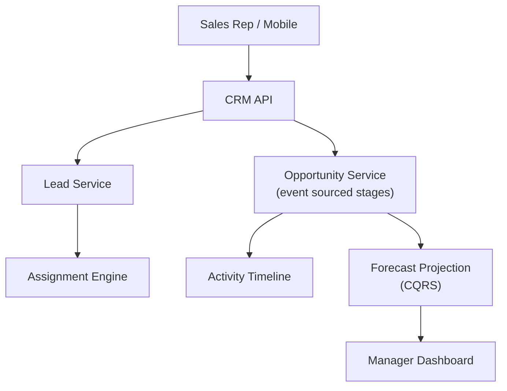

# Problem 47: CRM & Sales Pipeline (Salesforce-Style)

> **Porter Value Chain:** Marketing & Sales

## Business Problem
Sales teams manage **leads → opportunities → closed deals** in a shared CRM. Managers need pipeline forecasts, activity timelines, and assignment rules — without two reps working the same hot lead unknowingly.

## Hard Requirements
- **Lead assignment** rules (round-robin, territory).
- Opportunity **stage** history immutable.
- Activity timeline (calls, emails) unified per account.
- Forecast roll-up by team/region.
- 10k sales users; mobile offline sync optional.

## Why One Pattern Is Not Enough
| If you only use… | What breaks |
| --- | --- |
| Overwrite stage without history | Forecast lies; disputes |
| No assignment lock | Two reps call same lead |
| Activity in siloed tools | Incomplete customer view |
| Forecast query on raw events | Timeouts on quarter close |

You need **Event-sourced opportunity stages**, **distributed assignment lock**, **CQRS forecast projections**, **timeline aggregation**, and **RBAC by territory**.

## Architecture Overview


## Pattern Mix
| Concern | Patterns | Role |
| --- | --- | --- |
| Pipeline | [Event Sourcing](../Data_domain_patterns/15-event-sourcing.md), [State Machine](../Data_domain_patterns/) | Stage transitions |
| Assignment | [Distributed Lock](../Distributed_system_patterns/21-distributed-lock.md) | One owner per lead |
| Reads | [CQRS](../Scalability_patterns/06-cqrs.md), [Materialized View](../Data_domain_patterns/16-materialized-view.md) | Forecast dashboard |
| Security | [RBAC](../Security_patterns/), [ABAC](../Security_patterns/03-abac.md) | Territory access |
| Integrations | [Adapter](../Structural%20Patterns/Adapter.md) | Email/calendar sync |

## Happy-Path Flow
1. Web lead arrives → **assignment engine** picks rep by territory rule + lock.
2. Rep qualifies → converts to **opportunity** at stage `Discovery`.
3. Each stage change appends event → **forecast projection** recalculates.
4. Manager views weighted pipeline by region.

## Failure Scenarios
| Failure | Response |
| --- | --- |
| Rep leaves mid-deal | Reassign saga; preserve history |
| Duplicate lead import | Dedup on email + company domain |
| Offline mobile edit | Conflict merge on sync; event ordering |
| Forecast stale | Rebuild projection from event log |

## TypeScript Sketch
```typescript
async function advanceStage(oppId: string, toStage: string, repId: string) {
  return lock.with(`opp:${oppId}`, async () => {
    const opp = await opps.get(oppId);
    if (opp.ownerId !== repId) throw new ForbiddenError();
    await opps.appendEvent(oppId, { type: 'STAGE_CHANGED', from: opp.stage, to: toStage });
    await forecast.onStageChange(oppId, toStage, opp.amount);
  });
}
```

## Patterns Used (quick links)
[Event Sourcing](../Data_domain_patterns/15-event-sourcing.md) · [CQRS](../Scalability_patterns/06-cqrs.md) · [Distributed Lock](../Distributed_system_patterns/21-distributed-lock.md) · [Materialized View](../Data_domain_patterns/16-materialized-view.md) · [RBAC](../Security_patterns/)
