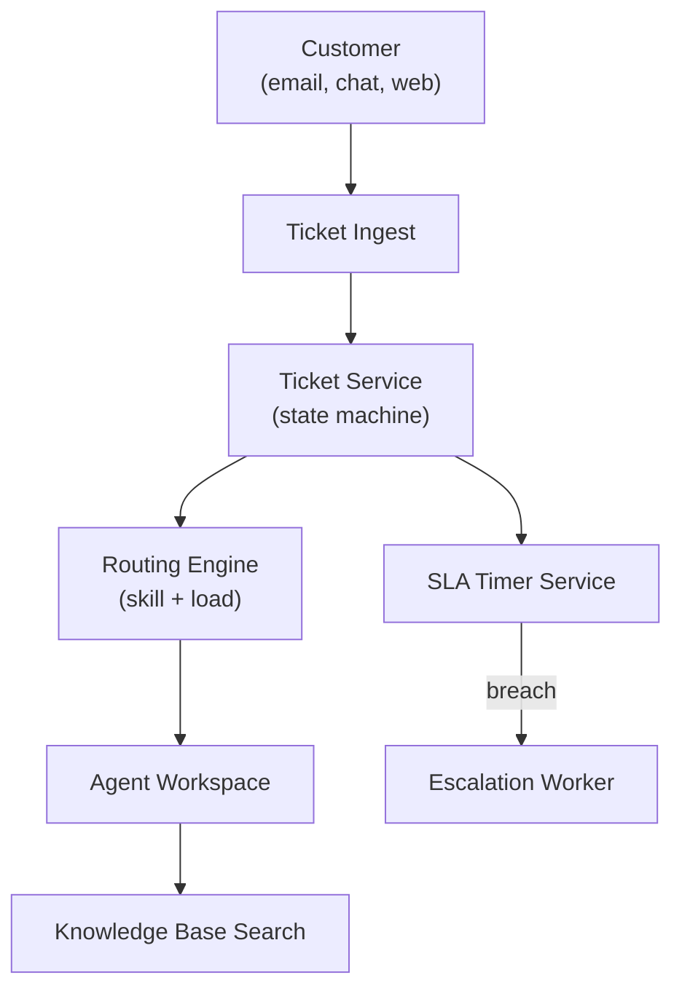

# Problem 48: Customer Support Helpdesk (Zendesk-Style)

> **Porter Value Chain:** Service

## Business Problem
Support teams handle **tickets** from email, chat, and phone. Agents need context, **SLA timers**, escalation paths, and a **knowledge base**. Customers expect first response within minutes on premium tiers.

## Hard Requirements
- **SLA clock** per ticket (first response, resolution).
- Smart **routing** by skill, language, load.
- Agent collision detection — two agents same ticket.
- KB search **< 300 ms** while typing.
- 100k tickets/day with burst on outages.

## Why One Pattern Is Not Enough
| If you only use… | What breaks |
| --- | --- |
| Shared inbox email | Duplicate tickets; no SLA |
| Round-robin only | Wrong skill agent assigned |
| SLA checked by cron hourly | Breaches before anyone notices |
| KB in same DB as tickets | Search slows ticket writes |

You need **Ticket state machine**, **priority queue routing**, **SLA scheduler**, **CQRS for KB search**, and **Pub/Sub for real-time agent UI**.

## Architecture Overview


## Pattern Mix
| Concern | Patterns | Role |
| --- | --- | --- |
| Tickets | [State Machine](../Data_domain_patterns/), [Event Sourcing](../Data_domain_patterns/15-event-sourcing.md) | Open → pending → solved |
| Routing | [Queue-Based Load Leveling](../Scalability_patterns/09-queue-based-load-leveling.md), [Priority Queue](../Concurrency_patterns/) | Skill queues |
| SLA | [Job Scheduler](./36-job-scheduler.md), [Event Notification](../Messaging_Integration_patterns/10-event-notification.md) | Deadline alerts |
| KB | [CQRS](../Scalability_patterns/06-cqrs.md), full-text index | Search separate from writes |
| Real-time | [Pub/Sub](../Messaging_Integration_patterns/08-pub-sub.md) | Agent sees new reply live |
| Collision | [Distributed Lock](../Distributed_system_patterns/21-distributed-lock.md) | One active editor |

## Happy-Path Flow
1. Customer email → **ingest** dedupes thread → ticket created, SLA clock starts.
2. **Router** assigns to `billing-en` queue → agent with capacity picks up.
3. Agent replies → first response SLA met → state `PENDING`.
4. Customer replies → SLA resolution timer resets → notify assigned agent.

## Failure Scenarios
| Failure | Response |
| --- | --- |
| SLA breach imminent | Escalate to senior queue + manager ping |
| Agent disconnect mid-reply | Draft saved; lock released on TTL |
| Outage spike | Load shed low-priority tiers; template auto-reply |
| Duplicate ticket from email | Merge by Message-ID thread key |

## TypeScript Sketch
```typescript
async function assignTicket(ticketId: string) {
  const ticket = await tickets.get(ticketId);
  const queue = await router.resolveQueue(ticket.tags, ticket.language);
  const agentId = await queue.nextAvailableAgent();
  await tickets.assign(ticketId, agentId);
  await sla.startResolutionTimer(ticketId, ticket.priority);
  await notify.push(agentId, { type: 'NEW_TICKET', ticketId });
}
```

## Patterns Used (quick links)
[State Machine](../Data_domain_patterns/) · [Queue-Based Load Leveling](../Scalability_patterns/09-queue-based-load-leveling.md) · [Job Scheduler](./36-job-scheduler.md) · [CQRS](../Scalability_patterns/06-cqrs.md) · [Distributed Lock](../Distributed_system_patterns/21-distributed-lock.md)
