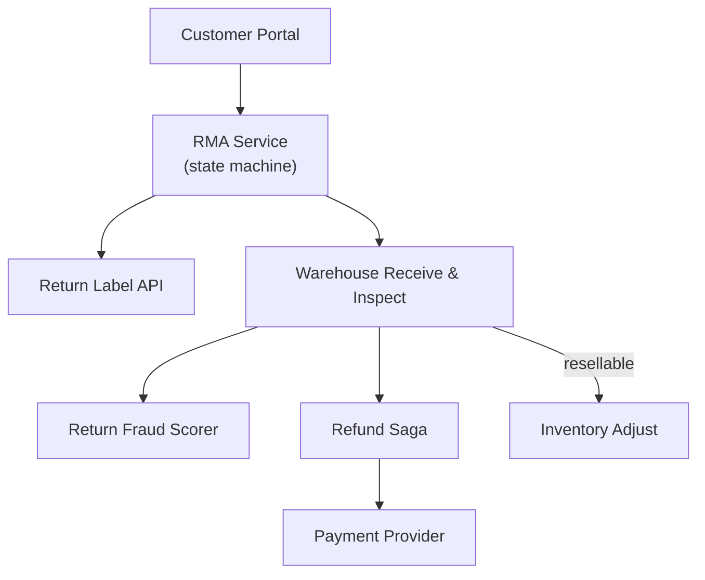

# Problem 49: Returns & Reverse Logistics (RMA Platform)

> **Porter Value Chain:** Margin (cross-value chain)

## Business Problem
E-commerce **returns** flow: customer requests RMA → ships item back → warehouse inspects → **refund or exchange** → restock or scrap. Fraud (wardrobing, empty box) and inventory accuracy must be controlled.

## Hard Requirements
- **Refund saga** ties return receipt to original payment.
- Serial / SKU validation against original order.
- Restock only if resellable grade.
- Return label generation and tracking.
- Finance reconciliation for partial refunds.

## Why One Pattern Is Not Enough
| If you only use… | What breaks |
| --- | --- |
| Refund before item received | Wardrobing fraud |
| Restock without inspection | Damaged goods resold |
| No link to original order | Wrong amount refunded |
| Returns DB separate from inventory | Oversell returned stock |

You need **RMA state machine**, **refund saga**, **event-sourced inventory**, **fraud scoring**, and **Outbox to payment provider**.

## Architecture Overview


## Pattern Mix
| Concern | Patterns | Role |
| --- | --- | --- |
| Lifecycle | [Saga](../Distributed_system_patterns/10-saga.md), [State Machine](../Data_domain_patterns/) | Request → receive → refund |
| Payments | [Idempotency](../Distributed_system_patterns/20-idempotency.md), [Outbox](../Distributed_system_patterns/11-outbox-pattern.md) | Exactly-once refund |
| Inventory | [Event Sourcing](../Data_domain_patterns/15-event-sourcing.md) | Restock events |
| Fraud | [Pipeline](../Concurrency_patterns/07-pipeline.md) | Risk score on receive |
| Link | See [Global Inventory Sync](./10-global-inventory-sync.md) | Cross-channel stock |

## Happy-Path Flow
1. Customer requests return for order line → **RMA** approved if within policy window.
2. Return label issued → customer ships.
3. Warehouse scans receipt → **inspect grade** A/B/scrap.
4. Grade A → restock event + **refund saga** to original payment method.

## Failure Scenarios
| Failure | Response |
| --- | --- |
| Empty box received | Fraud flag; deny refund; customer notify |
| Refund API fails | Outbox retry; RMA stays REFUND_PENDING |
| Wrong item returned | Reject; RMA closed no refund |
| Partial bundle return | Prorated refund calculation in saga |

## TypeScript Sketch
```typescript
async function completeInspection(rmaId: string, grade: 'A' | 'B' | 'SCRAP') {
  const rma = await rmas.get(rmaId);
  if (grade === 'A') await inventory.restock(rma.sku, rma.qty, rma.warehouseId);
  const amount = grade === 'SCRAP' ? 0 : rma.refundAmount;
  if (amount > 0) {
    await refundSaga.start({ rmaId, paymentId: rma.paymentId, amount, idempotencyKey: rmaId });
  }
  await rmas.setStatus(rmaId, amount > 0 ? 'REFUNDED' : 'CLOSED');
}
```

## Patterns Used (quick links)
[Saga](../Distributed_system_patterns/10-saga.md) · [Idempotency](../Distributed_system_patterns/20-idempotency.md) · [Outbox](../Distributed_system_patterns/11-outbox-pattern.md) · [Event Sourcing](../Data_domain_patterns/15-event-sourcing.md) · [Pipeline](../Concurrency_patterns/07-pipeline.md)
