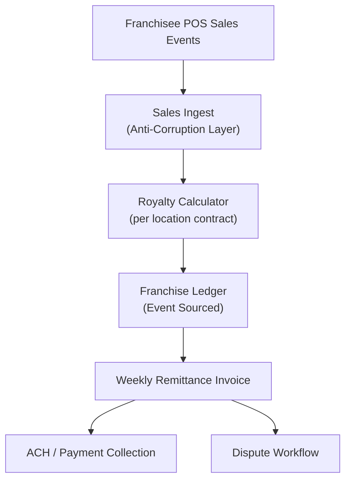

# Problem 50: Franchise Royalty & Fee Engine

> **Franchise Model:** Revenue streams — royalties, initial fee, marketing fund

## Business Problem
The **franchisor** collects **initial franchise fees**, weekly **royalties** (% of gross sales), and **marketing fund** contributions from each **franchisee location**. Calculations must be auditable; franchisees dispute if POS totals don't match remittance.

## Hard Requirements
- Royalty = **% of gross sales** per location per week.
- Support **fee tiers** by agreement vintage.
- **Idempotent** weekly billing per location + period.
- Master franchise **split** (sub-franchise overrides).
- Dispute workflow with POS reconciliation.

## Why One Pattern Is Not Enough
| If you only use… | What breaks |
| --- | --- |
| Manual spreadsheet royalties | Errors; franchisee lawsuits |
| Bill before POS ingest completes | Overcharge |
| One rate for all locations | Wrong contract terms |
| No audit trail | Can't defend in arbitration |

You need **Event-sourced sales ingest**, **materialized royalty projection**, **saga remittance**, **idempotent billing period**, and **hierarchical org tree**.

## Architecture Overview


## Pattern Mix
| Concern | Patterns | Role |
| --- | --- | --- |
| Sales | [Event Streaming](../Messaging_Integration_patterns/), [Anti-Corruption Layer](../Distributed_system_patterns/15-anti-corruption-layer.md) | Normalize POS feeds |
| Billing | [Idempotency](../Distributed_system_patterns/20-idempotency.md), [Materialized View](../Data_domain_patterns/16-materialized-view.md) | One bill per period |
| Money | [Saga](../Distributed_system_patterns/10-saga.md), [Outbox](../Distributed_system_patterns/11-outbox-pattern.md) | Collect remittance |
| Hierarchy | [Multi-Tenant Partitioning](../Data_domain_patterns/21-multi-tenant-partitioning.md) | Franchisor → franchisee → unit |
| Audit | [Event Sourcing](../Data_domain_patterns/15-event-sourcing.md) | See also [#6 Billing](./06-multi-tenant-saas-usage-billing.md) |

## Happy-Path Flow
1. Daily POS closes → sales events stream to **ingest** normalized by `locationId`.
2. Weekly job aggregates gross per location → applies contract royalty % + ad fund %.
3. **Remittance invoice** generated (idempotent `locationId:week`).
4. ACH collected → ledger event → franchisee portal updated.

## Failure Scenarios
| Failure | Response |
| --- | --- |
| POS feed delayed | Bill only after cutoff + grace window |
| Franchisee dispute | Freeze collection; show line-level POS tie-out |
| Master franchise split | Two ledger entries per collection |
| Duplicate POS event | Idempotent on `posTxnId` |

## TypeScript Sketch
```typescript
async function calculateWeeklyRoyalty(locationId: string, week: string) {
  const key = `${locationId}:${week}`;
  if (await idempotency.exists(key)) return idempotency.result(key);
  const contract = await contracts.get(locationId);
  const gross = await sales.sumGross(locationId, week);
  const royalty = gross * contract.royaltyRate;
  const adFund = gross * contract.adFundRate;
  const invoice = await ledger.createRemittance({ locationId, week, royalty, adFund, gross });
  await idempotency.save(key, invoice);
  return invoice;
}
```

## Patterns Used (quick links)
[Event Sourcing](../Data_domain_patterns/15-event-sourcing.md) · [Idempotency](../Distributed_system_patterns/20-idempotency.md) · [Saga](../Distributed_system_patterns/10-saga.md) · [Anti-Corruption Layer](../Distributed_system_patterns/15-anti-corruption-layer.md) · [Multi-Tenant Partitioning](../Data_domain_patterns/21-multi-tenant-partitioning.md)
