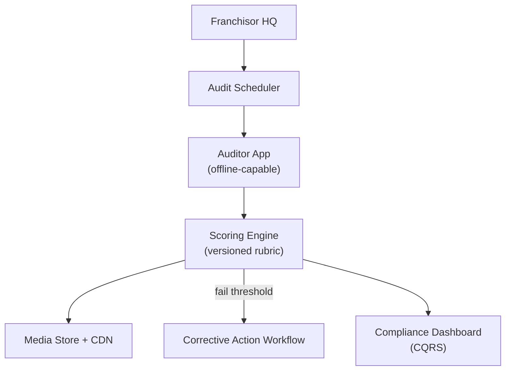

# Problem 51: Brand Compliance & Audit Platform

> **Franchise Model:** Key activities — compliance, performance reporting

## Business Problem
Franchisors enforce **brand standards** via scheduled audits (mystery shop, field visit, photo checklist). Franchisees below threshold enter **corrective action**; repeat failures risk termination. Evidence (photos, scores) must be immutable.

## Hard Requirements
- Audit **schedules** per location (quarterly, random).
- Scoring rubric versioned by brand policy.
- Photo/video evidence with timestamp + geo.
- Corrective action workflow with deadlines.
- HQ dashboard: compliance rate by region.

## Why One Pattern Is Not Enough
| If you only use… | What breaks |
| --- | --- |
| Paper checklists | Lost evidence; no trends |
| Score editable after submission | Franchisee disputes unfair |
| No corrective action tracking | Repeat violations |
| All audits sync on submit | App fails offline in store |

You need **Audit state machine**, **versioned rubrics**, **media pipeline**, **CQRS compliance dashboard**, and **Event Notification for deadlines**.

## Architecture Overview


## Pattern Mix
| Concern | Patterns | Role |
| --- | --- | --- |
| Workflow | [State Machine](../Data_domain_patterns/), [Saga](../Distributed_system_patterns/10-saga.md) | Audit → CAP → verify |
| Rubrics | [Event Sourcing](../Data_domain_patterns/15-event-sourcing.md) | Policy version pinned per audit |
| Media | [Pipeline](../Concurrency_patterns/07-pipeline.md), [CDN](../Scalability_patterns/05-cdn.md) | Upload photos async |
| Offline | [Store-and-Forward](../Messaging_Integration_patterns/) | Submit when connected |
| Reporting | [CQRS](../Scalability_patterns/06-cqrs.md), [Materialized View](../Data_domain_patterns/16-materialized-view.md) | Regional roll-up |

## Happy-Path Flow
1. **Scheduler** assigns audit to location #4521 → auditor app downloads rubric v3.
2. Auditor completes checklist offline → photos uploaded → **score** computed.
3. Score < 80 → **corrective action** opened with 30-day deadline.
4. Re-audit verifies fix → dashboard updates franchisee rating.

## Failure Scenarios
| Failure | Response |
| --- | --- |
| Photo upload fails | Queue locally; retry with idempotency |
| Rubric updated mid-audit | Pin version at audit start |
| Missed CAP deadline | Escalate to franchise consultant |
| GPS mismatch | Flag audit for manual review |

## TypeScript Sketch
```typescript
async function submitAudit(auditId: string, answers: Answer[], photos: string[]) {
  const audit = await audits.get(auditId);
  const rubric = await rubrics.getVersion(audit.rubricVersion);
  const score = rubric.score(answers);
  await audits.complete(auditId, { score, answers, photoIds: photos });
  if (score < rubric.passThreshold) {
    await cap.open({ locationId: audit.locationId, auditId, dueDays: 30 });
  }
  await complianceProjection.onAuditComplete(audit.locationId, score);
}
```

## Patterns Used (quick links)
[State Machine](../Data_domain_patterns/) · [Event Sourcing](../Data_domain_patterns/15-event-sourcing.md) · [CQRS](../Scalability_patterns/06-cqrs.md) · [Pipeline](../Concurrency_patterns/07-pipeline.md) · [Saga](../Distributed_system_patterns/10-saga.md)
