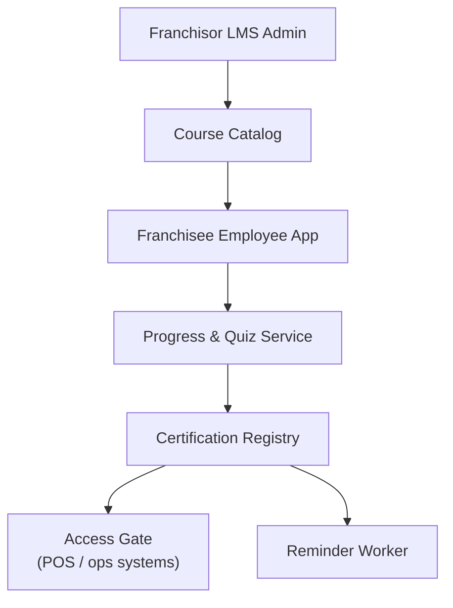

# Problem 52: Franchise Training & Certification LMS

> **Franchise Model:** Key resources — training, systems

## Business Problem
Franchisors publish **required training** (food safety, brand standards). Franchisee employees must **certify** before gaining POS or ops system access. Certs **expire** and require renewal.

## Hard Requirements
- Course catalog controlled by HQ; localized content.
- **Cert gating** — no POS login without valid cert.
- Expiration reminders 30/7/1 days before.
- Track completion by location and role.
- Quiz anti-cheat basic (time limits, question pools).

## Why One Pattern Is Not Enough
| If you only use… | What breaks |
| --- | --- |
| PDF emailed once | No proof of completion |
| POS access not tied to cert | Uncertified staff operate register |
| One global due date | Ignores hire date per employee |
| Sync quiz submit | Timeout loses attempt |

You need **LMS progress state machine**, **Job Scheduler for expiry**, **RBAC integration with POS**, **Outbox notifications**, and **idempotent quiz submission**.

## Architecture Overview


## Pattern Mix
| Concern | Patterns | Role |
| --- | --- | --- |
| Progress | [State Machine](../Data_domain_patterns/) | Not started → passed → expired |
| Access | [RBAC](../Security_patterns/), [ABAC](../Security_patterns/03-abac.md) | Cert as attribute |
| Reminders | [Job Scheduler](./36-job-scheduler.md), [Event Notification](../Messaging_Integration_patterns/10-event-notification.md) | Expiry nudges |
| Submit | [Idempotency](../Distributed_system_patterns/20-idempotency.md) | Quiz retry-safe |
| Content | [CDN](../Scalability_patterns/05-cdn.md) | Video modules |

## Happy-Path Flow
1. New hire at location → assigned **Food Safety 101** based on role.
2. Employee completes modules + passes quiz → **cert** issued with expiry.
3. **RBAC gate** enables POS login when cert valid.
4. **Scheduler** sends renewal reminders before expiry.

## Failure Scenarios
| Failure | Response |
| --- | --- |
| Cert expires mid-shift | Grace read-only mode; manager override logged |
| Quiz timeout | Idempotent resume from last question |
| Course updated | Grandfather in-progress; new hires get v2 |
| Fraudulent completion | Proctor flag; random spot checks |

## TypeScript Sketch
```typescript
async function checkPosAccess(employeeId: string): Promise<boolean> {
  const required = await roles.requiredCerts(employeeId);
  const held = await certs.activeFor(employeeId);
  return required.every(r => held.some(c => c.courseId === r && c.expiresAt > Date.now()));
}
```

## Patterns Used (quick links)
[State Machine](../Data_domain_patterns/) · [RBAC](../Security_patterns/) · [Job Scheduler](./36-job-scheduler.md) · [Idempotency](../Distributed_system_patterns/20-idempotency.md) · [Event Notification](../Messaging_Integration_patterns/10-event-notification.md)
