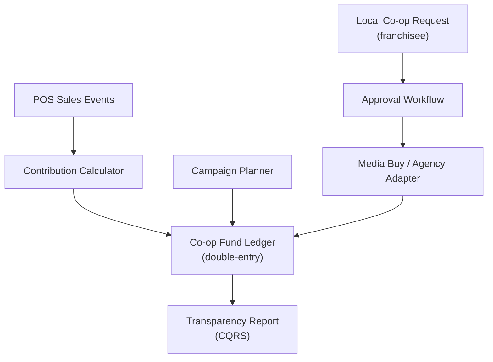

# Problem 53: Marketing Co-op Fund Allocation

> **Franchise Model:** Revenue — marketing contributions; Channels — franchisor networks

## Business Problem
Franchisees contribute a **% of sales** to a national **advertising fund**. HQ plans campaigns (TV, digital, local co-op), allocates budget by region, and must prove **spend vs contribution** balance to franchisee council.

## Hard Requirements
- Track **contributions** per location (linked to royalty engine).
- Campaign budget allocation by DMA/region.
- **Approve** local co-op spend requests from franchisees.
- Prevent overspend vs allocated pool.
- Transparency report per franchisee.

## Why One Pattern Is Not Enough
| If you only use… | What breaks |
| --- | --- |
| Contributions tracked separately from spend | Fund insolvency |
| Local co-op without approval | Brand inconsistency |
| Manual Excel allocation | Franchisee trust issues |
| No regional roll-up | Wrong market gets budget |

You need **Double-entry fund ledger**, **approval workflow**, **CQRS transparency reports**, **saga spend commit**, and **link to royalty ingest**.

## Architecture Overview


## Pattern Mix
| Concern | Patterns | Role |
| --- | --- | --- |
| Contributions | [Event Streaming](../Messaging_Integration_patterns/), link [#50 Royalties](./50-franchise-royalty-fee-engine.md) | Same sales feed |
| Ledger | [Event Sourcing](../Data_domain_patterns/15-event-sourcing.md) | Contribute vs spend |
| Approval | [State Machine](../Data_domain_patterns/), [Saga](../Distributed_system_patterns/10-saga.md) | Request → approve → pay |
| Reports | [CQRS](../Scalability_patterns/06-cqrs.md), [Materialized View](../Data_domain_patterns/16-materialized-view.md) | Per-franchisee PDF |
| Integrations | [Adapter](../Structural%20Patterns/Adapter.md) | Agency invoices |

## Happy-Path Flow
1. Weekly sales → **ad fund contribution** credited to regional pool.
2. HQ plans national TV buy → **debit** national pool with approval chain.
3. Franchisee requests local billboard → regional manager **approves** → spend committed.
4. Quarterly **transparency report** shows contribute vs benefit by DMA.

## Failure Scenarios
| Failure | Response |
| --- | --- |
| Pool insufficient | Reject spend; queue for next period |
| Agency invoice mismatch | Hold payment; manual reconcile |
| Duplicate contribution event | Idempotent on sales txn id |
| Campaign cancelled | Credit back to pool via compensating entry |

## TypeScript Sketch
```typescript
async function approveLocalSpend(requestId: string, approverId: string) {
  const req = await requests.get(requestId);
  const pool = await fund.balance(req.regionId);
  if (req.amount > pool.available) throw new InsufficientFundError();
  await fund.reserve(req.regionId, req.amount, requestId);
  await spendSaga.start({ requestId, amount: req.amount, vendorId: req.vendorId });
}
```

## Patterns Used (quick links)
[Event Sourcing](../Data_domain_patterns/15-event-sourcing.md) · [Saga](../Distributed_system_patterns/10-saga.md) · [CQRS](../Scalability_patterns/06-cqrs.md) · [State Machine](../Data_domain_patterns/) · [Event Streaming](../Messaging_Integration_patterns/)
