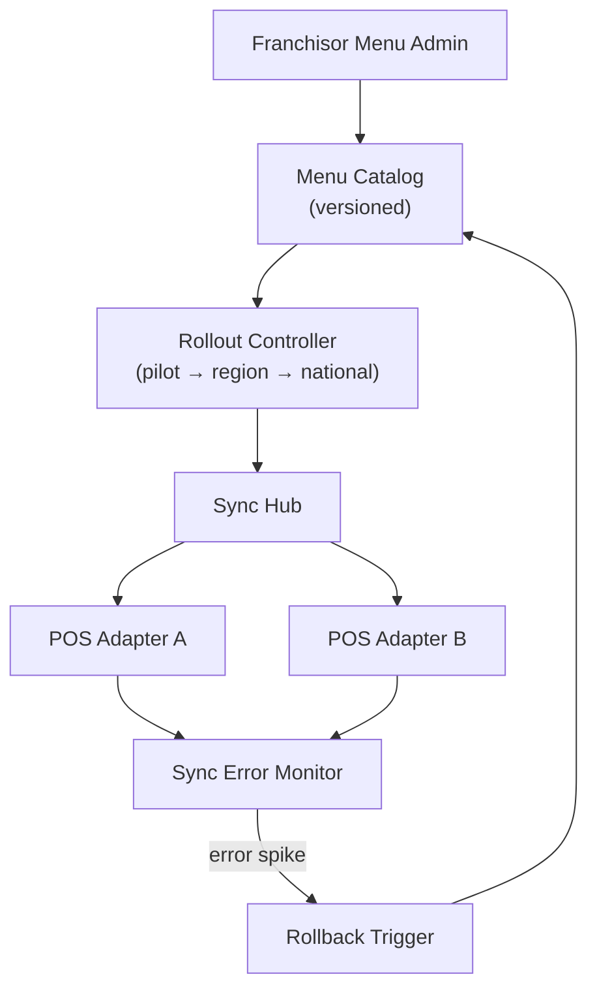

# Problem 54: HQ Menu, Pricing & Promo Control

> **Franchise Model:** Value proposition — proven processes; franchisor → franchisee ops

## Business Problem
Franchisor **HQ controls the menu**, base prices, and national promos. Changes **push to all POS systems** with staged rollout (pilot regions first). Franchisees cannot override **restricted items** or pricing on core products.

## Hard Requirements
- Menu version **immutable** once published.
- Staged rollout: pilot → region → national.
- **Rollback** within minutes if POS sync errors spike.
- Promo windows with automatic start/end.
- 10k locations; heterogeneous POS vendors.

## Why One Pattern Is Not Enough
| If you only use… | What breaks |
| --- | --- |
| Email PDF menu update | Locations run old prices for weeks |
| Big-bang national push | One bad price crashes brand |
| Franchisee edits core SKU price | Channel conflict; margin loss |
| Sync blocking POS checkout | Store can't sell during update |

You need **Versioned menu catalog**, **Pub/Sub staged rollout**, **Anti-Corruption Layer per POS**, **feature-flag-style rollback**, and **Event Sourcing menu history**.

## Architecture Overview


## Pattern Mix
| Concern | Patterns | Role |
| --- | --- | --- |
| Versioning | [Event Sourcing](../Data_domain_patterns/15-event-sourcing.md) | Menu history |
| Rollout | [Pub/Sub](../Messaging_Integration_patterns/08-pub-sub.md), staged flags | Pilot first |
| POS | [Anti-Corruption Layer](../Distributed_system_patterns/15-anti-corruption-layer.md), [Adapter](../Structural%20Patterns/Adapter.md) | Vendor-specific sync |
| Safety | [Circuit Breaker](../Resilience_Pattern/01-circuit-breaker.md), [Rollback](../DevOps_Delivery_patterns/) | Auto revert |
| Promo | [Job Scheduler](./36-job-scheduler.md) | Timed start/end |

## Happy-Path Flow
1. HQ publishes **Menu v2025.06** with new combo price → pilot 50 locations.
2. **Sync hub** pushes via POS adapters → ack per location.
3. Error rate OK → expand to **Southeast region**.
4. National rollout → promo **$5 box** auto-starts Monday 00:00 local.

## Failure Scenarios
| Failure | Response |
| --- | --- |
| POS adapter timeout | Retry; location stays on previous version |
| Error spike > 5% | **Rollback** to v2025.05 nationally |
| Franchisee unauthorized edit | POS rejects; alert compliance |
| Promo end missed | Scheduler force-end; audit log |

## TypeScript Sketch
```typescript
async function publishMenu(version: MenuVersion, stage: 'PILOT' | 'REGION' | 'NATIONAL') {
  await catalog.publish(version);
  const locations = await rollout.resolveLocations(stage, version.pilotRegions);
  await hub.pushBatch(locations, version, { rollbackOnErrorRate: 0.05 });
}
```

## Patterns Used (quick links)
[Event Sourcing](../Data_domain_patterns/15-event-sourcing.md) · [Pub/Sub](../Messaging_Integration_patterns/08-pub-sub.md) · [Anti-Corruption Layer](../Distributed_system_patterns/15-anti-corruption-layer.md) · [Circuit Breaker](../Resilience_Pattern/01-circuit-breaker.md) · [Job Scheduler](./36-job-scheduler.md)
