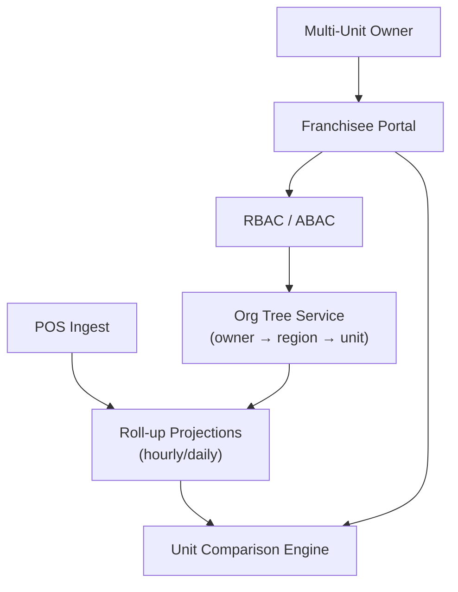

# Problem 55: Multi-Unit Franchisee Dashboard

> **Franchise Model:** Structure — multi-unit development

## Business Problem
A **multi-unit franchisee** owns 40 locations. They need roll-up **sales, labor, food cost**, and compliance scores — plus ability to delegate access to **regional managers** per group of stores.

## Hard Requirements
- Org tree: owner → regional mgr → location.
- **Roll-up metrics** near real-time (hourly sales).
- Compare units: same-store sales vs peer average.
- RBAC: manager sees only their locations.
- Export for lender / investor reporting.

## Why One Pattern Is Not Enough
| If you only use… | What breaks |
| --- | --- |
| Flat location list | Can't delegate regional access |
| Query all locations on every page load | Slow dashboard |
| POS data not normalized | Apples-to-oranges comparison |
| No materialized roll-ups | Timeout on 40-location P&L |

You need **Hierarchical multi-tenancy**, **CQRS roll-up projections**, **sharding by org subtree**, **POS normalization**, and **cache per org level**.

## Architecture Overview


## Pattern Mix
| Concern | Patterns | Role |
| --- | --- | --- |
| Hierarchy | [Multi-Tenant Partitioning](../Data_domain_patterns/21-multi-tenant-partitioning.md), org tree sharding | Delegate access |
| Metrics | [CQRS](../Scalability_patterns/06-cqrs.md), [Materialized View](../Data_domain_patterns/16-materialized-view.md) | Pre-aggregated roll-ups |
| Ingest | [Anti-Corruption Layer](../Distributed_system_patterns/15-anti-corruption-layer.md) | Normalize POS |
| Security | [ABAC](../Security_patterns/03-abac.md) | Location-scoped roles |
| Speed | [Cache-Aside](../Scalability_patterns/04-cache-aside.md) | Hot dashboard queries |

## Happy-Path Flow
1. Owner logs in → **RBAC** resolves visible location set (all 40).
2. **Projection** serves hourly sales roll-up from stream aggregates.
3. Regional manager sees 12 locations → compares labor % vs brand benchmark.
4. Owner exports QTD pack for lender — materialized view query.

## Failure Scenarios
| Failure | Response |
| --- | --- |
| One location POS offline | Show stale badge; exclude from live total option |
| Wrong org assignment | ABAC deny; audit admin change |
| Projection lag | Display as-of timestamp |
| Peer benchmark stale | Nightly recompute job |

## TypeScript Sketch
```typescript
async function getRollup(orgNodeId: string, userId: string, metric: string, period: string) {
  const allowed = await rbac.locationsForUser(userId);
  const subtree = await org.subtree(orgNodeId).filter(id => allowed.includes(id));
  return projections.sum(metric, subtree, period);
}
```

## Patterns Used (quick links)
[CQRS](../Scalability_patterns/06-cqrs.md) · [Multi-Tenant Partitioning](../Data_domain_patterns/21-multi-tenant-partitioning.md) · [Materialized View](../Data_domain_patterns/16-materialized-view.md) · [ABAC](../Security_patterns/03-abac.md) · [Cache-Aside](../Scalability_patterns/04-cache-aside.md)
