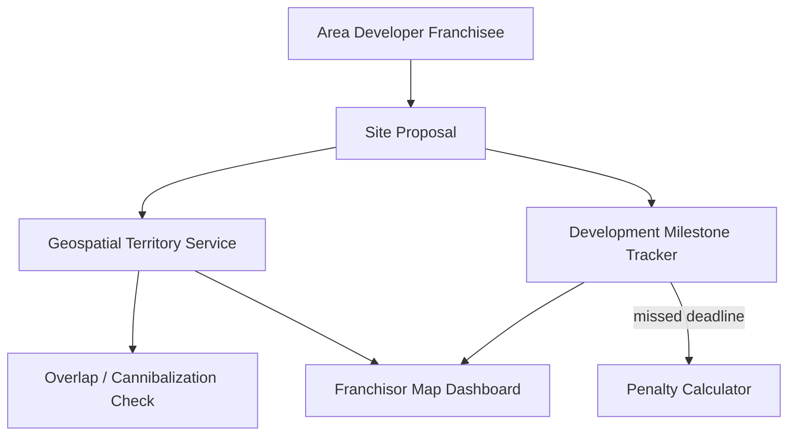

# Problem 56: Territory & Area Development Manager

> **Franchise Model:** Structure — area development agreement

## Business Problem
Franchisor grants **exclusive territory** rights: franchisee must open **N locations by deadline** in a geographic area. System tracks **development schedule**, penalties, cannibalization rules, and competing territory overlap disputes.

## Hard Requirements
- Territory defined by **polygon / zip list**.
- Development schedule milestones with deadlines.
- **Cannibalization check** on new site proposals.
- Penalty calculation if under-developed.
- Map view for franchisor development team.

## Why One Pattern Is Not Enough
| If you only use… | What breaks |
| --- | --- |
| Handshake territory on map | Overlap disputes |
| No milestone tracking | Missed openings undetected |
| Approve site without geo check | Cannibalize existing franchisee |
| Penalty calc manual | Inconsistent enforcement |

You need **Geospatial territory index**, **milestone state machine**, **overlap detection**, **Job Scheduler for deadline alerts**, and **audit trail**.

## Architecture Overview


## Pattern Mix
| Concern | Patterns | Role |
| --- | --- | --- |
| Territory | [Geospatial indexing](../Scalability_patterns/), [Partitioning](../Scalability_patterns/02-partitioning.md) | Polygons / zips |
| Milestones | [State Machine](../Data_domain_patterns/), [Job Scheduler](./36-job-scheduler.md) | Open-by dates |
| Overlap | [Distributed Lock](../Distributed_system_patterns/21-distributed-lock.md) | One exclusive claim |
| Disputes | [Event Sourcing](../Data_domain_patterns/15-event-sourcing.md) | Territory grant history |
| Alerts | [Event Notification](../Messaging_Integration_patterns/10-event-notification.md) | Deadline warnings |

## Happy-Path Flow
1. Developer signs **area agreement** → territory polygon stored exclusive.
2. Proposes site → **overlap check** vs existing locations + other territories.
3. Approved site → **milestone** marked complete when store opens.
4. Missed deadline → **penalty** invoice per contract formula.

## Failure Scenarios
| Failure | Response |
| --- | --- |
| Border zip dispute | Event-sourced grant; legal flag |
| Store opens late 1 day | Grace per contract; auto vs manual penalty |
| Territory resize | Migration saga; notify affected franchisees |
| Duplicate proposal | Idempotent on address hash |

## TypeScript Sketch
```typescript
async function checkSiteProposal(territoryId: string, lat: number, lng: number) {
  const conflicts = await geo.findConflicts(territoryId, lat, lng, { minDistanceKm: 3 });
  if (conflicts.length) return { approved: false, reason: 'CANNIBALIZATION', conflicts };
  return { approved: true };
}
```

## Patterns Used (quick links)
[Partitioning](../Scalability_patterns/02-partitioning.md) · [State Machine](../Data_domain_patterns/) · [Job Scheduler](./36-job-scheduler.md) · [Event Sourcing](../Data_domain_patterns/15-event-sourcing.md) · [Event Notification](../Messaging_Integration_patterns/10-event-notification.md)
