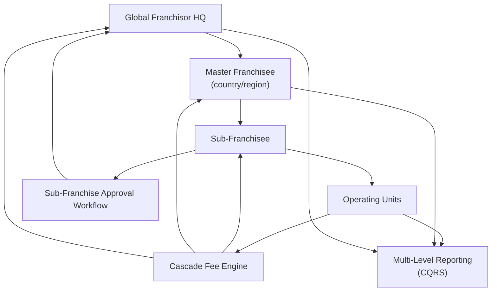

# Problem 57: Master Franchise Sub-Franchising Platform

> **Franchise Model:** Structure — master franchise (country/region)

## Business Problem
A **master franchisee** holds rights to a **country or region** and sells **sub-franchises**. Money flows split three ways: sub-franchisee → master → franchisor. Reporting, compliance, and fee rules differ per level.

## Hard Requirements
- **Three-level hierarchy**: franchisor → master → sub-franchisee → unit.
- Fee split rules per master agreement.
- Master can onboard sub-franchisees with franchisor approval.
- Consolidated reporting at each level.
- Localized tax/compliance fields by country.

## Why One Pattern Is Not Enough
| If you only use… | What breaks |
| --- | --- |
| Flat tenant model | Can't express master split |
| Sub-franchisee pays franchisor direct | Breaks master economics |
| One reporting schema globally | EU vs US field mismatch |
| Approval bypass | Unauthorized sub-franchisees |

You need **Hierarchical tenancy**, **cascade fee saga**, **Anti-Corruption Layer for localization**, **delegated RBAC**, and **rollup CQRS at each tier**.

## Architecture Overview


## Pattern Mix
| Concern | Patterns | Role |
| --- | --- | --- |
| Hierarchy | [Multi-Tenant Partitioning](../Data_domain_patterns/21-multi-tenant-partitioning.md) | 3-level tree |
| Fees | [Saga](../Distributed_system_patterns/10-saga.md), link [#50 Royalties](./50-franchise-royalty-fee-engine.md) | Split remittance |
| Localization | [Anti-Corruption Layer](../Distributed_system_patterns/15-anti-corruption-layer.md) | Country-specific fields |
| Governance | [State Machine](../Data_domain_patterns/), [RBAC](../Security_patterns/) | Approval chain |
| Reporting | [CQRS](../Scalability_patterns/06-cqrs.md), [Materialized View](../Data_domain_patterns/16-materialized-view.md) | Roll-up per tier |

## Happy-Path Flow
1. Master franchisee recruits sub-franchisee → **approval workflow** to franchisor.
2. Sub-franchisee opens units → sales feed **fee engine**.
3. Weekly: sub pays master share + franchisor royalty (single ACH **saga** splits).
4. Each tier sees **dashboard** scoped to their subtree.

## Failure Scenarios
| Failure | Response |
| --- | --- |
| Split calculation dispute | Event-sourced fee breakdown per unit |
| Master insolvency | Franchisor escrow policy per contract |
| Cross-border payment fail | Compensating saga; retry local rail |
| Unauthorized sub-franchise | Freeze unit; compliance review |

## TypeScript Sketch
```typescript
async function splitWeeklyFees(unitId: string, week: string, gross: number) {
  const chain = await org.chainToRoot(unitId); // unit → sub → master → franchisor
  const rules = await contracts.feeChain(chain);
  return {
    subShare: gross * rules.subRate,
    masterShare: gross * rules.masterRate,
    franchisorShare: gross * rules.franchisorRate,
  };
}
```

## Patterns Used (quick links)
[Multi-Tenant Partitioning](../Data_domain_patterns/21-multi-tenant-partitioning.md) · [Saga](../Distributed_system_patterns/10-saga.md) · [Anti-Corruption Layer](../Distributed_system_patterns/15-anti-corruption-layer.md) · [CQRS](../Scalability_patterns/06-cqrs.md) · [State Machine](../Data_domain_patterns/)
