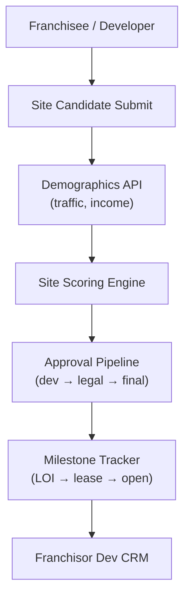

# Problem 58: Franchise Site Selection & Approval Pipeline

> **Franchise Model:** Key actions — site selection

## Business Problem
Prospective and existing franchisees propose **new locations**. Franchisor evaluates **demographics, traffic, competition**, lease terms, and brand fit before approving. Pipeline tracks from candidate site → LOI → lease signed → store opening.

## Hard Requirements
- Site candidate with map pin + demographic report.
- **Scoring model** (traffic, income, competition density).
- Multi-step franchisor approval (dev → legal → final).
- Milestone dates: LOI, lease, construction, grand opening.
- Pipeline CRM for franchisor development reps.

## Why One Pattern Is Not Enough
| If you only use… | What breaks |
| --- | --- |
| Email PDF site packages | Lost history; no scoring consistency |
| Approve without demographic data | Bad locations fail |
| No milestone tracking | Opening dates slip silently |
| Franchisee sees other candidates' sites | Data leak |

You need **Pipeline state machine**, **geo demographic integration**, **scoring pipeline**, **RBAC per candidate**, and **Event Notification on stage change**.

## Architecture Overview


## Pattern Mix
| Concern | Patterns | Role |
| --- | --- | --- |
| Pipeline | [State Machine](../Data_domain_patterns/), [Saga](../Distributed_system_patterns/10-saga.md) | Site lifecycle |
| Geo | [Adapter](../Structural%20Patterns/Adapter.md), geospatial | Demographics provider |
| Scoring | [Pipeline](../Concurrency_patterns/07-pipeline.md) | Weighted factors |
| Security | [ABAC](../Security_patterns/03-abac.md) | Candidate visibility |
| CRM | [CQRS](../Scalability_patterns/06-cqrs.md) | Rep pipeline views |
| Notify | [Event Notification](../Messaging_Integration_patterns/10-event-notification.md) | Stage change alerts |

## Happy-Path Flow
1. Franchisee submits candidate address → **demographics API** enriches traffic and income data.
2. **Scoring engine** ranks site vs brand thresholds.
3. Passes → **approval pipeline** (development → legal → COO).
4. Approved → milestones tracked until **grand opening** links to location record.

## Failure Scenarios
| Failure | Response |
| --- | --- |
| Demographics API down | Queue scoring; manual override path |
| Lease falls through | Return to pipeline `SEARCHING` state |
| Score model update | Re-score open candidates optionally |
| Duplicate address submit | Dedup hash; merge threads |

## TypeScript Sketch
```typescript
async function scoreSite(candidateId: string) {
  const c = await candidates.get(candidateId);
  const demo = await demographics.enrich(c.lat, c.lng, c.radiusM);
  const score = scorer.evaluate({ ...c, ...demo });
  await candidates.update(candidateId, { score, demoSnapshot: demo });
  if (score >= scorer.threshold) await pipeline.advance(candidateId, 'DEV_REVIEW');
  return score;
}
```

## Patterns Used (quick links)
[State Machine](../Data_domain_patterns/) · [Pipeline](../Concurrency_patterns/07-pipeline.md) · [Saga](../Distributed_system_patterns/10-saga.md) · [ABAC](../Security_patterns/03-abac.md) · [Event Notification](../Messaging_Integration_patterns/10-event-notification.md)
