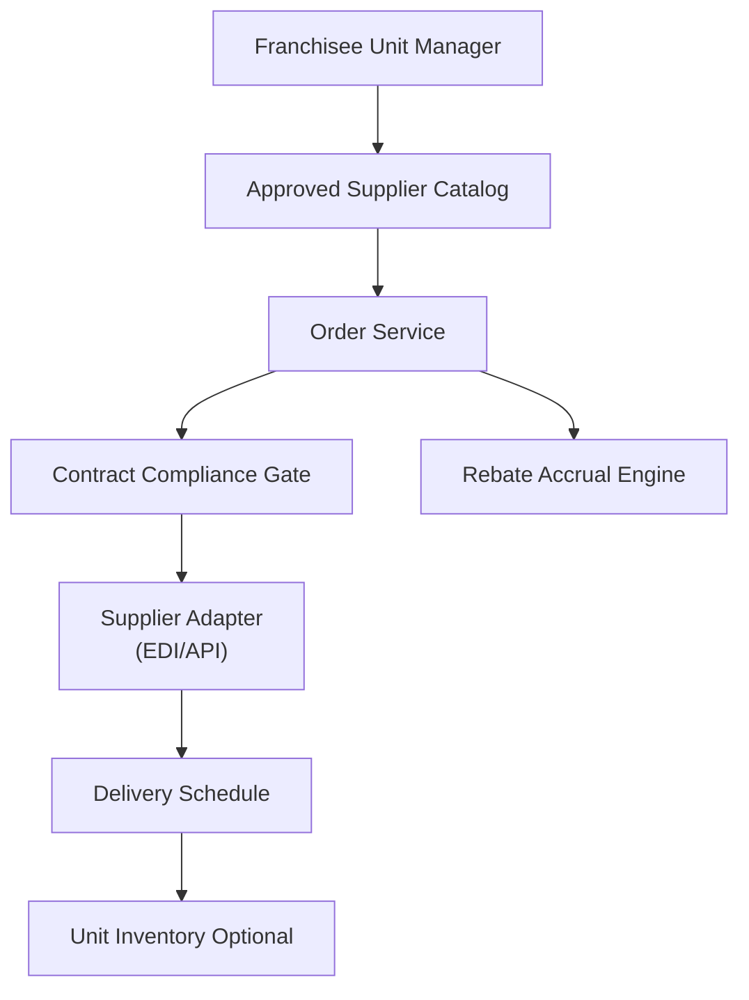

# Problem 59: Approved Supplier & Franchisee Purchasing Portal

> **Franchise Model:** Key partners; Cost structure — approved vendors

## Business Problem
Franchisees must purchase ingredients and supplies from **approved suppliers** at **negotiated prices**. HQ may earn **rebates** on volume. Orders deliver to unit; off-contract purchasing triggers **compliance flags**.

## Hard Requirements
- Catalog per brand with contract pricing tiers.
- **Block** checkout with non-approved SKUs.
- Volume rebate accrual to franchisor.
- Delivery scheduling to franchisee location.
- Integration with unit inventory (optional).

## Why One Pattern Is Not Enough
| If you only use… | What breaks |
| --- | --- |
| Franchisee buys from local cash-and-carry | Brand inconsistency; lost rebates |
| Static price PDF | Wrong prices; manual updates |
| No compliance tracking | Food safety traceability gap |
| Order without delivery slot | Stockout at unit |

You need **Approved catalog ACL**, **order saga**, **rebate accrual stream**, **supplier Adapter**, and **compliance event log**.

## Architecture Overview


## Pattern Mix
| Concern | Patterns | Role |
| --- | --- | --- |
| Catalog | [RBAC](../Security_patterns/), approved SKU list | Block off-contract |
| Orders | [Saga](../Distributed_system_patterns/10-saga.md), [Idempotency](../Distributed_system_patterns/20-idempotency.md) | Order → confirm → deliver |
| Suppliers | [Anti-Corruption Layer](../Distributed_system_patterns/15-anti-corruption-layer.md), [Adapter](../Structural%20Patterns/Adapter.md) | EDI/API normalize |
| Rebates | [Event Streaming](../Messaging_Integration_patterns/) | Volume accrual |
| Inventory | Link [#10 Inventory Sync](./10-global-inventory-sync.md) | Receive at unit |

## Happy-Path Flow
1. Unit manager orders weekly produce from **approved catalog** at contract price.
2. **Compliance gate** rejects any non-listed SKU.
3. Order → **supplier adapter** → delivery slot confirmed.
4. Receive goods → rebate accrual event to franchisor volume pool.

## Failure Scenarios
| Failure | Response |
| --- | --- |
| Supplier out of stock | Substitute SKU rules or partial ship saga |
| Off-contract attempt | Block + compliance notification to franchisor |
| Price mismatch vs contract | Hold order; use contracted price authority |
| Delivery miss | Reschedule; SLA credit per policy |

## TypeScript Sketch
```typescript
async function submitOrder(locationId: string, lines: OrderLine[]) {
  for (const line of lines) {
    if (!(await catalog.isApproved(line.sku))) throw new ComplianceError(line.sku);
  }
  const price = await catalog.contractPrice(locationId, lines);
  return orderSaga.start({ locationId, lines, price, idempotencyKey: hash(lines) });
}
```

## Patterns Used (quick links)
[Saga](../Distributed_system_patterns/10-saga.md) · [Anti-Corruption Layer](../Distributed_system_patterns/15-anti-corruption-layer.md) · [Idempotency](../Distributed_system_patterns/20-idempotency.md) · [Event Streaming](../Messaging_Integration_patterns/) · [RBAC](../Security_patterns/)
