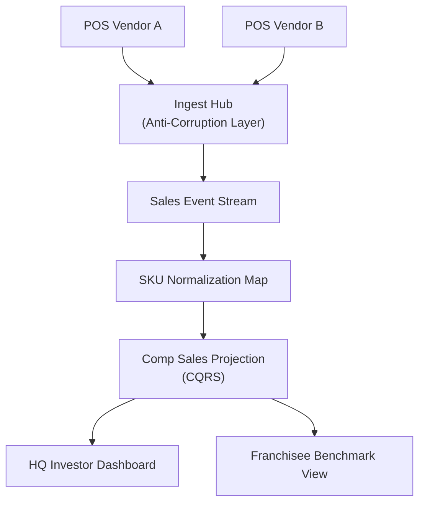

# Problem 60: Franchise POS Aggregation & Same-Store Sales

> **Franchise Model:** Operations; performance reporting

## Business Problem
Franchisor HQ ingests **POS data from heterogeneous vendors** at 10k locations. Normalize SKU and compute **same-store sales (comp)** YoY for investor reporting and franchisee benchmarking.

## Hard Requirements
- Ingest batch + near-real-time POS feeds.
- **Normalize** SKU mapping across vendors.
- Comp sales = locations open > 12 months.
- HQ dashboard updated hourly.
- Handle late-arriving POS files.

## Why One Pattern Is Not Enough
| If you only use… | What breaks |
| --- | --- |
| Each POS custom report | Incomparable metrics |
| Raw insert only | Comp calc wrong on calendar shift |
| Sync nightly only | CEO sees stale numbers |
| No late data handling | Restatements manual |

You need **Anti-Corruption Layer per POS**, **event stream ingest**, **materialized comp projections**, **idempotent file processing**, and **CQRS investor dashboard**.

## Architecture Overview


## Pattern Mix
| Concern | Patterns | Role |
| --- | --- | --- |
| Ingest | [Anti-Corruption Layer](../Distributed_system_patterns/15-anti-corruption-layer.md), [Pipeline](../Concurrency_patterns/07-pipeline.md) | Vendor formats |
| Stream | [Event Streaming](../Messaging_Integration_patterns/), [Idempotency](../Distributed_system_patterns/20-idempotency.md) | Late file dedup |
| Normalize | [Adapter](../Structural%20Patterns/Adapter.md), SKU map versioning | Comparable metrics |
| Analytics | [CQRS](../Scalability_patterns/06-cqrs.md), [Materialized View](../Data_domain_patterns/16-materialized-view.md) | Comp sales roll-up |
| Link | [#50 Royalties](./50-franchise-royalty-fee-engine.md) | Same sales feed |

## Happy-Path Flow
1. Location closes day → POS vendor sends sales file → **ingest hub** normalizes.
2. Events append to stream with `locationId`, `normalizedSku`, `gross`.
3. **Projection** updates hourly comp: open > 12 mo vs prior year same calendar week.
4. HQ investor dashboard and franchisee benchmark refreshed.

## Failure Scenarios
| Failure | Response |
| --- | --- |
| Late file for prior week | Idempotent restatement job |
| SKU map breaking change | Version map; dual-write period |
| Duplicate file delivery | Idempotent on file hash |
| New location grand opening | Comp eligibility starts month 13 |

## TypeScript Sketch
```typescript
async function onNormalizedSale(event: NormalizedSaleEvent) {
  await stream.append(event);
  await compProjection.apply(event);
  if (event.isRestatement) await compProjection.rebuildWeek(event.locationId, event.week);
}
```

## Patterns Used (quick links)
[Anti-Corruption Layer](../Distributed_system_patterns/15-anti-corruption-layer.md) · [Event Streaming](../Messaging_Integration_patterns/) · [CQRS](../Scalability_patterns/06-cqrs.md) · [Materialized View](../Data_domain_patterns/16-materialized-view.md) · [Idempotency](../Distributed_system_patterns/20-idempotency.md)
