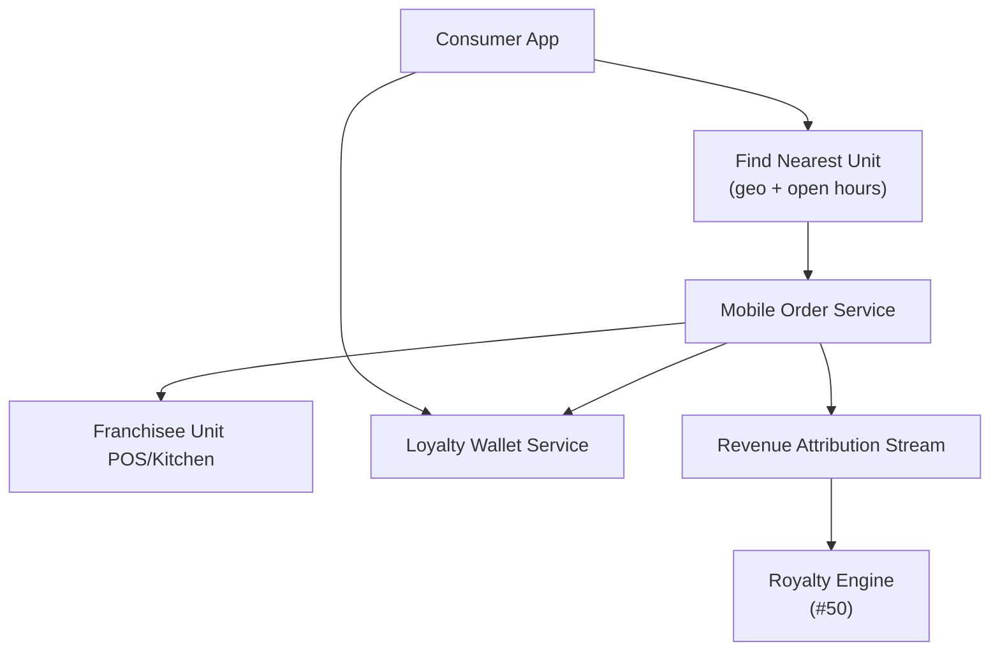

# Problem 61: Franchise Consumer App & Cross-Location Loyalty

> **Franchise Model:** Channels — physical + online; Customer segments

## Business Problem
One **brand consumer app** finds nearest franchisee location, supports **mobile order**, and **loyalty points** earned/redeemed at **any participating unit**. Revenue must **attribute** to correct franchisee for royalty calculation.

## Hard Requirements
- **Geo find nearest** open location.
- Loyalty wallet works cross-location.
- Order revenue **attributed** to fulfilling unit.
- Promo national + local (with franchisor approval).
- 10M users; peak lunch rush ordering.

## Why One Pattern Is Not Enough
| If you only use… | What breaks |
| --- | --- |
| Loyalty siloed per store | Poor UX; low repeat visits |
| National app without revenue attribution | Royalty disputes |
| Mobile order overloads one unit API | Wrong store gets orders |
| Points race on double-submit | Free food fraud |

You need **Geo discovery**, **loyalty saga**, **order routing to unit**, **idempotent checkout**, and **sales attribution stream** to royalty engine.

## Architecture Overview


## Pattern Mix
| Concern | Patterns | Role |
| --- | --- | --- |
| Discovery | [Geospatial](../Scalability_patterns/), [Cache-Aside](../Scalability_patterns/04-cache-aside.md) | Nearest open unit |
| Orders | [Saga](../Distributed_system_patterns/10-saga.md), [Idempotency](../Distributed_system_patterns/20-idempotency.md) | Pay → fulfill → attribute |
| Loyalty | [Event Sourcing](../Data_domain_patterns/15-event-sourcing.md) | Points ledger |
| Peak | [Queue-Based Load Leveling](../Scalability_patterns/09-queue-based-load-leveling.md) | Lunch rush |
| Link | [#54 Menu Control](./54-hq-menu-pricing-promo-control.md) | Prices from HQ |

## Happy-Path Flow
1. User opens app → **geo** finds nearest open unit with wait time estimate.
2. Mobile order placed → routed to **unit kitchen queue** → payment captured.
3. **Loyalty points** earned → wallet updated (valid at any unit).
4. **Attribution event** → unit `locationId` → feeds royalty calc.

## Failure Scenarios
| Failure | Response |
| --- | --- |
| Unit offline for mobile order | Route to next nearest; notify user |
| Points double earn | Idempotent on orderId |
| Wrong attribution | Saga reconcile with POS ticket id |
| National promo + local override | [#54](./54-hq-menu-pricing-promo-control.md) price authority |

## TypeScript Sketch
```typescript
async function placeMobileOrder(userId: string, locationId: string, cart: Cart, idempotencyKey: string) {
  if (await idempotency.exists(idempotencyKey)) return idempotency.result(idempotencyKey);
  const order = await orderSaga.start({ userId, locationId, cart });
  await loyalty.earn(userId, order.points, { idempotencyKey: order.id });
  await attribution.emit({ locationId, orderId: order.id, gross: order.total });
  await idempotency.save(idempotencyKey, order);
  return order;
}
```

## Patterns Used (quick links)
[Saga](../Distributed_system_patterns/10-saga.md) · [Idempotency](../Distributed_system_patterns/20-idempotency.md) · [Event Sourcing](../Data_domain_patterns/15-event-sourcing.md) · [Queue-Based Load Leveling](../Scalability_patterns/09-queue-based-load-leveling.md) · [Cache-Aside](../Scalability_patterns/04-cache-aside.md)
