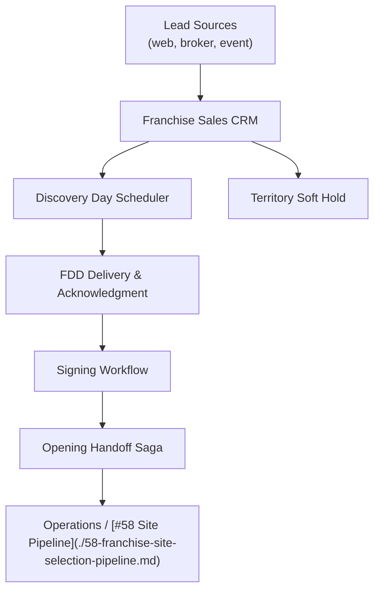

# Problem 62: Franchise Sales & FDD Pipeline

> **Franchise Model:** Key activities — scale the franchise network

## Business Problem
Franchisor **development team** converts leads into signed franchisees. Pipeline: lead → discovery day → **FDD** delivery → signing → **opening timeline**. CRM tracks candidates, territories reserved, and conversion metrics.

## Hard Requirements
- Lead capture from web, brokers, events.
- **FDD** (Franchise Disclosure Document) delivery tracked legally.
- Territory **soft hold** during due diligence.
- Pipeline stages with forecasted signings.
- Handoff to operations when store opens.

## Why One Pattern Is Not Enough
| If you only use… | What breaks |
| --- | --- |
| Spreadsheet pipeline | Lost leads; no FDD audit trail |
| No territory hold | Two candidates same market |
| FDD sent without tracking | Legal exposure |
| Sales and ops disconnected | Signed deal but no opening plan |

You need **CRM state machine**, **document delivery audit**, **territory soft lock**, **handoff saga to ops**, and **CQRS sales forecast**.

## Architecture Overview


## Pattern Mix
| Concern | Patterns | Role |
| --- | --- | --- |
| Pipeline | [State Machine](../Data_domain_patterns/), link [#47 CRM](./47-crm-sales-pipeline.md) | Candidate stages |
| Legal | [Event Sourcing](../Data_domain_patterns/15-event-sourcing.md) | FDD delivery proof |
| Territory | [Distributed Lock](../Distributed_system_patterns/21-distributed-lock.md), link [#56 Territory](./56-territory-area-development.md) | Soft hold |
| Handoff | [Saga](../Distributed_system_patterns/10-saga.md) | Sales → ops |
| Forecast | [CQRS](../Scalability_patterns/06-cqrs.md) | Weighted pipeline |

## Happy-Path Flow
1. Lead enters CRM → assigned franchise development rep.
2. Qualified → **discovery day** → **FDD** sent with read receipt tracked.
3. **Territory soft hold** placed during due diligence window.
4. Signed → **handoff saga** creates franchisee record + kicks **site selection** pipeline.

## Failure Scenarios
| Failure | Response |
| --- | --- |
| FDD not acknowledged | Block signing stage transition |
| Territory hold expires | Notify rep; release or renew |
| Candidate drops | Release hold; archive with reason |
| Duplicate lead | Merge by email; preserve activity history |

## TypeScript Sketch
```typescript
async function advanceCandidate(candidateId: string, toStage: string) {
  const c = await crm.get(candidateId);
  if (toStage === 'SIGNED' && !c.fddAcknowledgedAt) throw new LegalGateError('FDD_NOT_ACK');
  if (toStage === 'DILIGENCE') await territory.softHold(c.territoryId, candidateId, { days: 90 });
  await crm.appendStage(candidateId, toStage);
  if (toStage === 'SIGNED') await handoffSaga.start({ candidateId });
}
```

## Patterns Used (quick links)
[State Machine](../Data_domain_patterns/) · [Event Sourcing](../Data_domain_patterns/15-event-sourcing.md) · [Saga](../Distributed_system_patterns/10-saga.md) · [Distributed Lock](../Distributed_system_patterns/21-distributed-lock.md) · [CQRS](../Scalability_patterns/06-cqrs.md)
