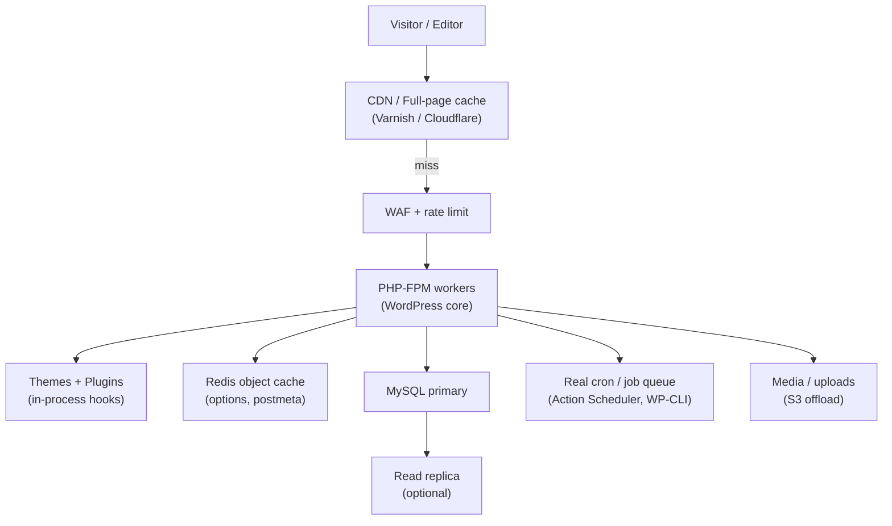

# Problem 63: WordPress (CMS Platform at Scale)

> **Platform type:** Self-hosted / managed CMS · plugin ecosystem · millions of sites

## Business Problem
**WordPress** powers blogs, marketing sites, and WooCommerce stores. Each site is a **PHP monolith** extended by **themes and plugins**, storing content in MySQL (`wp_posts`, postmeta, options). At scale (viral post, enterprise multisite, high plugin count), the classic LAMP stack needs **caching**, **async jobs**, and **careful plugin isolation** without breaking the open ecosystem.

## Hard Requirements
- Page load **< 200 ms** TTFB for cached public pages.
- **Plugin compatibility** — unknown third-party code runs in-process.
- **wp-cron** and async tasks must not block HTTP requests.
- **Multisite** optional: many sites, shared or split DB.
- Security: block SQLi/XSS from plugins; rate-limit `wp-login.php`.

## Why One Pattern Is Not Enough
| If you only use… | What breaks |
| --- | --- |
| Single MySQL for reads + writes | Connection pool exhaustion on traffic spike |
| No object cache | Every page hits DB for options + postmeta |
| Sync wp-cron on page views | Random users trigger batch jobs |
| Page cache without invalidation | Stale content after publish |
| Unlimited plugins on one server | Memory fatals; security blast radius |

You need **full-page cache + CDN**, **Redis object cache**, **real job queue**, **read replicas** (optional), and **edge/WAF** in front.

## Architecture Overview


## Pattern Mix
| Concern | Patterns | Role |
| --- | --- | --- |
| Read scaling | [CDN](../Scalability_patterns/05-cdn.md), [Cache-Aside](../Data_domain_patterns/18-cache-aside.md), [Read Replica](../Scalability_patterns/07-read-replica.md) | Full-page + object cache |
| Writes | [Queue-Based Load Leveling](../Scalability_patterns/09-queue-based-load-leveling.md), [Job Scheduler](../36-job-scheduler.md) | Replace pseudo-cron |
| Media | [Large Blobs](../concerns/06-handling-large-blobs.md), object storage | Offload uploads |
| Multisite | [Multi-Tenant Partitioning](../Data_domain_patterns/21-multi-tenant-partitioning.md) | Site ID scoping |
| Security | [Rate Limiting](../Distributed_system_patterns/18-rate-limiting.md), [Zero Trust](../Security_patterns/01-zero-trust.md) | Login abuse, admin |
| Plugins | [Bulkhead](../Resilience_Pattern/04-bulkhead.md), sandbox via hosting limits | Isolate bad plugin CPU |

## Happy-Path Flow
1. Editor publishes post → invalidates **CDN** + object cache keys for that post URL.
2. Visitor requests URL → **CDN hit** → HTML in < 50 ms.
3. Cache miss → PHP loads post via **object cache** (post + meta) → renders theme → caches page.
4. Background: **job queue** sends newsletter, regenerates sitemap, syncs search index.

## Failure Scenarios
| Failure | Response |
| --- | --- |
| Plugin fatal on every request | Safe mode / disable plugin via filesystem or host tool |
| Redis object cache down | Fall back to DB; alert; degrade gracefully |
| Viral post cache stampede | Single-flight regenerate; warm CDN |
| wp-cron backlog | Move to system cron + dedicated worker |
| DB replication lag | Admin reads primary; public reads replica with short TTL cache |

## TypeScript Sketch
*Conceptual — WordPress is PHP; sketch shows cache-invalidate service.*
```typescript
async function onPostPublished(postId: number, siteUrl: string) {
  const urls = await permalink.urlsForPost(postId);
  await objectCache.deletePattern(`post:${postId}:*`);
  await cdn.purge(urls);
  await jobQueue.enqueue({ type: 'SITEMAP_REGEN', siteUrl });
  await searchIndex.upsertPost(postId);
}
```

## Patterns Used (quick links)
[CDN](../Scalability_patterns/05-cdn.md) · [Cache-Aside](../Data_domain_patterns/18-cache-aside.md) · [Queue-Based Load Leveling](../Scalability_patterns/09-queue-based-load-leveling.md) · [Rate Limiting](../Distributed_system_patterns/18-rate-limiting.md) · [Multi-Tenant Partitioning](../Data_domain_patterns/21-multi-tenant-partitioning.md)

**Related:** [#12 Dropbox](./12-dropbox-file-sync.md) (media) · [#35 Cache](./35-distributed-cache.md) · Concern [Scaling Reads](./concerns/04-scaling-reads.md)
