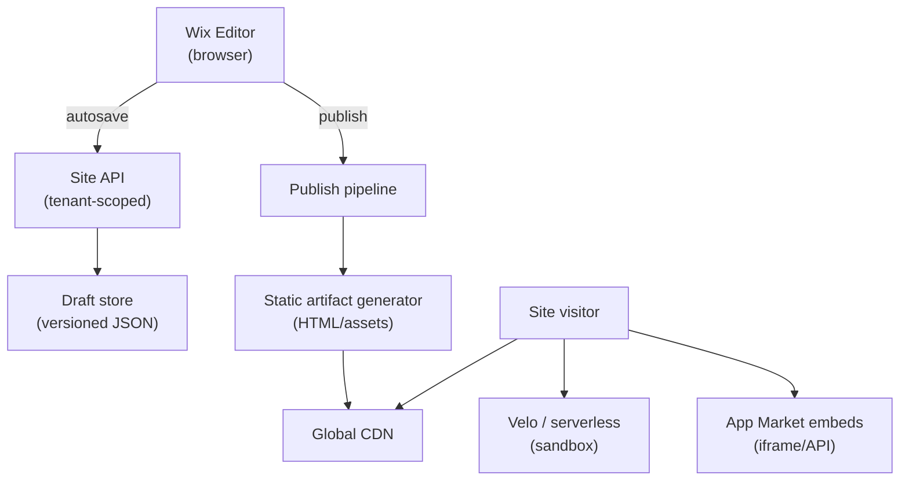

# Problem 64: Wix (Multi-Tenant Website Builder)

> **Platform type:** Hosted SaaS builder · drag-and-drop editor · millions of tenant sites

## Business Problem
**Wix** lets non-technical users build sites in a **visual editor**. Each tenant has isolated **site data** (pages, components, styles, apps). On **Publish**, the site must render fast globally via **CDN**. The editor needs **autosave**, **preview**, and **third-party app** embeds — all multi-tenant at massive scale.

## Hard Requirements
- Editor **autosave** every few seconds without data loss.
- **Publish** propagates to CDN in **< 60 s** worldwide.
- Tenant **hard isolation** — site A never leaks into site B.
- Support **Velo/serverless** user code in sandbox.
- Peak: Black Friday merchant traffic on shared infra.

## Why One Pattern Is Not Enough
| If you only use… | What breaks |
| --- | --- |
| One DB row per widget nested JSON | Huge documents; slow save |
| Render HTML on every request in app tier | Cannot scale millions of sites |
| Sync publish to all edge nodes in HTTP | Publish timeout |
| User code in same process as platform | Security catastrophe |
| No preview vs live separation | Draft leaks to public |

You need **multi-tenant sharding**, **draft vs published snapshots**, **static publish pipeline + CDN**, **event-driven invalidation**, and **sandboxed serverless**.

## Architecture Overview


## Pattern Mix
| Concern | Patterns | Role |
| --- | --- | --- |
| Tenancy | [Multi-Tenant Partitioning](../Data_domain_patterns/21-multi-tenant-partitioning.md), [Sharding](../Scalability_patterns/03-sharding.md) | Per-site data boundary |
| Editor | [Event Sourcing](../Data_domain_patterns/15-event-sourcing.md) or version snapshots | Autosave history |
| Publish | [Pipeline](../Concurrency_patterns/07-pipeline.md), [CDN](../Scalability_patterns/05-cdn.md) | Draft → static → edge |
| Reads | Concern [Scaling Reads](./concerns/04-scaling-reads.md) | CDN-first delivery |
| User code | [Bulkhead](../Resilience_Pattern/04-bulkhead.md), sandbox | Velo isolation |
| Apps | [Adapter](../Structural%20Patterns/Adapter.md), iframe boundaries | Third-party apps |

## Happy-Path Flow
1. User edits hero section → **autosave** appends draft version `v1842`.
2. User clicks **Publish** → pipeline compiles site model → static HTML/JS/CSS bundle.
3. Bundle uploaded to **CDN** origin → cache purge/warm for `user-site.wixsite.com`.
4. Visitor GET → **CDN edge** → no hit on core API.

## Failure Scenarios
| Failure | Response |
| --- | --- |
| Autosave conflict (two tabs) | Last-write-wins with version vector or merge UI |
| Publish pipeline partial fail | Keep previous published version live |
| CDN stale after publish | Versioned asset URLs (`?v=1842`) |
| Velo function timeout | 504 to visitor; log; circuit break repeat offenders |
| Hot tenant DDoS | Rate limit + dedicated shard migration |

## TypeScript Sketch
```typescript
async function publishSite(siteId: string, draftVersion: number) {
  const draft = await draftStore.get(siteId, draftVersion);
  const artifact = await staticGenerator.build(draft);
  const urls = await cdn.deploy(siteId, artifact, { cacheBust: draftVersion });
  await publishedIndex.set(siteId, { version: draftVersion, urls, at: Date.now() });
  return { liveUrl: urls.primary, version: draftVersion };
}
```

## Patterns Used (quick links)
[Multi-Tenant Partitioning](../Data_domain_patterns/21-multi-tenant-partitioning.md) · [CDN](../Scalability_patterns/05-cdn.md) · [Pipeline](../Concurrency_patterns/07-pipeline.md) · [Event Sourcing](../Data_domain_patterns/15-event-sourcing.md) · [Bulkhead](../Resilience_Pattern/04-bulkhead.md)

**Related:** [#6 Multi-Tenant SaaS](./06-multi-tenant-saas-usage-billing.md) · [#34 Google Docs](./34-google-docs-collaboration.md) (editor autosave)
