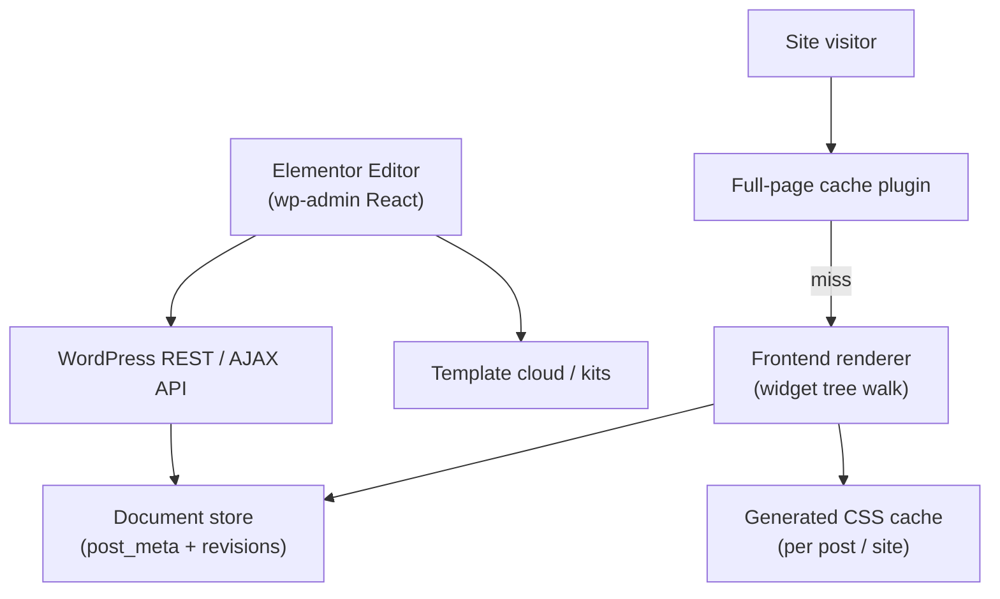

# Problem 65: Elementor (WordPress Page Builder Plugin)

> **Platform type:** WordPress plugin · visual builder · JSON document in post meta

## Business Problem
**Elementor** is a **WordPress plugin** that stores page layout as **JSON widget trees** in `post_meta`, renders them on the frontend, and loads a heavy **editor** in wp-admin. It must coexist with **themes**, **other plugins**, **caching plugins**, and **WooCommerce** — all inside one PHP process per request.

## Hard Requirements
- Editor loads in **< 3 s** on typical hosting.
- Frontend render **compatible** with full-page cache plugins.
- **Template library** sync (cloud kits) without blocking editor.
- Revision / autosave without corrupting JSON document.
- Minimize **N+1 postmeta queries** on complex pages.

## Why One Pattern Is Not Enough
| If you only use… | What breaks |
| --- | --- |
| One giant `_elementor_data` meta per page | Slow save; JSON parse on every view |
| Render all widgets synchronously | TTFB spikes on heavy pages |
| Editor AJAX without nonce/rate limit | CSRF and abuse |
| Cloud template download in render path | Frontend timeout |
| No CSS/asset dedup | 50 widget CSS files per page |

You need **structured document storage**, **generated static CSS cache**, **async template fetch**, **asset pipeline**, and **cache-plugin integration** (exclude editor, cache HTML).

## Architecture Overview


## Pattern Mix
| Concern | Patterns | Role |
| --- | --- | --- |
| Document | Versioned meta, [Event Sourcing](../Data_domain_patterns/15-event-sourcing.md)-lite revisions | Autosave / undo |
| Performance | [Cache-Aside](../Data_domain_patterns/18-cache-aside.md), generated CSS files | Avoid inline bloat |
| Async | [Queue](../Scalability_patterns/09-queue-based-load-leveling.md) | Cloud kit import |
| Integration | [Adapter](../Structural%20Patterns/Adapter.md) | Theme + cache plugin hooks |
| Security | [RBAC](../Security_patterns/), nonces, capability checks | Editor-only mutations |
| Parent platform | See [#63 WordPress](./63-wordpress-cms-platform.md) | Shared infra constraints |

## Happy-Path Flow
1. Designer edits page → **REST** saves JSON document + increments revision.
2. **CSS generator** rebuilds `post-123.css` from widget settings → file cache.
3. Visitor requests page → **full-page cache** miss → WordPress loads template → Elementor renderer walks widget tree → enqueues one CSS file.
4. Next visitor → **full-page cache hit** (HTML includes stable asset URLs).

## Failure Scenarios
| Failure | Response |
| --- | --- |
| Invalid JSON in postmeta | Fallback to last good revision |
| Theme conflict (content width) | Wrapper hooks + compatibility mode |
| Cache plugin serves stale widgets | Purge hooks on `elementor/document/save` |
| Cloud kit import timeout | Background job + editor notification |
| Plugin conflict (duplicate jQuery) | Documented dequeue order / safe mode |

## TypeScript Sketch
*Conceptual render pipeline.*
```typescript
async function renderPage(postId: number): Promise<string> {
  const doc = await docStore.getActive(postId);
  const cssKey = `elementor-css:${postId}:${doc.revision}`;
  if (!(await cssCache.exists(cssKey))) {
    await cssCache.write(cssKey, cssGenerator.fromWidgets(doc.widgets));
  }
  return widgetTree.render(doc.root, { cssUrl: cssCache.url(cssKey) });
}
```

## Patterns Used (quick links)
[Cache-Aside](../Data_domain_patterns/18-cache-aside.md) · [Adapter](../Structural%20Patterns/Adapter.md) · [Queue-Based Load Leveling](../Scalability_patterns/09-queue-based-load-leveling.md) · [Event Sourcing](../Data_domain_patterns/15-event-sourcing.md) · [RBAC](../Security_patterns/)

**Related:** [#63 WordPress](./63-wordpress-cms-platform.md) · [#64 Wix](./64-wix-website-builder.md) (builder comparison) · Concern [Scaling Reads](./concerns/04-scaling-reads.md)
