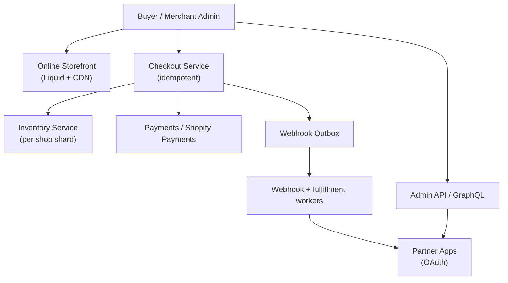

# Problem 66: Shopify (Multi-Tenant Commerce Platform)

> **Platform type:** Hosted e-commerce SaaS · one shop = tenant · checkout + app ecosystem

## Business Problem
**Shopify** hosts **millions of merchant stores** on shared platform infrastructure. Each shop has products, inventory, themes (Liquid), checkout, and **apps** (OAuth, webhooks, Admin GraphQL). Flash sales can spike **checkout and inventory** for one shop without affecting others.

## Hard Requirements
- **Shop isolation** — merchant A never reads B's orders.
- Checkout **idempotent** — refresh/double-submit safe.
- **Inventory** no oversell on limited drops.
- **Webhooks** to apps: reliable, signed, retried.
- Theme storefront **CDN-cached**; Admin/API authenticated separately.

## Why One Pattern Is Not Enough
| If you only use… | What breaks |
| --- | --- |
| Shared inventory row global lock | One drop blocks all merchants |
| Sync webhook in checkout thread | App timeout blocks purchase |
| Single DB for admin + storefront reads | Hot SKU melts primary |
| No idempotency on payment | Double charge on retry |
| Apps with full DB access | Tenant leak; platform risk |

You need **shop-scoped sharding**, **checkout saga**, **inventory reservation**, **Outbox webhooks**, **Storefront CDN**, and **API rate limits per shop/app**.

## Architecture Overview


## Pattern Mix
| Concern | Patterns | Role |
| --- | --- | --- |
| Tenancy | [Multi-Tenant Partitioning](../Data_domain_patterns/21-multi-tenant-partitioning.md), `shop_id` everywhere | Hard shop boundary |
| Checkout | [Saga](../Distributed_system_patterns/10-saga.md), [Idempotency](../Distributed_system_patterns/20-idempotency.md) | Pay + order + inventory |
| Inventory | [Distributed Lock](../Distributed_system_patterns/21-distributed-lock.md), compare-and-set | Limited stock drops |
| Apps | [Outbox](../Distributed_system_patterns/11-outbox-pattern.md), HMAC webhooks | Reliable app events |
| Storefront | [CDN](../Scalability_patterns/05-cdn.md), [CQRS](../Scalability_patterns/06-cqrs.md) | Cache catalog pages |
| API | [Rate Limiting](../Distributed_system_patterns/18-rate-limiting.md), [Token Bucket](../Distributed_system_patterns/22-token-bucket.md) | Per shop/app quotas |
| Extensions | Shopify Functions (discount, validation) | Sandboxed business rules |

## Happy-Path Flow
1. Buyer adds limited sneaker → **Storefront CDN** serves product page.
2. Checkout starts with **Idempotency-Key** → **reserve** inventory line (TTL 10 min).
3. Payment succeeds → **saga** creates order, commits inventory, enqueues **Outbox** `orders/create` webhooks.
4. Merchant app receives signed webhook → fulfills via Admin API.

## Failure Scenarios
| Failure | Response |
| --- | --- |
| Payment OK, order create fails | Idempotent retry; never double-sell |
| Webhook app down | Outbox retries; merchant polls Admin API |
| Inventory race on 1 unit | One reservation wins; other checkout error |
| Shop traffic 100× ( celebrity drop ) | Shop shard scale; queue checkout admission |
| App OAuth token leaked | Rotate; scoped permissions; audit |

## TypeScript Sketch
```typescript
async function checkoutComplete(
  shopId: string,
  cartId: string,
  paymentRef: string,
  idempotencyKey: string,
) {
  if (await idempotency.exists(idempotencyKey)) return idempotency.result(idempotencyKey);

  const order = await db.transaction(async (tx) => {
    await inventory.commitReservation(shopId, cartId, tx);
    const o = await tx.orders.create({ shopId, cartId, paymentRef });
    await tx.outbox.insert({ shopId, topic: 'orders/create', payload: o });
    return o;
  });
  await idempotency.save(idempotencyKey, order);
  return order;
}
```

## Patterns Used (quick links)
[Multi-Tenant Partitioning](../Data_domain_patterns/21-multi-tenant-partitioning.md) · [Saga](../Distributed_system_patterns/10-saga.md) · [Idempotency](../Distributed_system_patterns/20-idempotency.md) · [Outbox](../Distributed_system_patterns/11-outbox-pattern.md) · [CDN](../Scalability_patterns/05-cdn.md)

**Related:** [#1 E-Commerce](./01-scaling-ecommerce-notifications.md) · [#10 Inventory](./10-global-inventory-sync.md) · [#37 Payment](./37-payment-system.md) · [#6 Multi-Tenant Billing](./06-multi-tenant-saas-usage-billing.md)
