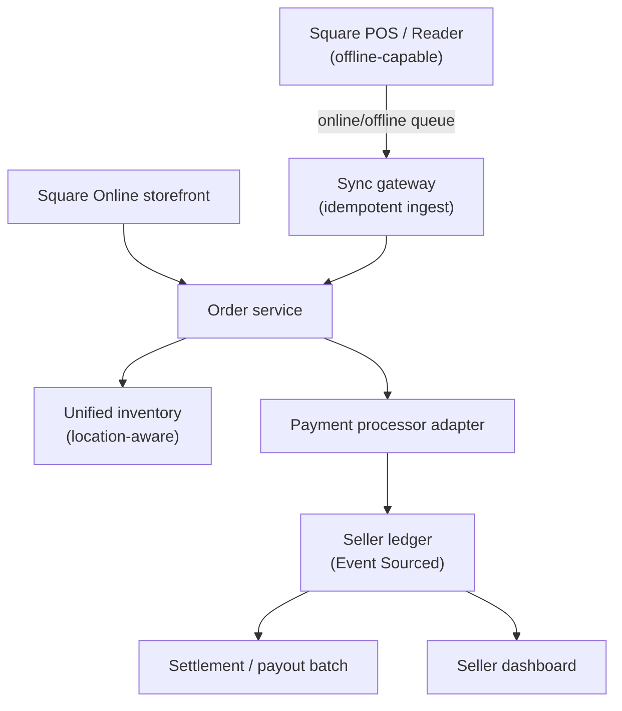

# Problem 67: Square (POS + Payments + Commerce)

> **Platform type:** Unified seller platform · in-person POS · online · payments ledger

## Business Problem
**Square** gives sellers **card readers**, **POS apps**, **online stores**, and **payroll/invoices** in one ecosystem. A coffee shop swipes cards **offline-capable**, syncs orders to cloud, and shares **inventory** with their Square Online site. Money movement must match **processor settlement** with **audit-grade ledger**.

## Hard Requirements
- **Offline POS** — queue transactions; sync when online.
- **No double capture** on retry after flaky WiFi.
- **Unified catalog** — item sold in-store decrements online stock.
- Sub-second **card auth** at peak lunch.
- **Multi-location** roll-up for franchise-style sellers.

## Why One Pattern Is Not Enough
| If you only use… | What breaks |
| --- | --- |
| Online and store inventory separate | Oversell across channels |
| Sync payment only when cloud reachable | Lost sales or duplicate charges |
| One ledger table per seller unsharded | Hot merchant at festival |
| Webhook-only reconciliation | Gaps vs processor statement |
| No idempotency on mobile sync | Duplicate orders same receipt |

You need **offline store-and-forward**, **idempotent sync**, **inventory saga across channels**, **event-sourced ledger**, and **multi-location hierarchy**.

## Architecture Overview


## Pattern Mix
| Concern | Patterns | Role |
| --- | --- | --- |
| Offline | [Store-and-Forward](../Messaging_Integration_patterns/), client queue | POS without WiFi |
| Sync | [Idempotency](../Distributed_system_patterns/20-idempotency.md), [Inbox](../Distributed_system_patterns/12-inbox-pattern.md) | Dedup mobile replay |
| Inventory | [Saga](../Distributed_system_patterns/10-saga.md), link [#10 Inventory](./10-global-inventory-sync.md) | Cross-channel stock |
| Payments | [Outbox](../Distributed_system_patterns/11-outbox-pattern.md), [Circuit Breaker](../Resilience_Pattern/01-circuit-breaker.md) | Processor + ledger |
| Audit | [Event Sourcing](../Data_domain_patterns/15-event-sourcing.md) | Disputes, payouts |
| Multi-location | [Multi-Tenant Partitioning](../Data_domain_patterns/21-multi-tenant-partitioning.md) | Seller → locations |
| Real-time | Concern [Real-Time Updates](./concerns/01-real-time-updates.md) | Dashboard sales tick |

## Happy-Path Flow
1. Barista swipes card on POS → **auth** locally cached if offline → receipt printed.
2. When online, POS **syncs** order with client-generated **idempotency key**.
3. **Inventory** decrements beans SKU at `locationId=42`; online catalog projection updates.
4. End of day → **ledger** events reconcile to processor batch → **payout** to seller bank.

## Failure Scenarios
| Failure | Response |
| --- | --- |
| Duplicate sync same offline order | Idempotent on device txn ID |
| Auth offline but capture fails later | Void/compensate; notify seller |
| Online sale last unit while in-store ring | Reservation or oversell alert |
| Processor settlement mismatch | Reconciliation job; hold payout |
| Festival seller hot shard | Scale seller partition; bulkhead POS ingest |

## TypeScript Sketch
```typescript
async function ingestPosOrder(sellerId: string, order: OfflineOrder) {
  const key = `pos:${order.deviceId}:${order.clientTxnId}`;
  if (await inbox.seen(key)) return inbox.result(key);

  const result = await orderSaga.complete({
    sellerId,
    locationId: order.locationId,
    lines: order.lines,
    paymentRef: order.paymentRef,
  });
  await inbox.record(key, result);
  await inventory.apply(sellerId, order.locationId, order.lines);
  return result;
}
```

## Patterns Used (quick links)
[Idempotency](../Distributed_system_patterns/20-idempotency.md) · [Event Sourcing](../Data_domain_patterns/15-event-sourcing.md) · [Saga](../Distributed_system_patterns/10-saga.md) · [Outbox](../Distributed_system_patterns/11-outbox-pattern.md) · [Multi-Tenant Partitioning](../Data_domain_patterns/21-multi-tenant-partitioning.md)

**Related:** [#37 Payment](./37-payment-system.md) · [#3 Settlement](./03-payment-settlement-platform.md) · [#66 Shopify](./66-shopify-commerce-platform.md) · [#50 Franchise royalty](./50-franchise-royalty-fee-engine.md) (multi-location)
