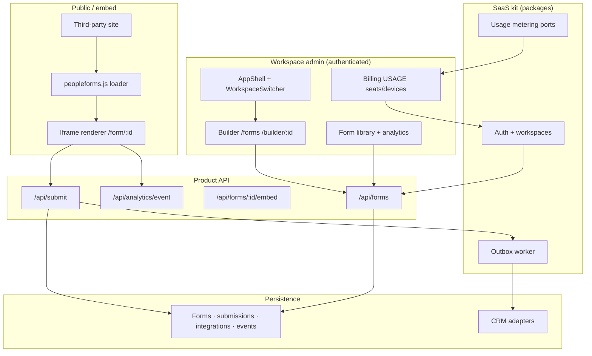

# Problem 68: PeopleForms — Visual Form Builder on Dual-Mode SaaS

> **Product reference:** [PeopleForms](https://github.com/llanesleonardo/formBuilder) (`@peopleforms/people-forms`) — reference implementation on `@llanesleonardo/create-saas` + SaaS kit.  
> **Ground truth in that repo:** `docs/Development/architecture-overview.md` · `docs/Development/dual-mode-overview.md`

## Business Problem

Teams need to **design**, **publish**, and **embed** lead-capture forms without engineering for every campaign. PeopleForms combines:

- A **drag-and-drop builder** and **form library** (share links, analytics).
- A **public renderer** plus **embed/popup widgets** on third-party sites.
- **Workspace-scoped** data on a shared SaaS kit (auth, billing, AppShell).
- **Consent + policy** fields, **CRM fan-out**, and **usage metering** (seats, signed-in devices).

The hard part is not one form page — it is **schema evolution**, **cross-origin embed security**, **async integrations**, and **tenant isolation** on one codebase that also runs **self-hosted** (matrix billing, no Stripe checkout).

## Hard Requirements

- **FormSchema contract** — builder produces JSON; renderer and API validate the same shape; submissions store a **schema snapshot** when fields change.
- **Workspace tenancy** — every form, submission, integration scoped; no cross-workspace reads.
- **Public embed surface** — iframe loader, CORS allow-list, optional targeting (UTM, visitor type, session dismiss).
- **Consent / opt-in** — required consent linked to uploaded policies; opt-in for marketing lists.
- **CRM dispatch** — Mailchimp / Constant Contact / Zoho (and fake adapter for tests) without blocking submit.
- **Analytics** — view / start / submit funnel by surface (`hosted` | `embed` | `popup`); server-only submit counts.
- **Dual-mode billing** — SaaS: Stripe checkout + usage; self-hosted: plan matrix + invoices, live seat/device counts.
- **Kit boundaries** — consume `@llanesleonardo/saas-platform` + `saas-product-shell`; domain logic stays in product routes/APIs.

## Why One Pattern Is Not Enough

| If you only use… | What breaks |
| --- | --- |
| Single JSON blob, no snapshot | Old submissions unreadable after field edits |
| Sync CRM call in submit handler | Timeouts; partial saves; angry users |
| `*` CORS on all forms | CSRF / data exfil on embed abuse |
| Shared DB without workspace column | Tenant leak |
| Client-only `form_submit` events | Inflated conversion metrics |
| Fork shell auth/billing in-app | Kit upgrades impossible; dual-mode drift |

You need **schema versioning**, **outbox/worker** for integrations, **CORS + origin policy**, **multi-tenant partitioning**, **event pipeline for analytics**, **Adapter** per CRM, and **CQRS-style** billing usage reads — orchestrated through the SaaS kit, not reimplemented.

## Architecture Overview



## Pattern Mix

| Concern | Patterns | Role in PeopleForms |
| --- | --- | --- |
| Contract | [Schema validation](../Data_domain_patterns/), [Versioning](../Data_domain_patterns/) | `FormSchema` + snapshot on submit |
| Tenancy | [Multi-Tenant Partitioning](../Data_domain_patterns/21-multi-tenant-partitioning.md), [ABAC](../Security_patterns/03-abac.md) | Workspace id on all rows; shell proxy gates |
| Public surface | [BFF](../Architectural%20Patterns/BFF.md), [CORS policy](../Security_patterns/) | Embed config API; origin allow-list |
| Distribution | [Adapter](../Structural%20Patterns/Adapter.md), iframe isolation | `peopleforms.js` + hosted Next renderer |
| Integrations | [Outbox](../Distributed_system_patterns/11-outbox-pattern.md), [Queue](../Messaging_Integration_patterns/02-queue.md) | Worker dispatches CRM after commit |
| Analytics | [Event Streaming](../Messaging_Integration_patterns/09-event-streaming.md), [Materialized View](../Data_domain_patterns/16-materialized-view.md) | `form_events` + funnel rollups |
| Billing | [CQRS](../Scalability_patterns/06-cqrs.md), [Adapter](../Structural%20Patterns/Adapter.md) | Usage projection; Stripe vs matrix dual-mode |
| Resilience | [Idempotency](../Distributed_system_patterns/20-idempotency.md), [Retry](../Resilience_patterns/) | Submit idempotency; CRM retry in worker |
| Growth | [Feature flags](./42-feature-flags-experimentation.md) (concept) | Targeting rules on embed/popup |
| Compliance | [Policy storage](./concerns/06-handling-large-blobs.md) | PDF policies; consent field linkage |

## Happy-Path Flow

1. Admin in workspace opens **builder** → saves `FormSchema` + theme + publish settings.
2. **Library** exposes share URL `/form/{id}` and embed snippets.
3. Visitor on partner site loads **loader** → **iframe** renders form; `form_view` / `form_start` recorded.
4. Submit → API **validates against live schema**, persists answers + **schema snapshot**, enqueues **outbox** job.
5. Worker **Adapter** pushes lead to configured CRM; server emits **form_submit** once.
6. Billing job reads **seat + device** counts via kit metering for invoice line items.

## Failure Scenarios

| Failure | Response |
| --- | --- |
| Schema changed after publish | Renderer uses current schema; submissions keep snapshot for audit |
| CRM API down | Outbox retries; submission still saved; integration log |
| Disallowed embed origin | 403 on embed API; no iframe config leaked |
| Duplicate submit (double-click) | Idempotency key or client guard + server dedupe window |
| Self-hosted without Stripe | Matrix plan + manual invoice; same usage meters |
| Hot form on viral embed | Scale reads (form config CDN/cache); async analytics writes |

## TypeScript Sketch

```typescript
// Submit: validate, snapshot, persist, enqueue — never block on CRM
async function submitForm(formId: string, answers: Record<string, unknown>, meta: SubmitMeta) {
  const form = await db.getFormById(formId);
  if (!form) throw new NotFoundError();

  assertOriginAllowed(meta.origin, form.publishSettings?.allowedOrigins);

  const validated = validateAndSanitizeSubmission(form.schema, answers);
  const submission = await db.createSubmission({
    formId,
    answers: validated,
    schemaSnapshot: form.schema,
  });

  await outbox.enqueue({
    type: "crm.dispatch",
    workspaceId: form.workspaceId,
    submissionId: submission.id,
  });

  await analytics.recordSubmit({ formId, surface: meta.surface }); // server-only
  return submission;
}
```

## Related SEP Problems

| Lens | Read |
| --- | --- |
| Lead capture / CRM | [#47 CRM & Sales Pipeline](./47-crm-sales-pipeline.md) |
| SaaS metering | [#6 Multi-Tenant SaaS Usage Billing](./06-multi-tenant-saas-usage-billing.md) |
| Embeds & third-party JS | [#15 Facebook News Feed](./15-fb-news-feed.md) · [#65 Elementor](./65-elementor-page-builder-plugin.md) |
| Cross-cutting | [Scaling writes](./concerns/05-scaling-writes.md) · [Multi-step processes](./concerns/03-multi-step-processes.md) |

## Patterns Used (quick links)

[Multi-Tenant Partitioning](../Data_domain_patterns/21-multi-tenant-partitioning.md) · [Outbox](../Distributed_system_patterns/11-outbox-pattern.md) · [Adapter](../Structural%20Patterns/Adapter.md) · [CQRS](../Scalability_patterns/06-cqrs.md) · [Idempotency](../Distributed_system_patterns/20-idempotency.md) · [Event Streaming](../Messaging_Integration_patterns/09-event-streaming.md) · [ABAC](../Security_patterns/03-abac.md)

## Agent Notes

- Use this file for **pattern composition**; read the product’s `docs/Development/` and `src/` for **what shipped today**.
- Do not rewrite shell/platform tenancy or billing — extend domain under product paths only (see **saas-kit-protect** in scaffold rules).
