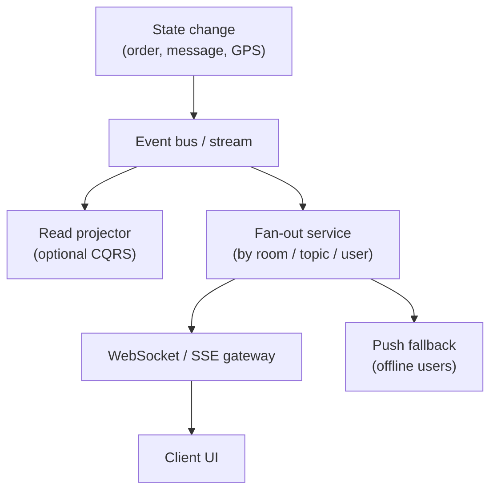

# Concern: Real-Time Updates

Push fresh state to clients in seconds — without melting your database.

> **Cross-cutting lens** — maps to many [problems](../INDEX.md) and [patterns](../../Scalability_patterns/INDEX.md). Learning doc only.

## What this concern means

Users expect **live** data: chat messages, delivery map pins, stock prices, live comments, collaborative cursors. "Real-time" usually means **sub-second to few-second** delivery, not necessarily microsecond latency.

### Typical symptoms

- Client polls REST every 2s → DB overload
- WebSocket hub is one giant process → can't scale viral stream
- Stale ETA on delivery map → support calls
- User sees own message twice or out of order

## Why one approach is not enough

| If you only use… | What breaks |
| --- | --- |
| HTTP polling | N × users RPS; battery drain; stale UI |
| Single WebSocket server | Hot event (live stream) melts one node |
| Push full row on every tick | Bandwidth and serialization cost |
| No presence / subscription model | Fan-out to offline users wastes work |

You need **Pub/Sub or event stream**, **WebSocket/SSE gateway**, **CQRS read projections**, **delta updates**, and **push fallback** (FCM/APNs).

## Architecture pattern (generic)

## Pattern mix

| Concern | Patterns | Role |
| --- | --- | --- |
| Transport | [Pub/Sub](../Messaging_Integration_patterns/01-publish-subscribe.md), [Event Notification](../Messaging_Integration_patterns/10-event-notification.md) | Topic per room/order |
| Connection | WebSocket / SSE at edge | Persistent client channel |
| Read path | [CQRS](../Scalability_patterns/06-cqrs.md) | Write DB ≠ push payload |
| Scale | [Partitioning](../Scalability_patterns/02-partitioning.md), shard by `roomId` | Viral stream isolation |
| Offline | [Queue](../Messaging_Integration_patterns/02-queue.md), push adapters | Store-and-forward |
| Resilience | [Load Shedding](../Resilience_Pattern/08-load-shedding.md) | Sample low-priority viewers |

## Problems in this repo that exercise it

| Problem | What updates in real time |
| --- | --- |
| [#7 Chat](../07-realtime-chat-notifications.md) | Messages, unread counts |
| [#18 WhatsApp](../18-whatsapp.md) | Delivery receipts, multi-device |
| [#4 / #13 / #23 Delivery & Uber](../04-food-delivery-dispatch.md) | Order status, GPS, ETA |
| [#20 Live Comments](../20-fb-live-comments.md) | Comment stream on viral video |
| [#33 Robinhood](../33-robinhood-trading.md) | Quote ticks |
| [#34 Google Docs](../34-google-docs-collaboration.md) | Keystrokes, cursors |
| [#29 Strava](../29-strava-fitness-tracking.md) | Activity feed, live segments |

## Step 3 — Mini design drill

**Design drill (5 min):** Food delivery app — customer sees driver on map. List: (1) event source, (2) topic key, (3) why not poll every 1s, (4) one failure if WebSocket drops.

## Before testing (naive failures)

| Naive build | Symptom before tests | Fix |
| --- | --- | --- |
| Poll `GET /order` every second | DB CPU graph spikes at dinner | WebSocket + event on status change |
| Broadcast GPS to all users | Wrong privacy + wasted bandwidth | Subscribe only to `order:{id}` |
| Full order JSON every GPS tick | Mobile data + janky map | Delta: `{ lat, lng, eta }` only |

## Related exercises

[48 Helpdesk](../exercises/48-helpdesk.md) (agent notify) · Problem [#7](../07-realtime-chat-notifications.md)

## Quick pattern links

[Pub/Sub](../Messaging_Integration_patterns/01-publish-subscribe.md), [Event Notification](../Messaging_Integration_patterns/10-event-notification.md) · WebSocket / SSE at edge · [CQRS](../Scalability_patterns/06-cqrs.md)
