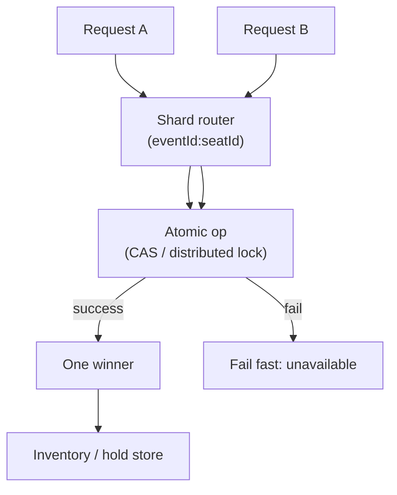

# Concern: Dealing with Contention

Many actors want the same resource at once — exactly one must win.

> **Cross-cutting lens** — maps to many [problems](../INDEX.md) and [patterns](../../Scalability_patterns/INDEX.md). Learning doc only.

## What this concern means

**Contention** happens when concurrent requests compete for one ** scarce resource**: a seat, a bin qty, a match pair, an auction lot, inventory row, or hot cache key. Goal: **correctness first** (no double sell), then **throughput** (don't serialize the world).

### Typical symptoms

- Two users "success" on same seat
- Inventory goes negative
- DB deadlocks on hot rows
- p99 latency spikes when one key is hot

## Why one approach is not enough

| If you only use… | What breaks |
| --- | --- |
| Global DB table lock | Entire site serializes |
| Optimistic lock without retry UX | Random "try again" for users |
| Lock entire event/warehouse | Throughput collapses |
| Application-level mutex on one server | Multi-node race remains |

You need **Fine-grained locks**, **compare-and-set**, **sharding** to spread hot keys, **fail-fast** UX, and **idempotent retries**.

## Architecture pattern (generic)

## Pattern mix

| Concern | Patterns | Role |
| --- | --- | --- |
| Atomicity | [Distributed Lock](../Distributed_system_patterns/21-distributed-lock.md), compare-and-set | Per resource key |
| Partition | [Sharding](../Scalability_patterns/03-sharding.md), [Partitioning](../Scalability_patterns/02-partitioning.md) | Spread hot sections |
| UX | [Fail Fast](../Resilience_Pattern/05-fail-fast.md) | Immediate "taken" |
| Retry | [Idempotency](../Distributed_system_patterns/20-idempotency.md) | Safe client retry |
| Audit | [Event Sourcing](../Data_domain_patterns/15-event-sourcing.md) | Prove who won |

## Problems in this repo that exercise it

| Problem | What's contended |
| --- | --- |
| [#2 Ticketmaster](../02-ticketmaster-style-event-booking.md) | Same seat |
| [#16 Tinder](../16-tinder.md) | Mutual match creation |
| [#30 Auction](../30-online-auction.md) | High bid |
| [#10 Inventory](../10-global-inventory-sync.md) | Stock qty |
| [#45 Fulfillment](../45-order-fulfillment-pick-pack-ship.md) | Bin pick qty |
| [#4 / #23 Dispatch](../23-uber-ride-hailing.md) | Assign driver to order |

## Step 3 — Mini design drill

**Design drill:** 500k users, 1 seat left. Where is the lock key? Why not lock the whole venue?

## Before testing (naive failures)

| Naive build | Symptom | Fix |
| --- | --- | --- |
| `UPDATE ... WHERE available` race | Two tickets same seat | CAS on `seatId` |
| Redis LOCK global | 1 op/sec worldwide | Shard by section |
| No idempotent hold retry | Duplicate holds same user | Idempotency-Key |

## Related exercises

[02 Ticketmaster](../exercises/02-ticketmaster.md) · [45 Fulfillment](../exercises/45-order-fulfillment-pick-pack-ship.md)

## Quick pattern links

[Distributed Lock](../Distributed_system_patterns/21-distributed-lock.md), compare-and-set · [Sharding](../Scalability_patterns/03-sharding.md), [Partitioning](../Scalability_patterns/02-partitioning.md) · [Fail Fast](../Resilience_Pattern/05-fail-fast.md)
