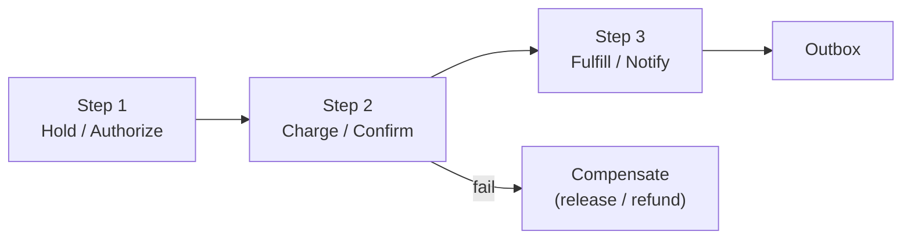

# Concern: Multi-Step Processes

Business flows span services and time — one HTTP call cannot own the whole story.

> **Cross-cutting lens** — maps to many [problems](../INDEX.md) and [patterns](../../Scalability_patterns/INDEX.md). Learning doc only.

## What this concern means

A **multi-step process** crosses **multiple services or minutes/hours**: place order → pay → ship → notify; hold seat → charge → issue ticket; approve PO → receive → match invoice → pay. Steps can **fail independently**; you need clear **state**, **compensation**, and **at-least-once safety**.

### Typical symptoms

- User charged but order not created
- Payment OK, ticket never emailed
- Stuck in `PENDING` forever
- Duplicate side effects on retry

## Why one approach is not enough

| If you only use… | What breaks |
| --- | --- |
| One big synchronous HTTP chain | Cascading timeouts; partial failure orphan |
| Fire-and-forget after step 1 | No recovery; lost money/data |
| Manual ops to fix stuck rows | Doesn't scale; no audit |
| Retry whole chain blindly | Double charge / double ship |

You need **Saga** (orchestrated/choreographed), **state machine**, **Outbox**, **idempotency**, **Job Scheduler** for timeouts.

## Architecture pattern (generic)

## Pattern mix

| Concern | Patterns | Role |
| --- | --- | --- |
| Orchestration | [Saga](../Distributed_system_patterns/10-saga.md), state machine | Forward + compensate |
| Messaging | [Outbox](../Distributed_system_patterns/11-outbox-pattern.md), [Inbox](../Distributed_system_patterns/12-inbox-pattern.md) | Reliable handoff |
| Safety | [Idempotency](../Distributed_system_patterns/20-idempotency.md) | Each step once |
| Time | [Job Scheduler](../36-job-scheduler.md), [Timeout](../Resilience_Pattern/03-timeout.md) | Hold expiry, SLA |
| Audit | [Event Sourcing](../Data_domain_patterns/15-event-sourcing.md) | Replay disputes |

## Problems in this repo that exercise it

| Problem | Multi-step flow |
| --- | --- |
| [#2 Ticketmaster](../02-ticketmaster-style-event-booking.md) | Hold → pay → ticket → email |
| [#3 / #37 Payment](../37-payment-system.md) | Auth → capture → ledger → webhook |
| [#4 Delivery](../04-food-delivery-dispatch.md) | Order → assign → deliver → settle |
| [#43 Procurement](../43-supplier-portal-procurement.md) | RFQ → PO → receive → 3-way match |
| [#49 Returns](../49-returns-reverse-logistics.md) | RMA → receive → restock → refund |
| [#62 FDD Pipeline](../62-franchise-sales-fdd-pipeline.md) | Lead → FDD → sign → open |

## Step 3 — Mini design drill

**Design drill:** Payment succeeds, confirm inventory fails. List compensate actions in order. What does client retry?

## Before testing (naive failures)

| Naive build | Symptom | Fix |
| --- | --- | --- |
| No idempotency on charge | Double charge on retry | Idempotency-Key per step |
| Email in same TX as payment | Lost ticket if SMTP slow | Outbox worker |
| No timeout on hold | Seats locked forever | Scheduler release job |

## Related exercises

[37 Payment](../exercises/37-payment-system.md) · [#2](../02-ticketmaster-style-event-booking.md)

## Quick pattern links

[Saga](../Distributed_system_patterns/10-saga.md), state machine · [Outbox](../Distributed_system_patterns/11-outbox-pattern.md), [Inbox](../Distributed_system_patterns/12-inbox-pattern.md) · [Idempotency](../Distributed_system_patterns/20-idempotency.md)
