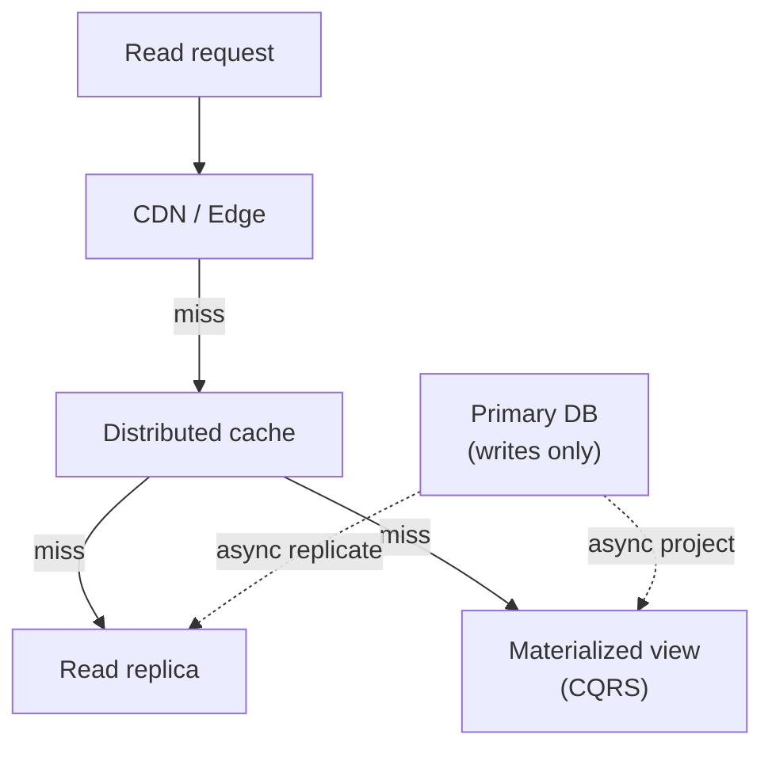

# Concern: Scaling Reads

Serve millions of reads without copying every read to the primary database.

> **Cross-cutting lens** — maps to many [problems](../INDEX.md) and [patterns](../../Scalability_patterns/INDEX.md). Learning doc only.

## What this concern means

Most apps are **read-heavy**: feeds, search, product pages, seat maps, dashboards. **Scaling reads** means adding **caches, replicas, CDNs, and precomputed projections** so read traffic doesn't crush the write DB.

### Typical symptoms

- Homepage slow while writes fine
- Replica lag → users see stale feed
- Cache stampede on hot key expiry
- Search timeouts under load

## Why one approach is not enough

| If you only use… | What breaks |
| --- | --- |
| Single primary for all reads | Connection pool exhaustion |
| Cache with no invalidation | Stale prices forever |
| Read replica for critical money read | Stale balance |
| Materialize on every request | CPU meltdown on dashboard |

You need **Cache-aside**, **read replicas**, **CDN**, **CQRS projections**, **eventual consistency** where acceptable.

## Architecture pattern (generic)

## Pattern mix

| Concern | Patterns | Role |
| --- | --- | --- |
| Edge | [CDN](../Scalability_patterns/05-cdn.md) | Static + cacheable API |
| Cache | [Cache-Aside](../Data_domain_patterns/18-cache-aside.md), [Distributed Cache](../Scalability_patterns/08-distributed-cache.md) | Hot keys |
| DB reads | [Read Replica](../Scalability_patterns/07-read-replica.md), [Replication](../Scalability_patterns/04-replication.md) | Scale SELECT |
| Complex reads | [CQRS](../Scalability_patterns/06-cqrs.md), [Materialized View](../Data_domain_patterns/16-materialized-view.md) | Feeds, dashboards |
| Consistency | [Eventual Consistency](../Distributed_system_patterns/12-eventual-consistency.md) | Accept lag for reads |

## Problems in this repo that exercise it

| Problem | Read-heavy surface |
| --- | --- |
| [#11 Bitly](../11-bitly-url-shortener.md) | Redirect lookup |
| [#15 News Feed](../15-fb-news-feed.md) | Home timeline |
| [#21 Post Search](../21-fb-post-search.md) | Search results |
| [#28 Yelp](../28-yelp-local-discovery.md) | Geo + review search |
| [#35 Cache](../35-distributed-cache.md) | Generic read scaling |
| [#55 Multi-Unit Dashboard](../55-multi-unit-franchisee-dashboard.md) | Roll-up metrics |

## Step 3 — Mini design drill

**Design drill:** 10M users open feed. Draw read path without hitting primary DB.

## Before testing (naive failures)

| Naive build | Symptom | Fix |
| --- | --- | --- |
| No TTL on cache | Stale promo price | TTL + invalidate on write |
| Stampede on expiry | DB cliff every hour | Single-flight lock |
| Dashboard SUM on raw events | Query timeout | Materialized view |

## Related exercises

[35 Distributed Cache](../exercises/35-distributed-cache.md)

## Quick pattern links

[CDN](../Scalability_patterns/05-cdn.md) · [Cache-Aside](../Data_domain_patterns/18-cache-aside.md), [Distributed Cache](../Scalability_patterns/08-distributed-cache.md) · [Read Replica](../Scalability_patterns/07-read-replica.md), [Replication](../Scalability_patterns/04-replication.md)
