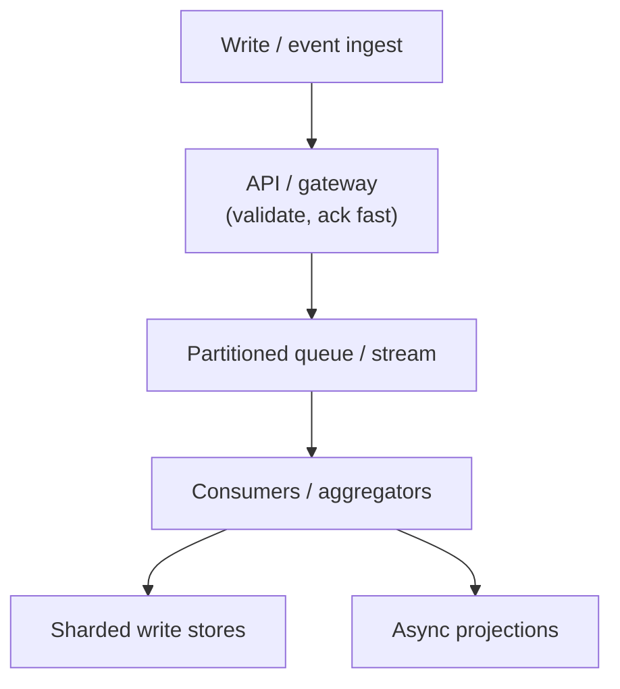

# Concern: Scaling Writes

Ingest firehoses of events and commands without serializing through one row.

> **Cross-cutting lens** — maps to many [problems](../INDEX.md) and [patterns](../../Scalability_patterns/INDEX.md). Learning doc only.

## What this concern means

**Write scaling** is the hard path: clicks, messages, metrics, sales events, GPS pings. Techniques: **partition**, **append-only logs**, **async queues**, **batching**, and **avoid hot primary rows**.

### Typical symptoms

- Single Kafka partition lagging
- One `UPDATE counters` row locks
- API slow because sync write to analytics
- Shard rebalancing pain at growth

## Why one approach is not enough

| If you only use… | What breaks |
| --- | --- |
| One INSERT table for all clicks | Write ceiling in hours |
| Sync counter increment in API | Latency + lock contention |
| Random UUID partition key | Can't aggregate efficiently |
| Scale-up only bigger DB | Cost cliff |

You need **Event streaming**, **partition by key**, **queue load leveling**, **CQRS** (write log, read aggregate), **batch writers**.

## Architecture pattern (generic)

## Pattern mix

| Concern | Patterns | Role |
| --- | --- | --- |
| Buffer | [Queue-Based Load Leveling](../Scalability_patterns/09-queue-based-load-leveling.md), [Event Streaming](../Messaging_Integration_patterns/09-event-streaming.md) | Decouple ingest |
| Partition | [Sharding](../Scalability_patterns/03-sharding.md), [Partitioning](../Scalability_patterns/02-partitioning.md) | Key = userId, campaignId |
| Read side | [CQRS](../Scalability_patterns/06-cqrs.md) | Don't query raw firehose |
| Idempotency | [Idempotency](../Distributed_system_patterns/20-idempotency.md) | Dedup at-least-once |
| Scale | [Competing Consumers](../Messaging_Integration_patterns/08-competing-consumers.md) | Horizontal workers |

## Problems in this repo that exercise it

| Problem | Write firehose |
| --- | --- |
| [#26 Ad Clicks](../26-ad-click-aggregator.md) | Click/impression stream |
| [#38 Metrics](../38-metrics-monitoring.md) | Time-series points |
| [#20 Live Comments](../20-fb-live-comments.md) | Comment append log |
| [#18 WhatsApp](../18-whatsapp.md) | Message ingress |
| [#22 Top K](../22-youtube-top-k.md) | View events |
| [#6 Billing meter](../06-multi-tenant-saas-usage-billing.md) | Usage events |

## Step 3 — Mini design drill

**Design drill:** 1M clicks/sec. Where does API return 204? Where is aggregate computed?

## Before testing (naive failures)

| Naive build | Symptom | Fix |
| --- | --- | --- |
| INSERT per click sync | API p99 5s | Kafka + batch consumer |
| Global counter row | DB lock wait | Per-shard counters + merge |
| No dedup on retry | Inflated billing | Idempotent eventId |

## Related exercises

[06 Multi-Tenant Billing](../exercises/06-multi-tenant-billing.md)

## Quick pattern links

[Queue-Based Load Leveling](../Scalability_patterns/09-queue-based-load-leveling.md), [Event Streaming](../Messaging_Integration_patterns/09-event-streaming.md) · [Sharding](../Scalability_patterns/03-sharding.md), [Partitioning](../Scalability_patterns/02-partitioning.md) · [CQRS](../Scalability_patterns/06-cqrs.md)
