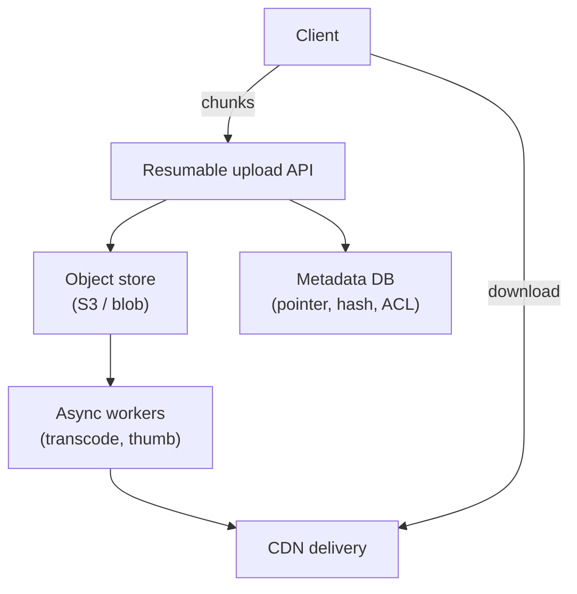

# Concern: Handling Large Blobs

Files, video, and images are too big for your app server and OLTP rows.

> **Cross-cutting lens** — maps to many [problems](../INDEX.md) and [patterns](../../Scalability_patterns/INDEX.md). Learning doc only.

## What this concern means

**Large blobs** (MB–GB): video uploads, photo libraries, file sync blocks, PDF tickets, audit photos. Never stream whole files through app memory or store in Postgres. Use **object storage**, **chunked/resumable upload**, **CDN delivery**, and **metadata separate from bytes**.

### Typical symptoms

- API OOM on 2 GB upload
- Timeout at 30s proxy
- Duplicate storage cost
- Slow download far from user

## Why one approach is not enough

| If you only use… | What breaks |
| --- | --- |
| `BYTEA` in SQL | DB size and backup hell |
| Single PUT upload | Fail at 90% → restart |
| App server proxies all bytes | Bandwidth and memory |
| Same file stored per user copy | Cost explosion |

You need **Multipart upload**, **content-addressable blocks**, **object store (S3)**, **CDN**, **Claim Check** pattern for messages carrying file refs.

## Architecture pattern (generic)

## Pattern mix

| Concern | Patterns | Role |
| --- | --- | --- |
| Upload | Multipart / chunked transfer, resume tokens | Reliable large upload |
| Dedup | Content-hash addressing | Store block once |
| Async | [Pipeline](../Concurrency_patterns/07-pipeline.md), [Queue](../Scalability_patterns/09-queue-based-load-leveling.md) | Transcode off path |
| Delivery | [CDN](../Scalability_patterns/05-cdn.md) | Edge download |
| Messaging | [Claim Check](../Messaging_Integration_patterns/21-claim-check.md) | Event carries URL not bytes |

## Problems in this repo that exercise it

| Problem | Blob type |
| --- | --- |
| [#12 Dropbox](../12-dropbox-file-sync.md) | File blocks |
| [#8 / #24 Video](../08-video-upload-transcoding-pipeline.md) | Raw + transcoded video |
| [#32 Instagram](../32-instagram-photo-sharing.md) | Images + thumbnails |
| [#51 Audit photos](../51-brand-compliance-audit-platform.md) | Compliance evidence |
| [#8 Transcode pipeline](../08-video-upload-transcoding-pipeline.md) | Worker farm |

## Step 3 — Mini design drill

**Design drill:** 4 GB video upload on flaky WiFi. List chunk size, resume API, what metadata row stores.

## Before testing (naive failures)

| Naive build | Symptom | Fix |
| --- | --- | --- |
| Upload through API gateway body | 413 / timeout | Presigned URL to object store |
| Full file re-upload on fail | User rage quit | Resume from last part |
| Transcode before HTTP 200 | User waits 20 min | Async queue + status poll |

## Related exercises

Problem [#8](../08-video-upload-transcoding-pipeline.md) · [#12](../12-dropbox-file-sync.md)

## Quick pattern links

Multipart / chunked transfer, resume tokens · Content-hash addressing · [Pipeline](../Concurrency_patterns/07-pipeline.md), [Queue](../Scalability_patterns/09-queue-based-load-leveling.md)
