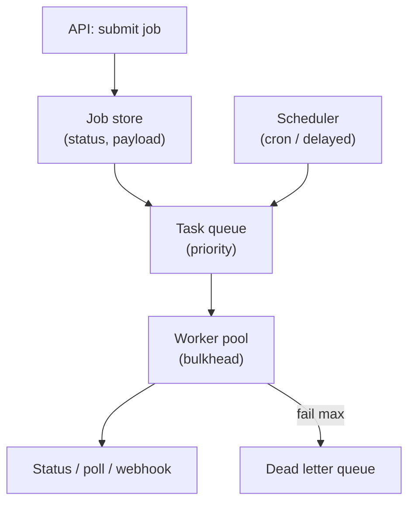

# Concern: Managing Long Running Tasks

Work that takes seconds to hours cannot live inside one HTTP request.

> **Cross-cutting lens** — maps to many [problems](../INDEX.md) and [patterns](../../Scalability_patterns/INDEX.md). Learning doc only.

## What this concern means

**Long-running tasks**: video transcode, payroll run, web crawl batch, ML inference job, report generation, franchise royalty week-close. Pattern: **enqueue → worker → status poll/Webhook → idempotent lease**.

### Typical symptoms

- HTTP gateway timeout at 30s while job still running
- Duplicate job execution → double pay
- Queue backlog invisible until crisis
- Worker crash loses half-finished work

## Why one approach is not enough

| If you only use… | What breaks |
| --- | --- |
| `await transcode()` in controller | Timeout; no scale |
| Cron on one server | SPOF; missed runs |
| No job idempotency | Retry = duplicate side effect |
| Infinite retry poison job | Workers stuck forever |

You need **Job queue**, **worker pool**, **lease/lock**, **idempotent handlers**, **DLQ**, **progress/status API**.

## Architecture pattern (generic)

## Pattern mix

| Concern | Patterns | Role |
| --- | --- | --- |
| Queue | [Queue-Based Load Leveling](../Scalability_patterns/09-queue-based-load-leveling.md), [Competing Consumers](../Messaging_Integration_patterns/08-competing-consumers.md) | Scale workers |
| Correctness | [Idempotency](../Distributed_system_patterns/20-idempotency.md), lease token | Exactly-once effect |
| Schedule | [Job Scheduler](../36-job-scheduler.md) | Cron, delayed, TTL jobs |
| Isolation | [Bulkhead](../Resilience_Pattern/04-bulkhead.md) | Judge pool ≠ web pool |
| Failure | [Dead Letter Queue](../Messaging_Integration_patterns/07-dead-letter-queue.md), [Retry](../Resilience_Pattern/02-retry.md) | Poison pills |

## Problems in this repo that exercise it

| Problem | Long task |
| --- | --- |
| [#36 Job Scheduler](../36-job-scheduler.md) | Generic cron/lease |
| [#8 / #24 Video](../24-youtube-video-platform.md) | Transcode farm |
| [#17 LeetCode](../17-leetcode.md) | Code judge sandbox |
| [#25 Web Crawler](../25-web-crawler.md) | Crawl batches |
| [#41 Payroll](../41-hris-payroll-platform.md) | Pay run |
| [#39 ChatGPT](../39-chatgpt-llm-platform.md) | GPU inference queue |

## Step 3 — Mini design drill

**Design drill:** User submits 10-min report. API response? Job states? Worker dies at 80% — what happens?

## Before testing (naive failures)

| Naive build | Symptom | Fix |
| --- | --- | --- |
| Sync transcode in POST | 504 gateway | 202 + jobId + poll |
| No lease on worker | Two workers same job | Acquire lease TTL |
| Retry forever on bad input | Queue stalled | DLQ after N tries |

## Related exercises

Problem [#36](../36-job-scheduler.md) · [#17](../17-leetcode.md)

## Quick pattern links

[Queue-Based Load Leveling](../Scalability_patterns/09-queue-based-load-leveling.md), [Competing Consumers](../Messaging_Integration_patterns/08-competing-consumers.md) · [Idempotency](../Distributed_system_patterns/20-idempotency.md), lease token · [Job Scheduler](../36-job-scheduler.md)
