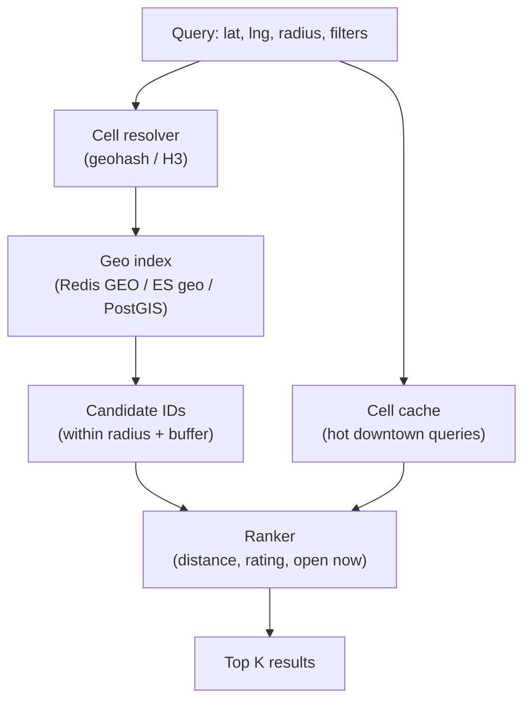

# Concern: Proximity Search

Find what's **near** the user — restaurants, drivers, stores, dates — in milliseconds at scale.

> **Cross-cutting lens** — maps to many [problems](../INDEX.md) and [patterns](../../Scalability_patterns/INDEX.md). Learning doc only.

## What this concern means

**Proximity search** answers: *"What entities are within X km of (lat, lng)?"* ranked by distance, rating, or availability. Unlike text search, distance is continuous — you cannot brute-force `ORDER BY distance` on billions of rows.

### Typical symptoms

- `SELECT * FROM stores` + app-side distance filter → timeout
- Wrong results at city borders or poles
- Driver matching takes 30s during rush
- Index works in dev (10k rows) but fails in prod (100M POIs)

## Why one approach is not enough

| If you only use… | What breaks |
| --- | --- |
| SQL `Haversine` on full table | Full scan; unusable p99 |
| Fixed grid without tuning | Too many false positives or missed neighbors |
| Lat/lng B-tree index | Doesn't model 2D nearness |
| Single global geo index | Hot city overloads one shard |

You need **geospatial indexing** (geohash, H3, S2, R-tree), **shard by region**, **two-phase filter** (geo candidates → rank), and **cache for popular cells**.

## Architecture pattern (generic)

## Pattern mix

| Concern | Patterns | Role |
| --- | --- | --- |
| Index | Geohash, H3, S2, R-tree; [Partitioning](../Scalability_patterns/02-partitioning.md) | 2D nearness without full scan |
| Scale | [Sharding](../Scalability_patterns/03-sharding.md), [Data Locality](../Scalability_patterns/12-data-locality.md) | Shard by region/cell |
| Read path | [Cache-Aside](../Data_domain_patterns/18-cache-aside.md) | Hot "Times Square" cell |
| Pipeline | Two-phase: geo filter → business rank | Distance + relevance |
| Updates | Stream GPS → update cell membership | Drivers move continuously |
| Real-time | Link [Proximity + Real-Time](./01-real-time-updates.md) | Live driver positions |

## Problems in this repo that exercise it

| Problem | Proximity use case |
| --- | --- |
| [#28 Yelp](../28-yelp-local-discovery.md) | "Pizza near me" + filters |
| [#16 Tinder](../16-tinder.md) | Candidates within radius |
| [#23 Uber](../23-uber-ride-hailing.md) | Match driver within 5 km |
| [#4 / #13 Delivery](../04-food-delivery-dispatch.md) | Dispatch radius expansion |
| [#61 Franchise App](../61-franchise-consumer-app-loyalty.md) | Nearest open unit |
| [#56 Territory](../56-territory-area-development.md) | Polygon overlap / cannibalization |
| [#58 Site Selection](../58-franchise-site-selection-pipeline.md) | Demographics around pin |

## Step 3 — Mini design drill

**Design drill (5 min):** Uber needs drivers within 3 km of rider at 8 PM Friday.

1. What is the **index key** for a moving driver?
2. How often do you refresh driver position in the index?
3. Why not query all drivers in the city?
4. What happens when **zero** drivers in 3 km?

## Before testing (naive failures)

| Naive build | Symptom before tests | Fix |
| --- | --- | --- |
| `WHERE lat BETWEEN … AND lng BETWEEN …` on 50M rows | p99 30s+ | Geohash/H3 cell lookup |
| No cell buffer at edges | Miss neighbors on cell boundary | Query adjacent cells |
| Re-index driver on every GPS tick sync | Write storm | Throttle updates (every 3–5 s) |
| Rank in SQL on 10k candidates | Slow sort | Cap candidates; rank in app |
| Single Redis GEO key worldwide | Hot key on Manhattan | Shard geo by region |

## Related exercises

Problem [#23 Uber](../23-uber-ride-hailing.md) · [#28 Yelp](../28-yelp-local-discovery.md) · Concern [Scaling Reads](./04-scaling-reads.md)

## Quick pattern links

[Partitioning](../Scalability_patterns/02-partitioning.md) · [Sharding](../Scalability_patterns/03-sharding.md) · [Cache-Aside](../Data_domain_patterns/18-cache-aside.md) · [Data Locality](../Scalability_patterns/12-data-locality.md)
