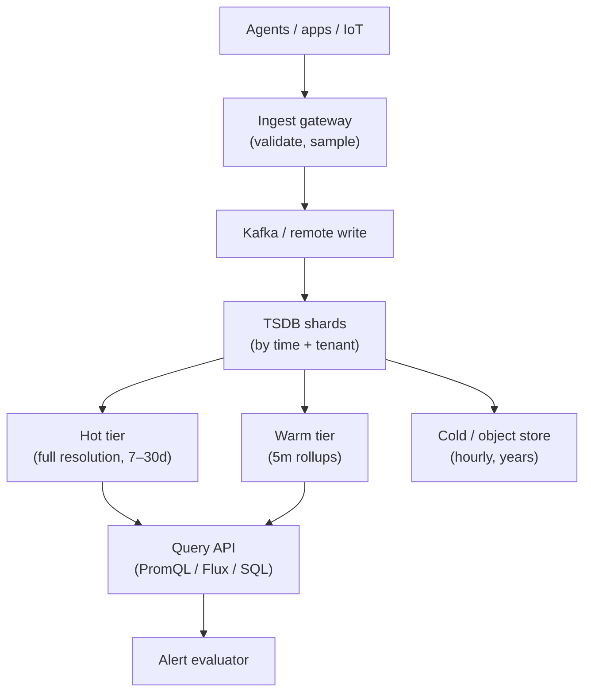

# Concern: Time Series Databases

Store and query **metrics, events, and samples over time** — without treating time as just another column.

> **Cross-cutting lens** — maps to many [problems](../INDEX.md) and [patterns](../../Scalability_patterns/INDEX.md). Learning doc only.

## What this concern means

A **time series database (TSDB)** optimizes **append-heavy writes** of `(timestamp, value, labels)` and **range queries**: "CPU avg last 24h grouped by 5m", "sales per hour per store". General OLTP schemas choke on retention, compression, and aggregation at scale.

### Typical symptoms

- Metrics table grows TB/month; backups impossible
- `SELECT AVG(...) WHERE ts > now()-7d` timeouts
- Downsampling old data manual and wrong
- Cardinality explosion (too many unique label combos)

## Why one approach is not enough

| If you only use… | What breaks |
| --- | --- |
| Postgres row per metric point | Write and storage ceiling |
| One giant `metrics` table no partition | Queries scan years of data |
| Keep full 1s resolution forever | Cost explodes |
| Unbounded label cardinality | Index memory OOM |

You need **time partitioning**, **append-optimized storage**, **rollups/down sampling**, **retention tiers**, and **cardinality limits**.

## Architecture pattern (generic)

## Pattern mix

| Concern | Patterns | Role |
| --- | --- | --- |
| Ingest | [Event Streaming](../Messaging_Integration_patterns/09-event-streaming.md), [Queue-Based Load Leveling](../Scalability_patterns/09-queue-based-load-leveling.md) | Buffer spikes |
| Partition | [Partitioning](../Scalability_patterns/02-partitioning.md) by time bucket | Drop old partitions cheaply |
| Aggregation | Rollups, [CQRS](../Scalability_patterns/06-cqrs.md) | Pre-compute 1m → 1h → 1d |
| Retention | Tiered storage, compaction | Hot/warm/cold |
| Cardinality | [Rate Limiting](../Distributed_system_patterns/18-rate-limiting.md), label allowlists | Prevent tag explosion |
| Alerts | [Job Scheduler](../36-job-scheduler.md) | Periodic rule evaluation |

## Problems in this repo that exercise it

| Problem | Time series angle |
| --- | --- |
| [#38 Metrics Monitoring](../38-metrics-monitoring.md) | Full TSDB stack |
| [#22 YouTube Top K](../22-youtube-top-k.md) | View counts per time window |
| [#26 Ad Clicks](../26-ad-click-aggregator.md) | Clicks per minute per campaign |
| [#31 Price Tracking](../31-price-tracking-service.md) | Price history charts |
| [#60 Comp Sales](../60-franchise-pos-aggregation-comp-sales.md) | Same-store sales over time |
| [#33 Robinhood](../33-robinhood-trading.md) | Quote tick history (intraday) |
| [#29 Strava](../29-strava-fitness-tracking.md) | GPS/time samples on activity |

## Step 3 — Mini design drill

**Design drill (5 min):** Dashboard shows **error rate last 30 days** at 5-minute granularity.

1. Where is raw 10s data stored vs rollup?
2. When does 30-day query hit cold tier?
3. What label combo causes cardinality blow-up?
4. Retention: how long keep 10s resolution?

## Before testing (naive failures)

| Naive build | Symptom before tests | Fix |
| --- | --- | --- |
| INSERT every point into MySQL | Disk full in weeks | TSDB or partitioned tables |
| No downsampling | 30-day chart query kills DB | Rollup jobs |
| `userId` as high-cardinality label | TSDB OOM | Allowlist labels; sample |
| Delete old rows one DELETE | Table lock hours | Drop time partition |
| Query spans all tenants | Slow + leak risk | Tenant shard + RBAC |

## Related exercises

Problem [#38 Metrics Monitoring](../38-metrics-monitoring.md) · Concern [Scaling Writes](./05-scaling-writes.md)

## Quick pattern links

[Event Streaming](../Messaging_Integration_patterns/09-event-streaming.md) · [Partitioning](../Scalability_patterns/02-partitioning.md) · [CQRS](../Scalability_patterns/06-cqrs.md) · [Job Scheduler](../36-job-scheduler.md)
