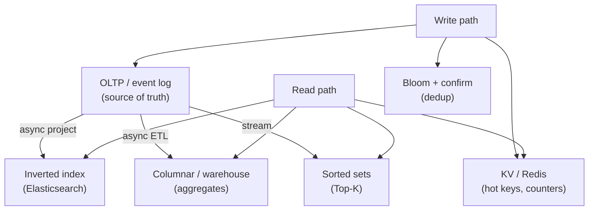

# Concern: Data Structures for Big Data

Choose the **right structure** for billion-row workloads — not one giant table.

> **Cross-cutting lens** — maps to many [problems](../INDEX.md) and [patterns](../../Scalability_patterns/INDEX.md). Learning doc only.

## What this concern means

**Big data** here means: too much volume, velocity, or variety for a single normalized Postgres table. You pick structures by **access pattern**:

| Structure | Best for | Example |
| --- | --- | --- |
| **Hash / KV store** | Point lookup by key | Session, rate limit counter |
| **Sorted set (ZSET)** | Top-K, leaderboards | Trending videos, segment times |
| **Bloom filter** | "Probably seen?" dedup | Crawler URL set |
| **Inverted index** | Full-text search | Post search, KB |
| **Columnar / OLAP** | Analytics scans | Ad billing rollups |
| **LSM tree log** | Append-heavy writes | Event stream, metrics |
| **Graph adjacency** | Follow/mutual edges | Feed fan-out (limited depth) |
| **Ring / consistent hash** | Cache sharding | Distributed cache |

Wrong structure → right idea, wrong performance.

### Typical symptoms

- "We'll query it later" → no structure supports the read
- Redis for everything → memory cost and wrong semantics
- Elasticsearch for strong consistency inventory → lost updates
- RDBMS for crawl dedup → insert rate ceiling

## Why one approach is not enough

| If you only use… | What breaks |
| --- | --- |
| One relational schema | Wrong tool per access path |
| Redis without persistence plan | Data loss on restart |
| Bloom filter alone | False positives need confirm |
| MapReduce for online reads | Batch latency, not ms |

You need **polyglot persistence**, **CQRS** (write structure ≠ read structure), and **explicit access-pattern docs**.

## Architecture pattern (generic)

## Pattern mix

| Concern | Patterns | Role |
| --- | --- | --- |
| Split reads/writes | [CQRS](../Scalability_patterns/06-cqrs.md), [Materialized View](../Data_domain_patterns/16-materialized-view.md) | Different structures per path |
| Dedup | Bloom filter + confirm in DB | Crawler, idempotency |
| Rankings | Sorted sets, heap, Count-Min Sketch | Top-K, trending |
| Search | Inverted index | Text/geo search |
| Analytics | Columnar, batch + stream | Billing, metrics |
| Cache | [Distributed Cache](../Scalability_patterns/08-distributed-cache.md), consistent hash | Hot key routing |

## Problems in this repo that exercise it

| Problem | Structure highlight |
| --- | --- |
| [#25 Web Crawler](../25-web-crawler.md) | Bloom filter + frontier queue |
| [#22 Top K](../22-youtube-top-k.md) | ZSET / heap / stream aggregate |
| [#21 Post Search](../21-fb-post-search.md) | Inverted index |
| [#11 Bitly](../11-bitly-url-shortener.md) | KV redirect cache + sharded link store |
| [#26 Ad Clicks](../26-ad-click-aggregator.md) | Stream + OLAP warehouse |
| [#19 Rate Limiter](../19-rate-limiter.md) | Redis counter / token bucket |
| [#15 News Feed](../15-fb-news-feed.md) | Precomputed feed lists (materialized) |
| [#35 Distributed Cache](../35-distributed-cache.md) | Consistent hash ring |

## Step 3 — Mini design drill

**Design drill (5 min):** Web crawler must avoid revisiting URLs; serve "is this URL new?" at 50k checks/sec.

1. First-line structure?
2. What about false positives?
3. Where is canonical URL stored long-term?
4. Why not only PostgreSQL UNIQUE on URL?

## Before testing (naive failures)

| Naive build | Symptom before tests | Fix |
| --- | --- | --- |
| `UNIQUE(url)` insert per crawl | Insert rate ceiling | Bloom + async confirm |
| Single JSON blob feed per user | Rewrite 10MB per post | Fan-out IDs list / ZSET |
| ES as inventory source of truth | Oversell on race | OLTP + CAS; ES for search only |
| MySQL for 1M/sec counters | Row lock hell | Redis INCR / stream aggregate |
| Graph DB for entire social network | Query cost explosion | Fan-out on write + read merge |

## Related exercises

[19 Rate Limiter](../exercises/19-rate-limiter.md) · [35 Cache](../exercises/35-distributed-cache.md) · Problems [#25](../25-web-crawler.md), [#22](../22-youtube-top-k.md)

## Quick pattern links

[CQRS](../Scalability_patterns/06-cqrs.md) · [Materialized View](../Data_domain_patterns/16-materialized-view.md) · [Distributed Cache](../Scalability_patterns/08-distributed-cache.md) · [Event Streaming](../Messaging_Integration_patterns/09-event-streaming.md)
