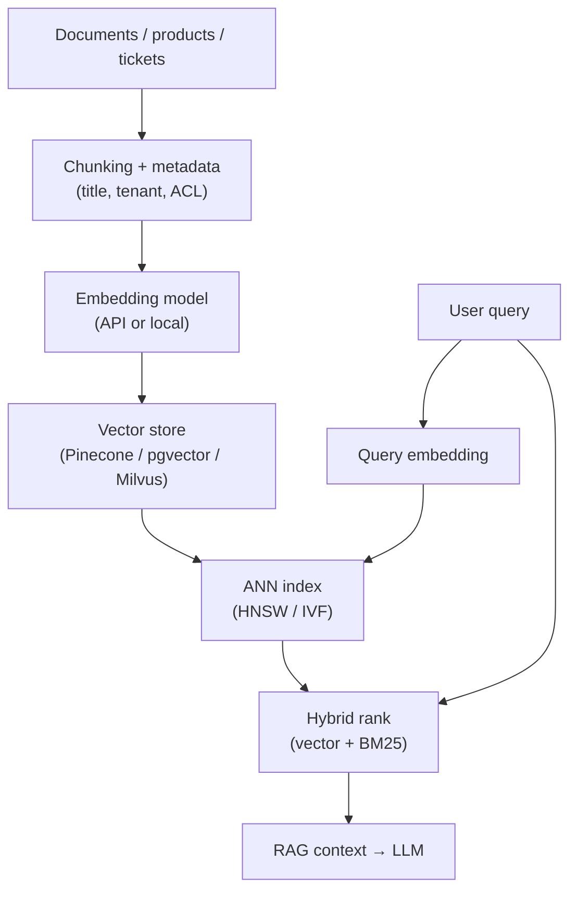

# Concern: Vector Databases

Store **embeddings** and retrieve **nearest neighbors** by semantic similarity — the engine behind RAG and modern search.

> **Cross-cutting lens** — maps to many [problems](../INDEX.md) and [patterns](../../Scalability_patterns/INDEX.md). Learning doc only.

## What this concern means

A **vector database** stores high-dimensional **embedding vectors** (e.g. 768–3072 floats from an LLM/vision model) and answers **k-NN queries**: *"Find the 10 chunks most similar to this query embedding."* Used in **RAG**, semantic search, recommendations, image similarity, and dedup by meaning.

Distance metrics: **cosine similarity**, **dot product**, **L2 (Euclidean)**.

### Typical symptoms

- Brute-force compare query to 10M vectors → seconds per query
- Embeddings in Postgres JSON column → no index, full scan
- Stale index after doc update → wrong RAG answers
- Recall drops after quantization and nobody notices

## Why one approach is not enough

| If you only use… | What breaks |
| --- | --- |
| Exact brute-force k-NN | Latency at millions of vectors |
| Full-text search only | Misses paraphrases ("car" vs "automobile") |
| One global flat index | Memory and query time explode |
| Embed on every request without cache | Embedding API cost + latency |

You need **ANN indexes** (HNSW, IVF), **metadata filtering**, **chunking pipeline**, **hybrid search** (vector + keyword), and **index refresh on content change**.

## Architecture pattern (generic)

## Pattern mix

| Concern | Patterns | Role |
| --- | --- | --- |
| Retrieval | [RAG](../AI_Agentic_patterns/01-rag-retrieval-augmented-generation.md) | Context for LLM |
| Index | HNSW, IVF-PQ; shard by tenant/collection | ANN at scale |
| Hybrid | Vector + inverted index | Precision + recall |
| Freshness | [CQRS](../Scalability_patterns/06-cqrs.md), CDC on doc change | Re-embed on update |
| Security | Metadata filter (tenantId, ACL) before k-NN | No cross-tenant leak |
| Pipeline | [Pipeline](../Concurrency_patterns/07-pipeline.md) | Chunk → embed → upsert |
| Scale | [Partitioning](../Scalability_patterns/02-partitioning.md) | Collection per tenant/region |

## Problems in this repo that exercise it

| Problem | Vector angle |
| --- | --- |
| [#39 ChatGPT / LLM](../39-chatgpt-llm-platform.md) | RAG retrieval step |
| [#21 Post Search](../21-fb-post-search.md) | Semantic + keyword (hybrid) |
| [#27 News Aggregator](../27-news-aggregator.md) | Story clustering by embedding |
| [#48 Helpdesk](../48-customer-support-helpdesk.md) | KB semantic search while typing |
| [#1 AI RAG pattern](../../AI_Agentic_patterns/01-rag-retrieval-augmented-generation.md) | Core pattern doc |
| [#58 Site Selection](../58-franchise-site-selection-pipeline.md) | Demographic similarity (optional ML) |

## Step 3 — Mini design drill

**Design drill (5 min):** Company docs RAG for support bot — 500k PDF chunks, multi-tenant.

1. Chunk size tradeoff (500 vs 2000 tokens)?
2. What metadata filters **before** vector search?
3. Doc updated — re-embed whole corpus or delta?
4. How measure **bad retrieval** before users complain?

## Before testing (naive failures)

| Naive build | Symptom before tests | Fix |
| --- | --- | --- |
| Cosine loop in application code | p99 10s on 1M vectors | ANN index (HNSW) |
| No ACL filter on metadata | Tenant A doc in Tenant B answer | Pre-filter by tenantId |
| Giant chunks (whole PDF) | Vague retrieval; wrong paragraph | Semantic chunking |
| Never re-index on edit | Stale policy answers | CDC → re-embed pipeline |
| Vector only, no keyword | Misses exact SKU/error codes | Hybrid BM25 + vector |
| Quantization too aggressive | "Close enough" wrong docs | Tune recall@k offline |

## Related exercises

Problem [#39 ChatGPT](../39-chatgpt-llm-platform.md) · Pattern [RAG](../../AI_Agentic_patterns/01-rag-retrieval-augmented-generation.md) · Concern [Scaling Reads](./04-scaling-reads.md)

## Quick pattern links

[RAG](../AI_Agentic_patterns/01-rag-retrieval-augmented-generation.md) · [CQRS](../Scalability_patterns/06-cqrs.md) · [Pipeline](../Concurrency_patterns/07-pipeline.md) · [Partitioning](../Scalability_patterns/02-partitioning.md)
