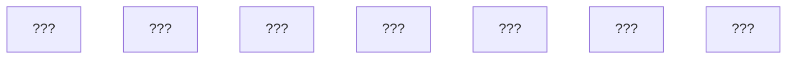

# Exercise 02: Ticketmaster — Design & Build Slice

> **Learning doc only** — no runnable code or test suite required.  
> **Read first:** [Problem 2: Event Ticketing](../02-ticketmaster-style-event-booking.md)

---

## Step 3 — Design Drill

*Close the problem file. Timer optional.*

### Drill A — Diagram from memory (5 min)

Redraw the architecture from memory. Your diagram must include at least:

- CDN path vs booking path
- Waiting room → BFF → Hold + Payment
- Inventory shards → Outbox → async workers

<details>
<summary>Starter skeleton (use if stuck after 5 min)</summary>



</details>

### Drill B — Pattern trio

Name **three** patterns from the problem doc and fill in:

| Pattern | One-sentence job in *this* system |
| --- | --- |
| 1. | |
| 2. | |
| 3. | |

### Drill C — Why one pattern fails alone

Complete: *"If we only used DB row locks on the seat map, \_\_\_ would happen because \_\_\_.*

### Drill D — Constraint twist

**Twist:** Sales open hits **5 million** users (10× original), but you still cannot double-book.

- Which component fails first today?
- What do you add or change? (name 2 patterns)

### Drill E — Symptom → cause

| Symptom | Your hypothesis (component + missing pattern) |
| --- | --- |
| Same seat sold to two customers | |
| User charged but no ticket email | |
| 90% of users see "site unavailable" at 10:00:00 | |
| Seats stuck "held" overnight | |

---

## Step 4 — Build Slice (pseudocode only)

### In scope

- `admitUser(eventId)` — token bucket / waiting room boolean
- `holdSeat(eventId, sectionId, seatId, userId)` — atomic hold + 10 min TTL
- `purchase(holdId, payment, idempotencyKey)` — charge + mark SOLD + outbox row
- **One failure path:** payment succeeds but DB confirm fails → retry must not double-sell

### Out of scope

- Seat map UI, PDF tickets, email worker, multi-region, waitlist

### Happy path — mental walkthrough

Write pseudocode (10–25 lines). Mark with comments:

- `// CAS or lock`
- `// idempotency check`
- `// outbox insert same transaction`

```typescript
// YOUR PSEUDOCODE HERE
async function holdSeat(...) { }
async function purchase(...) { }
```

### Failure path — mental walkthrough

Payment gateway returns **success**, but `inventoryShard.set(SOLD)` throws (network blip).

1. What state is the system in? (hold? payment? seat?)
2. What does the **client** do if it retries `purchase` with the same `Idempotency-Key`?
3. What does a **background job** do if hold TTL expires during retry storm?

---

## Before testing: how naive implementations fail

*You would notice these in staging, logs, or support tickets — often while happy-path manual tests still pass.*

| # | Naive implementation | Symptom (before any automated test) | Why happy-path tests miss it | Pattern that fixes it |
| --- | --- | --- | --- | --- |
| 1 | `UPDATE seats SET status='HELD' WHERE status='AVAILABLE'` without transaction isolation | Two users both see "success"; duplicate holds on one seat | Single-user test always wins | Compare-and-set / per-seat lock |
| 2 | Hold in Redis, payment in API thread, no saga | User charged; seat released by TTL; angry refund tickets | Test pays once in 5 seconds; TTL is 10 min | Saga + idempotent purchase |
| 3 | No idempotency on `purchase()` | Refresh after pay → double charge same card | Manual test clicks once | Idempotency-Key store |
| 4 | Global `LOCK ticketing` around all holds | 500k users → 1 seat/sec worldwide; Twitter meltdown | Load test never run | Sharding by section/event |
| 5 | Outbox email in same HTTP handler as payment | Payment times out → user retries → duplicate outbox or lost ticket | Postman single request OK | Outbox + async worker |
| 6 | No waiting room; direct to BFF | DB connection pool exhausted; random 503s | Dev tests 1 user | Rate limit + queue token |

### The lesson

Tests assert **what you already suspect**. These failures teach you **what to suspect**. If you cannot predict row #1–#3 from the requirements alone, re-read [Why One Pattern Is Not Enough](../02-ticketmaster-style-event-booking.md) before writing any code.

---

## Self-check answers

<details>
<summary>Drill B — example answers</summary>

| Pattern | Role |
| --- | --- |
| Rate limiting / token bucket | Admit N users/sec; waiting room fairness |
| Sharding + CAS | Per-seat atomic hold without global lock |
| Saga + idempotency | Pay → confirm → or compensate; safe retry |
| Outbox | Ticket email after commit, not in request thread |

</details>

<details>
<summary>Drill D — example</summary>

Gateway and waiting room saturate first. Add load shedding, more aggressive queue admission, scale BFF horizontally, pre-warm cache for seat map reads (CDN/CQRS). Holds and payment idempotency unchanged — correctness patterns don't change, admission does.

</details>

<details>
<summary>Drill E — example</summary>

- Double sell → missing CAS/lock on hold
- Charged no email → outbox not used or worker down (payment not the bug)
- Site unavailable → no admission control / pool exhaustion
- Held overnight → no TTL scheduler on holds

</details>

## Done when

- [ ] Diagram drawn from memory with Hold + Payment split
- [ ] Pseudocode marks CAS, idempotency, and outbox
- [ ] You can explain failure #2 without looking at the table
