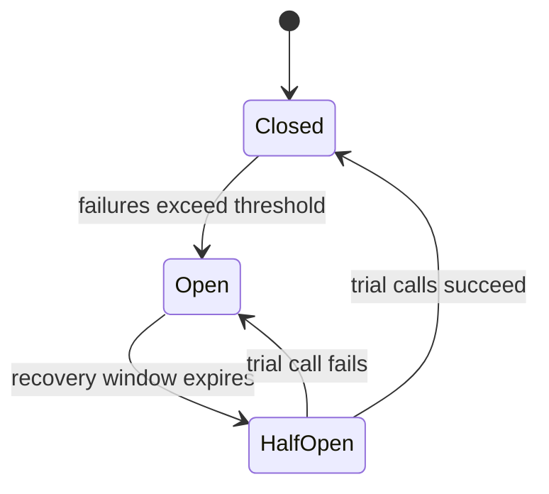
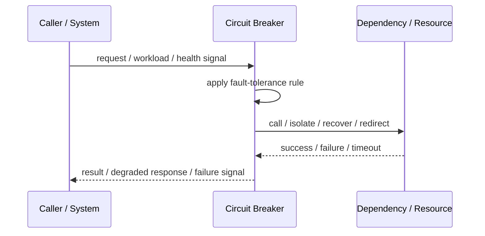
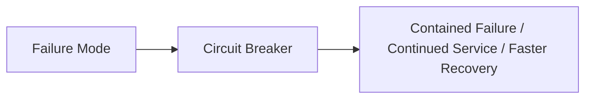

# Circuit Breaker

## Core Idea

Circuit Breaker stops calls to a failing dependency temporarily so the failure does not cascade through the system.

---

## Problem It Solves

A service keeps calling a dependency that is already failing, wasting resources and causing cascading failures.

---

## 3 Concrete Examples

### Example 1: Payment Provider Outage

Checkout opens the circuit after repeated payment timeouts and returns a controlled payment-unavailable response.

### Example 2: Recommendation Service Failure

Product pages skip recommendations when the recommendation service is failing.

### Example 3: Inventory API Timeout

Order service stops calling inventory after failure thresholds are exceeded and protects its worker threads.

---

## Architect Questions

- Which dependency can fail repeatedly?
- What failures count toward opening the circuit?
- What threshold opens the circuit?
- How long should the circuit stay open?
- What fallback response is acceptable?
- What metrics show whether the dependency recovered?

---

## Main Diagram



---

## Runtime / Failure Flow



---

## Implementation Shape

```txt
1. Identify the failure mode: timeout, overload, crash, dependency failure, slow consumer, partial outage, or regional failure.
2. Define detection signals: errors, latency, saturation, queue depth, missed heartbeats, health checks, or progress markers.
3. Define the protective action: reject, retry, fallback, isolate, degrade, checkpoint, fail over, or slow producers.
4. Define limits and thresholds.
5. Define user/caller-visible behavior.
6. Add observability: failure rates, timeout counts, open circuits, fallback usage, rejected work, failover events, and recovery time.
7. Test failure modes deliberately. Untested fault tolerance is mostly wishful thinking.
```

---

## When to Use

- Remote dependencies can fail repeatedly.
- Cascading failures are a risk.
- Fallback or controlled failure is acceptable.

---

## When Not to Use

- The call is local and cheap.
- No fallback or controlled error exists.
- Opening the circuit would cause more harm than protection.

---

## Common Smell That Suggests This Pattern

```txt
One dependency failure,
traffic spike,
slow consumer,
hung process,
or node outage can spread and damage unrelated parts of the system.
```

---

## Common Mistakes

```txt
Adding retries without timeouts.

Adding retries without idempotency.

Using fallback that returns misleading data.

Failing over to an untested standby.

Letting queues grow without bounds.

Hiding overload instead of shedding or applying backpressure.

Treating heartbeat as proof of correctness.

Not monitoring degraded mode.
```

---

## Best Visual Summary



## Final Meaning

Circuit Breaker is useful when it contains failure, limits blast radius, or keeps the system usable under stress. If it is not tested under real failure conditions, assume it does not work.
