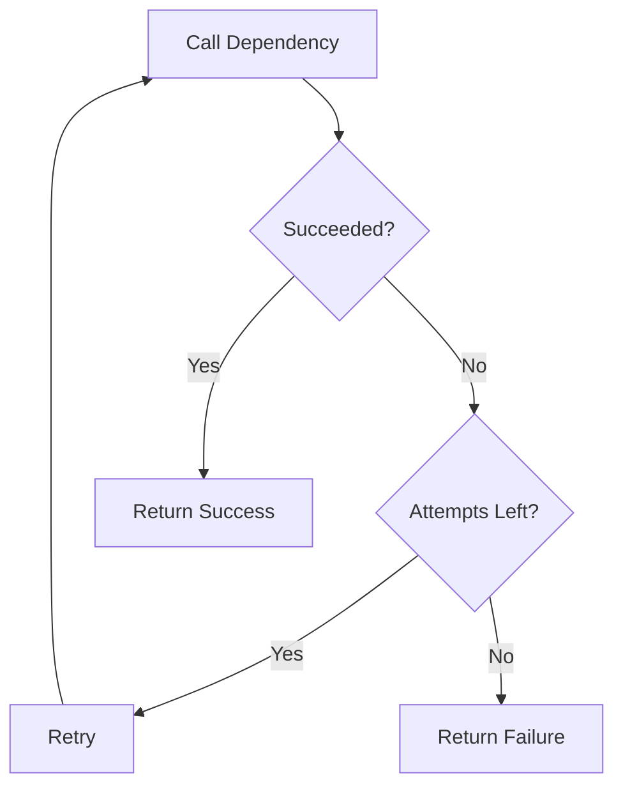
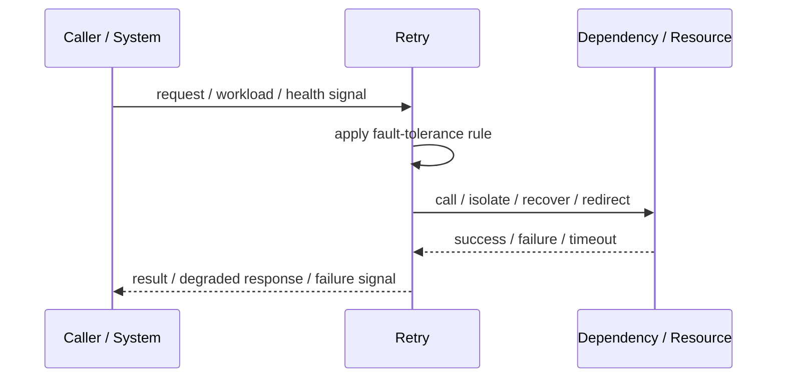
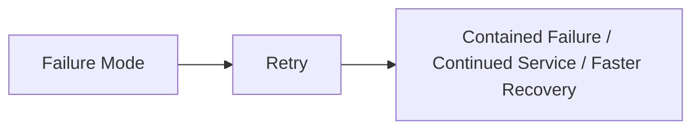

# Retry

## Core Idea

Retry repeats a failed operation when the failure is likely temporary.

---

## Problem It Solves

Transient errors such as network resets, temporary overload, or leader failover can fail operations that would succeed shortly after.

---

## 3 Concrete Examples

### Example 1: Database Deadlock

A transaction is retried after a deadlock error.

### Example 2: API Connection Reset

An HTTP client retries a request after a temporary network error.

### Example 3: Message Publish Failure

A worker retries publishing a message when the broker briefly disconnects.

---

## Architect Questions

- Is the failure transient or permanent?
- Which errors are retryable?
- Is the operation idempotent?
- How many attempts are allowed?
- Should retries use backoff and jitter?
- What happens after retries are exhausted?

---

## Main Diagram



---

## Runtime / Failure Flow



---

## Implementation Shape

```txt
1. Identify the failure mode: timeout, overload, crash, dependency failure, slow consumer, partial outage, or regional failure.
2. Define detection signals: errors, latency, saturation, queue depth, missed heartbeats, health checks, or progress markers.
3. Define the protective action: reject, retry, fallback, isolate, degrade, checkpoint, fail over, or slow producers.
4. Define limits and thresholds.
5. Define user/caller-visible behavior.
6. Add observability: failure rates, timeout counts, open circuits, fallback usage, rejected work, failover events, and recovery time.
7. Test failure modes deliberately. Untested fault tolerance is mostly wishful thinking.
```

---

## When to Use

- Failures are transient.
- Operations are idempotent or safely repeatable.
- Retry limits and error classification are clear.

---

## When Not to Use

- Failures are permanent.
- The operation is not idempotent.
- Retries would worsen overload.

---

## Common Smell That Suggests This Pattern

```txt
One dependency failure,
traffic spike,
slow consumer,
hung process,
or node outage can spread and damage unrelated parts of the system.
```

---

## Common Mistakes

```txt
Adding retries without timeouts.

Adding retries without idempotency.

Using fallback that returns misleading data.

Failing over to an untested standby.

Letting queues grow without bounds.

Hiding overload instead of shedding or applying backpressure.

Treating heartbeat as proof of correctness.

Not monitoring degraded mode.
```

---

## Best Visual Summary



## Final Meaning

Retry is useful when it contains failure, limits blast radius, or keeps the system usable under stress. If it is not tested under real failure conditions, assume it does not work.
