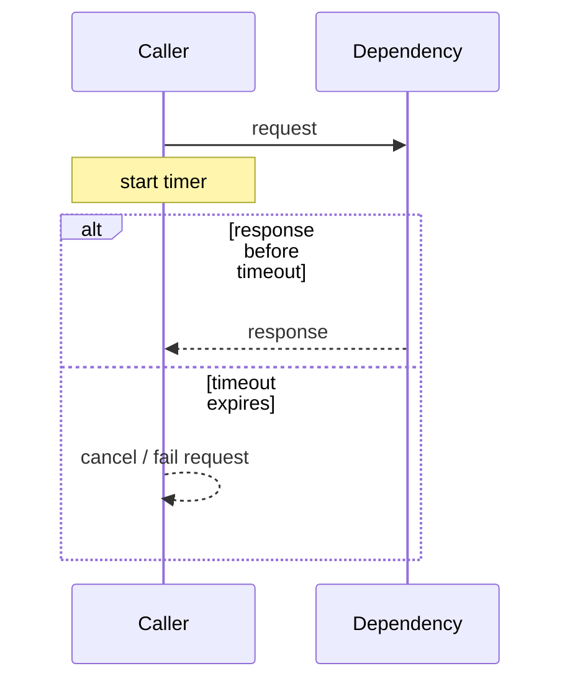
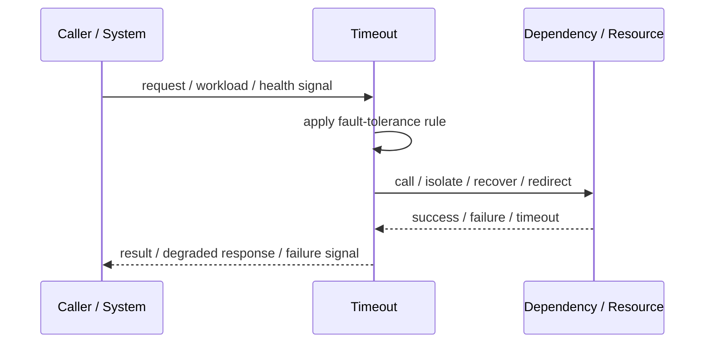
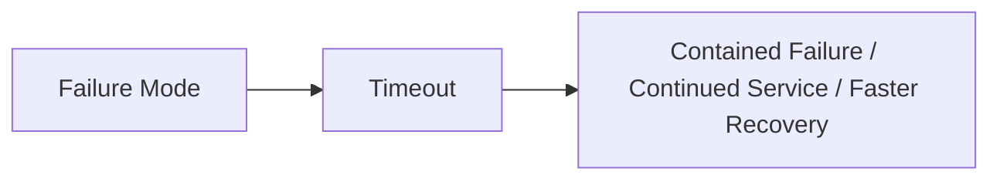

# Timeout

## Core Idea

Timeout limits how long a caller waits for an operation before treating it as failed.

---

## Problem It Solves

Without timeouts, slow or stuck dependencies can consume threads, connections, memory, and user patience indefinitely.

---

## 3 Concrete Examples

### Example 1: HTTP Client Timeout

A service gives a downstream API 2 seconds before failing the call.

### Example 2: Database Query Timeout

A reporting query is cancelled after a configured maximum duration.

### Example 3: Queue Processing Timeout

A worker abandons a stuck task after the visibility timeout expires.

---

## Architect Questions

- What is the maximum acceptable wait time?
- Is the timeout per attempt or total operation?
- What cleanup happens after timeout?
- How does timeout interact with retries?
- What response does the user or caller receive?
- Are timeouts shorter than upstream timeouts?

---

## Main Diagram



---

## Runtime / Failure Flow



---

## Implementation Shape

```txt
1. Identify the failure mode: timeout, overload, crash, dependency failure, slow consumer, partial outage, or regional failure.
2. Define detection signals: errors, latency, saturation, queue depth, missed heartbeats, health checks, or progress markers.
3. Define the protective action: reject, retry, fallback, isolate, degrade, checkpoint, fail over, or slow producers.
4. Define limits and thresholds.
5. Define user/caller-visible behavior.
6. Add observability: failure rates, timeout counts, open circuits, fallback usage, rejected work, failover events, and recovery time.
7. Test failure modes deliberately. Untested fault tolerance is mostly wishful thinking.
```

---

## When to Use

- Dependencies can hang or become slow.
- Callers need bounded waiting time.
- Resource exhaustion from stuck calls is a risk.

---

## When Not to Use

- The operation must complete regardless of duration.
- Timeout cleanup is impossible.
- Timeouts are guessed without considering upstream/downstream budgets.

---

## Common Smell That Suggests This Pattern

```txt
One dependency failure,
traffic spike,
slow consumer,
hung process,
or node outage can spread and damage unrelated parts of the system.
```

---

## Common Mistakes

```txt
Adding retries without timeouts.

Adding retries without idempotency.

Using fallback that returns misleading data.

Failing over to an untested standby.

Letting queues grow without bounds.

Hiding overload instead of shedding or applying backpressure.

Treating heartbeat as proof of correctness.

Not monitoring degraded mode.
```

---

## Best Visual Summary



## Final Meaning

Timeout is useful when it contains failure, limits blast radius, or keeps the system usable under stress. If it is not tested under real failure conditions, assume it does not work.
