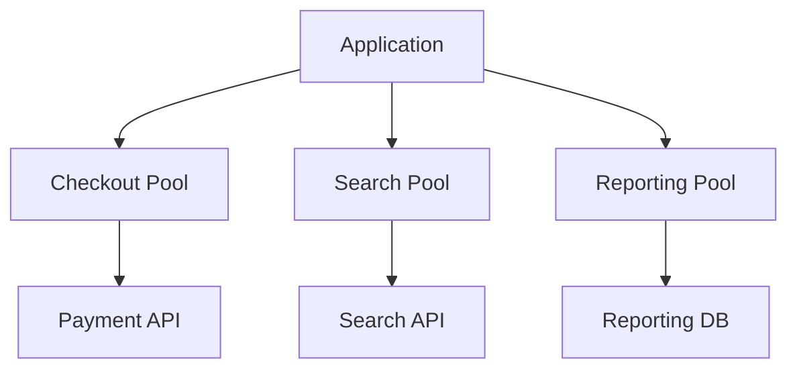
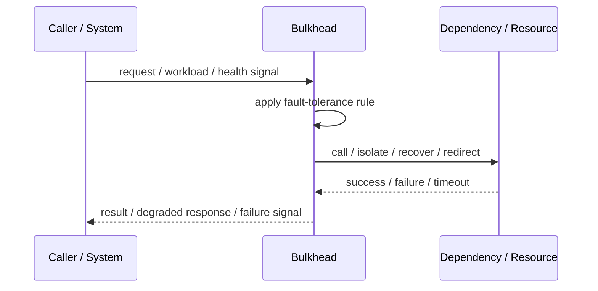
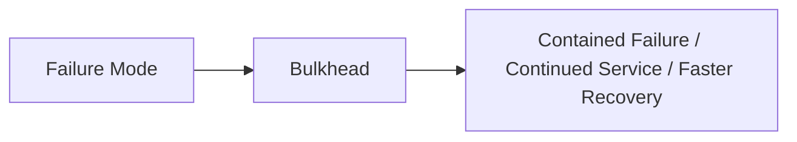

# Bulkhead

## Core Idea

Bulkhead isolates resources so one failing or overloaded area does not sink the whole system.

---

## Problem It Solves

One dependency or workload can consume all shared threads, connections, or capacity and break unrelated features.

---

## 3 Concrete Examples

### Example 1: Separate Thread Pools

Payment calls and search calls use separate pools so search failures do not block checkout.

### Example 2: Connection Pool Isolation

Reporting queries use a separate database pool from customer-facing transactions.

### Example 3: Tenant Isolation

A noisy tenant is limited to its own resource pool.

---

## Architect Questions

- Which workloads can interfere with each other?
- What resources should be isolated?
- How much capacity does each bulkhead get?
- What happens when a bulkhead fills?
- Which workloads are business-critical?
- How are bulkheads monitored?

---

## Main Diagram



---

## Runtime / Failure Flow



---

## Implementation Shape

```txt
1. Identify the failure mode: timeout, overload, crash, dependency failure, slow consumer, partial outage, or regional failure.
2. Define detection signals: errors, latency, saturation, queue depth, missed heartbeats, health checks, or progress markers.
3. Define the protective action: reject, retry, fallback, isolate, degrade, checkpoint, fail over, or slow producers.
4. Define limits and thresholds.
5. Define user/caller-visible behavior.
6. Add observability: failure rates, timeout counts, open circuits, fallback usage, rejected work, failover events, and recovery time.
7. Test failure modes deliberately. Untested fault tolerance is mostly wishful thinking.
```

---

## When to Use

- Workloads can starve each other.
- Critical paths need isolation.
- Resource pools can be separated meaningfully.

---

## When Not to Use

- There is no meaningful workload boundary.
- Isolation wastes too many resources.
- The system is too small for bulkhead overhead.

---

## Common Smell That Suggests This Pattern

```txt
One dependency failure,
traffic spike,
slow consumer,
hung process,
or node outage can spread and damage unrelated parts of the system.
```

---

## Common Mistakes

```txt
Adding retries without timeouts.

Adding retries without idempotency.

Using fallback that returns misleading data.

Failing over to an untested standby.

Letting queues grow without bounds.

Hiding overload instead of shedding or applying backpressure.

Treating heartbeat as proof of correctness.

Not monitoring degraded mode.
```

---

## Best Visual Summary



## Final Meaning

Bulkhead is useful when it contains failure, limits blast radius, or keeps the system usable under stress. If it is not tested under real failure conditions, assume it does not work.
