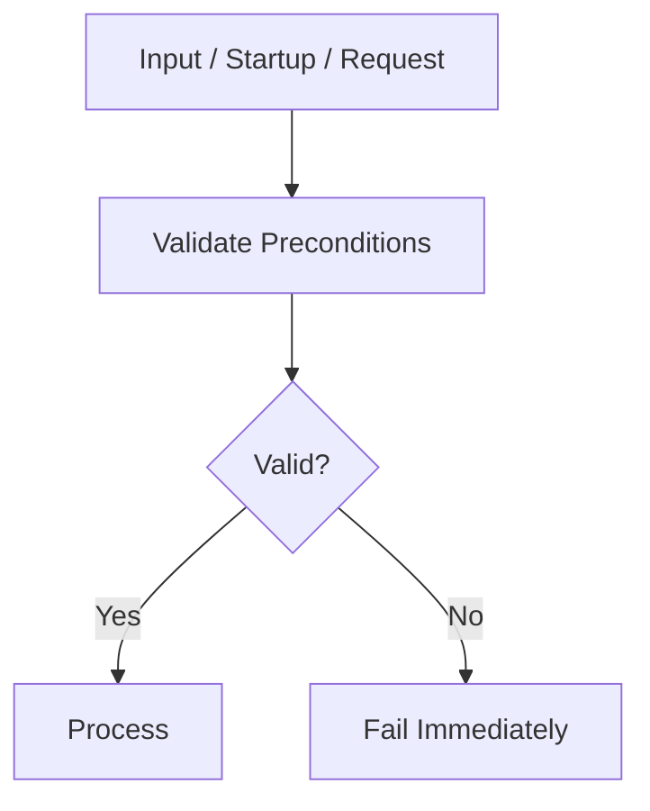
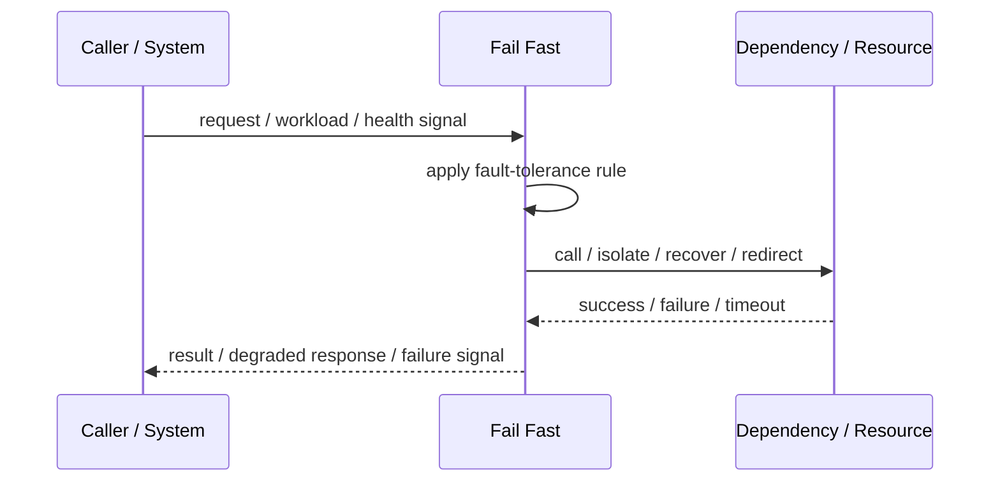
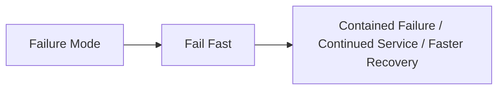

# Fail Fast

## Core Idea

Fail Fast detects invalid or impossible conditions early and stops immediately instead of continuing in a bad state.

---

## Problem It Solves

Systems that continue after invalid input, missing dependencies, or corrupted state often fail later in harder-to-debug ways.

---

## 3 Concrete Examples

### Example 1: Startup Dependency Check

A service refuses to start if required configuration or secrets are missing.

### Example 2: Invalid Request Rejection

An API rejects malformed commands before touching downstream services.

### Example 3: Capacity Guard

A worker rejects new work immediately when required resources are unavailable.

---

## Architect Questions

- What conditions should stop processing immediately?
- What checks can happen early?
- What error should be returned?
- Can failing fast prevent wasted downstream work?
- How are fail-fast decisions logged?
- Could fail fast reduce availability unnecessarily?

---

## Main Diagram



---

## Runtime / Failure Flow



---

## Implementation Shape

```txt
1. Identify the failure mode: timeout, overload, crash, dependency failure, slow consumer, partial outage, or regional failure.
2. Define detection signals: errors, latency, saturation, queue depth, missed heartbeats, health checks, or progress markers.
3. Define the protective action: reject, retry, fallback, isolate, degrade, checkpoint, fail over, or slow producers.
4. Define limits and thresholds.
5. Define user/caller-visible behavior.
6. Add observability: failure rates, timeout counts, open circuits, fallback usage, rejected work, failover events, and recovery time.
7. Test failure modes deliberately. Untested fault tolerance is mostly wishful thinking.
```

---

## When to Use

- Invalid conditions can be detected early.
- Continuing would waste resources or corrupt state.
- Clear errors are better than delayed failures.

---

## When Not to Use

- Temporary waiting would resolve the issue safely.
- The fail-fast condition is unreliable.
- It rejects valid work too often.

---

## Common Smell That Suggests This Pattern

```txt
One dependency failure,
traffic spike,
slow consumer,
hung process,
or node outage can spread and damage unrelated parts of the system.
```

---

## Common Mistakes

```txt
Adding retries without timeouts.

Adding retries without idempotency.

Using fallback that returns misleading data.

Failing over to an untested standby.

Letting queues grow without bounds.

Hiding overload instead of shedding or applying backpressure.

Treating heartbeat as proof of correctness.

Not monitoring degraded mode.
```

---

## Best Visual Summary



## Final Meaning

Fail Fast is useful when it contains failure, limits blast radius, or keeps the system usable under stress. If it is not tested under real failure conditions, assume it does not work.
