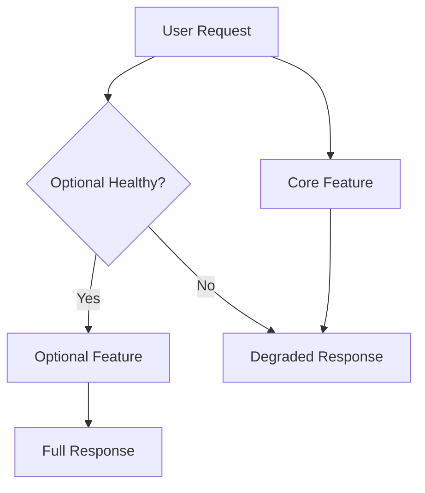
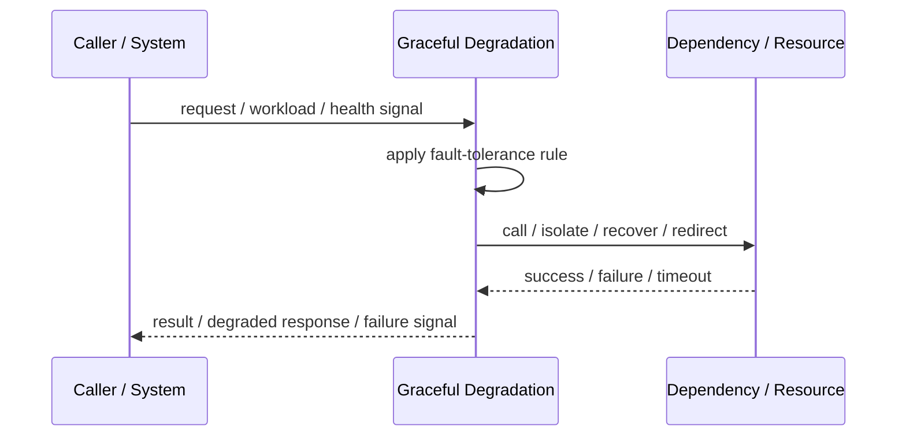
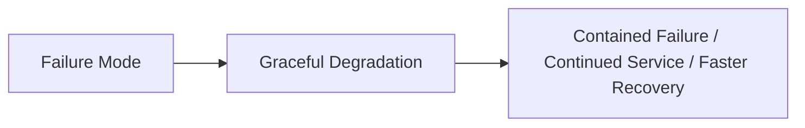

# Graceful Degradation

## Core Idea

Graceful Degradation keeps core functionality available while reducing or disabling non-critical features during failure.

---

## Problem It Solves

A partial dependency failure should not take down the entire user experience.

---

## 3 Concrete Examples

### Example 1: Product Page Without Recommendations

The product page still loads even if recommendations are unavailable.

### Example 2: Checkout Without Promo Engine

Checkout proceeds without applying optional promotions if the promo service is down.

### Example 3: Read-Only Mode

An app disables writes but still allows users to view existing data.

---

## Architect Questions

- What is core functionality?
- What features can be degraded?
- What user message is appropriate?
- How is degraded mode triggered?
- How is degraded mode exited?
- How do we avoid hiding serious failures too long?

---

## Main Diagram



---

## Runtime / Failure Flow



---

## Implementation Shape

```txt
1. Identify the failure mode: timeout, overload, crash, dependency failure, slow consumer, partial outage, or regional failure.
2. Define detection signals: errors, latency, saturation, queue depth, missed heartbeats, health checks, or progress markers.
3. Define the protective action: reject, retry, fallback, isolate, degrade, checkpoint, fail over, or slow producers.
4. Define limits and thresholds.
5. Define user/caller-visible behavior.
6. Add observability: failure rates, timeout counts, open circuits, fallback usage, rejected work, failover events, and recovery time.
7. Test failure modes deliberately. Untested fault tolerance is mostly wishful thinking.
```

---

## When to Use

- Partial functionality is better than total outage.
- Optional features can be disabled.
- Users can tolerate reduced capability.

---

## When Not to Use

- The feature is core and cannot be degraded.
- Users would receive misleading results.
- Degraded mode hides serious failures indefinitely.

---

## Common Smell That Suggests This Pattern

```txt
One dependency failure,
traffic spike,
slow consumer,
hung process,
or node outage can spread and damage unrelated parts of the system.
```

---

## Common Mistakes

```txt
Adding retries without timeouts.

Adding retries without idempotency.

Using fallback that returns misleading data.

Failing over to an untested standby.

Letting queues grow without bounds.

Hiding overload instead of shedding or applying backpressure.

Treating heartbeat as proof of correctness.

Not monitoring degraded mode.
```

---

## Best Visual Summary



## Final Meaning

Graceful Degradation is useful when it contains failure, limits blast radius, or keeps the system usable under stress. If it is not tested under real failure conditions, assume it does not work.
