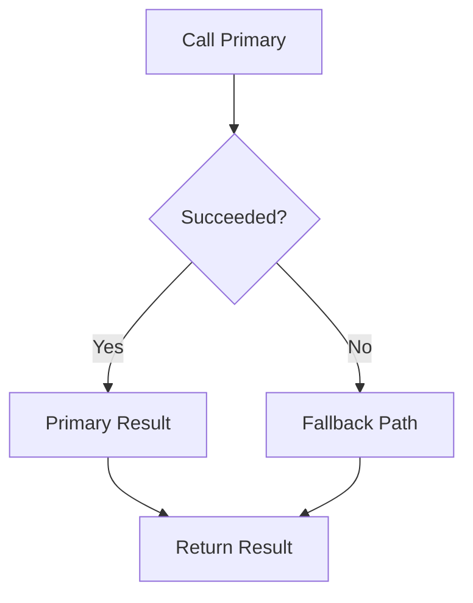
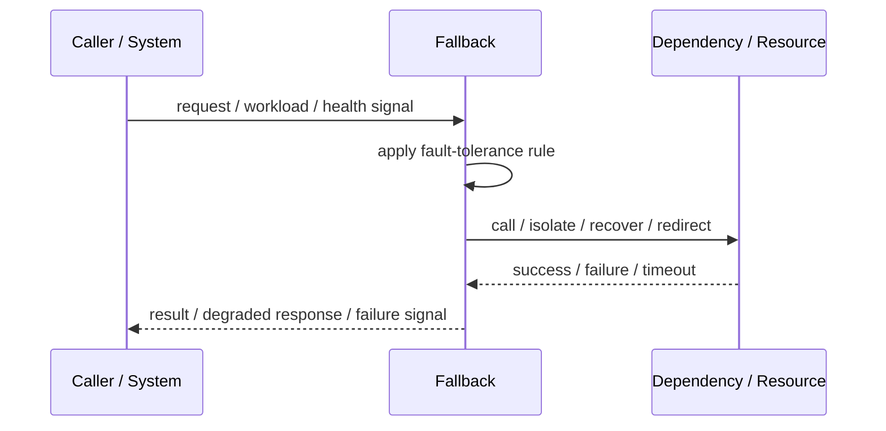
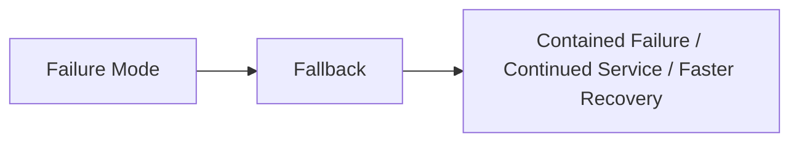

# Fallback

## Core Idea

Fallback provides an alternative response or path when the primary operation fails.

---

## Problem It Solves

A failed dependency or operation needs a safe substitute instead of returning a raw failure.

---

## 3 Concrete Examples

### Example 1: Cached Response

If the live catalog API fails, return recently cached product data.

### Example 2: Default Recommendation

If personalization fails, show popular products.

### Example 3: Secondary Provider

If the primary SMS provider fails, send through a backup provider.

---

## Architect Questions

- What primary failure triggers fallback?
- What fallback result is safe?
- Is fallback stale, approximate, or alternate?
- Should the user know fallback was used?
- How is fallback monitored?
- Can fallback become permanently relied on?

---

## Main Diagram



---

## Runtime / Failure Flow



---

## Implementation Shape

```txt
1. Identify the failure mode: timeout, overload, crash, dependency failure, slow consumer, partial outage, or regional failure.
2. Define detection signals: errors, latency, saturation, queue depth, missed heartbeats, health checks, or progress markers.
3. Define the protective action: reject, retry, fallback, isolate, degrade, checkpoint, fail over, or slow producers.
4. Define limits and thresholds.
5. Define user/caller-visible behavior.
6. Add observability: failure rates, timeout counts, open circuits, fallback usage, rejected work, failover events, and recovery time.
7. Test failure modes deliberately. Untested fault tolerance is mostly wishful thinking.
```

---

## When to Use

- A safe alternative response or path exists.
- Primary dependency failure should not fully break the experience.
- Fallback quality is acceptable.

---

## When Not to Use

- Fallback data is unsafe or misleading.
- Fallback silently masks data corruption.
- No one monitors fallback usage.

---

## Common Smell That Suggests This Pattern

```txt
One dependency failure,
traffic spike,
slow consumer,
hung process,
or node outage can spread and damage unrelated parts of the system.
```

---

## Common Mistakes

```txt
Adding retries without timeouts.

Adding retries without idempotency.

Using fallback that returns misleading data.

Failing over to an untested standby.

Letting queues grow without bounds.

Hiding overload instead of shedding or applying backpressure.

Treating heartbeat as proof of correctness.

Not monitoring degraded mode.
```

---

## Best Visual Summary



## Final Meaning

Fallback is useful when it contains failure, limits blast radius, or keeps the system usable under stress. If it is not tested under real failure conditions, assume it does not work.
