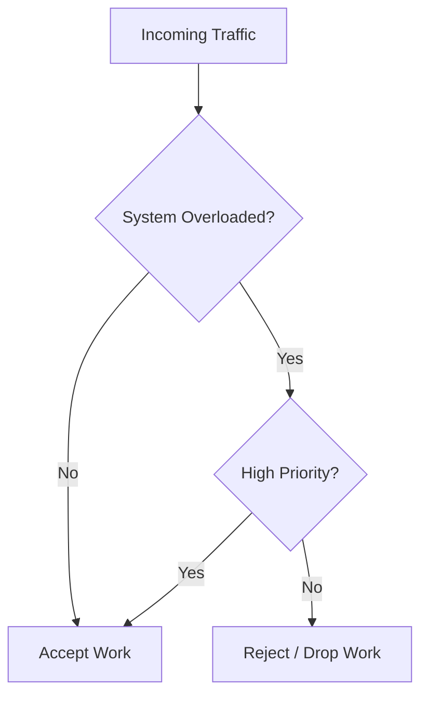
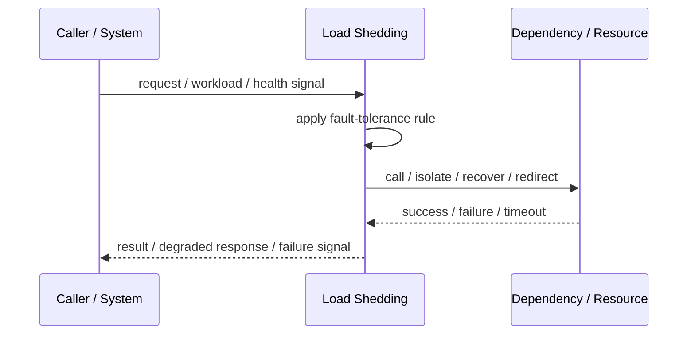
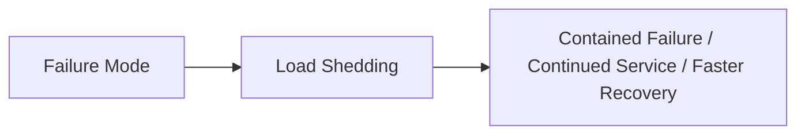

# Load Shedding

## Core Idea

Load Shedding intentionally rejects or drops some work when the system is overloaded to preserve health for accepted work.

---

## Problem It Solves

When overload is not controlled, the whole system slows down, queues grow, and eventually everything fails.

---

## 3 Concrete Examples

### Example 1: Reject Low-Priority Requests

During overload, analytics or expensive search requests are rejected before checkout requests.

### Example 2: API Overload Protection

Gateway returns 503 to excess traffic when backend saturation is high.

### Example 3: Queue Drop Policy

A telemetry pipeline drops non-critical events when buffers are full.

---

## Architect Questions

- What overload signal triggers shedding?
- Which traffic is rejected first?
- What error response is returned?
- Can clients retry safely?
- How is priority defined?
- How do we avoid shedding too aggressively?

---

## Main Diagram



---

## Runtime / Failure Flow



---

## Implementation Shape

```txt
1. Identify the failure mode: timeout, overload, crash, dependency failure, slow consumer, partial outage, or regional failure.
2. Define detection signals: errors, latency, saturation, queue depth, missed heartbeats, health checks, or progress markers.
3. Define the protective action: reject, retry, fallback, isolate, degrade, checkpoint, fail over, or slow producers.
4. Define limits and thresholds.
5. Define user/caller-visible behavior.
6. Add observability: failure rates, timeout counts, open circuits, fallback usage, rejected work, failover events, and recovery time.
7. Test failure modes deliberately. Untested fault tolerance is mostly wishful thinking.
```

---

## When to Use

- The system must protect itself under overload.
- Some traffic is lower priority.
- Rejecting work is better than total collapse.

---

## When Not to Use

- All traffic is equally critical.
- Clients cannot handle rejection.
- Shedding policy is unclear or unfair.

---

## Common Smell That Suggests This Pattern

```txt
One dependency failure,
traffic spike,
slow consumer,
hung process,
or node outage can spread and damage unrelated parts of the system.
```

---

## Common Mistakes

```txt
Adding retries without timeouts.

Adding retries without idempotency.

Using fallback that returns misleading data.

Failing over to an untested standby.

Letting queues grow without bounds.

Hiding overload instead of shedding or applying backpressure.

Treating heartbeat as proof of correctness.

Not monitoring degraded mode.
```

---

## Best Visual Summary



## Final Meaning

Load Shedding is useful when it contains failure, limits blast radius, or keeps the system usable under stress. If it is not tested under real failure conditions, assume it does not work.
