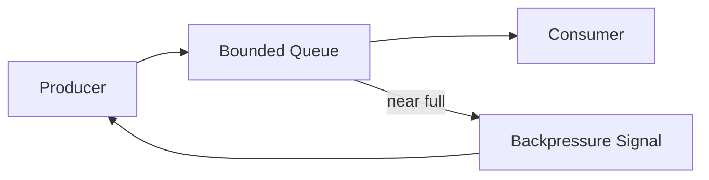
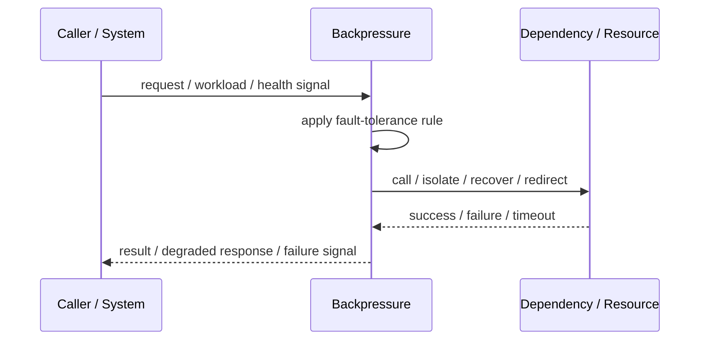
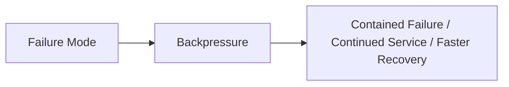

# Backpressure

## Core Idea

Backpressure signals upstream producers to slow down when downstream consumers cannot keep up.

---

## Problem It Solves

Fast producers can overwhelm slower consumers, causing queues, memory, latency, and failures to grow uncontrollably.

---

## 3 Concrete Examples

### Example 1: Streaming Pipeline

A slow consumer requests fewer messages until it catches up.

### Example 2: HTTP 429 Response

An API tells clients to slow down when capacity is constrained.

### Example 3: Bounded Queue Blocking

Producers block or slow when a worker queue reaches capacity.

---

## Architect Questions

- Where does overload appear first?
- How is pressure signaled upstream?
- Do producers slow down, block, buffer, or drop?
- What queue limits are enforced?
- How is pressure monitored?
- What happens if producers ignore the signal?

---

## Main Diagram



---

## Runtime / Failure Flow



---

## Implementation Shape

```txt
1. Identify the failure mode: timeout, overload, crash, dependency failure, slow consumer, partial outage, or regional failure.
2. Define detection signals: errors, latency, saturation, queue depth, missed heartbeats, health checks, or progress markers.
3. Define the protective action: reject, retry, fallback, isolate, degrade, checkpoint, fail over, or slow producers.
4. Define limits and thresholds.
5. Define user/caller-visible behavior.
6. Add observability: failure rates, timeout counts, open circuits, fallback usage, rejected work, failover events, and recovery time.
7. Test failure modes deliberately. Untested fault tolerance is mostly wishful thinking.
```

---

## When to Use

- Producers can overwhelm consumers.
- Upstream can slow down or stop producing.
- Queue growth must be controlled.

---

## When Not to Use

- Producers cannot slow down.
- The protocol cannot signal pressure.
- The system just buffers endlessly anyway.

---

## Common Smell That Suggests This Pattern

```txt
One dependency failure,
traffic spike,
slow consumer,
hung process,
or node outage can spread and damage unrelated parts of the system.
```

---

## Common Mistakes

```txt
Adding retries without timeouts.

Adding retries without idempotency.

Using fallback that returns misleading data.

Failing over to an untested standby.

Letting queues grow without bounds.

Hiding overload instead of shedding or applying backpressure.

Treating heartbeat as proof of correctness.

Not monitoring degraded mode.
```

---

## Best Visual Summary



## Final Meaning

Backpressure is useful when it contains failure, limits blast radius, or keeps the system usable under stress. If it is not tested under real failure conditions, assume it does not work.
