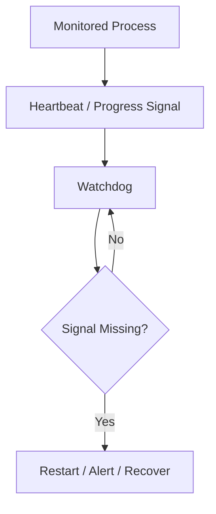
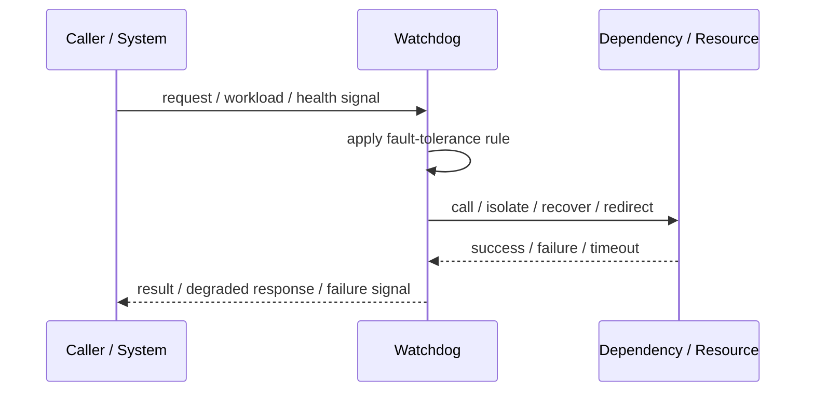
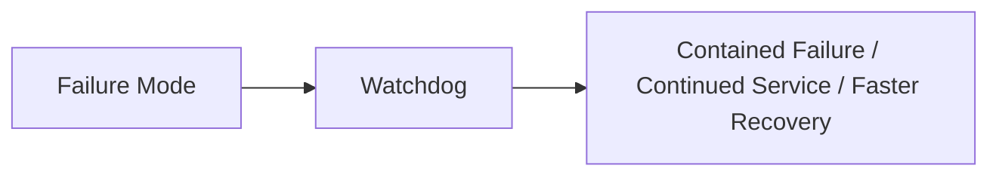

# Watchdog

## Core Idea

Watchdog monitors a process, task, or system and triggers recovery if it becomes unhealthy or unresponsive.

---

## Problem It Solves

Processes can hang, deadlock, or stop making progress while still appearing to run.

---

## 3 Concrete Examples

### Example 1: Process Watchdog

A supervisor restarts a service if it stops responding to health probes.

### Example 2: Embedded System Watchdog

A device reboots if firmware fails to reset the watchdog timer.

### Example 3: Job Progress Watchdog

A long-running job is cancelled and retried if progress heartbeat stops.

---

## Architect Questions

- What does healthy progress look like?
- What signal does the watchdog monitor?
- What timeout indicates failure?
- What recovery action is safe?
- How do we avoid false positives?
- How are watchdog actions audited?

---

## Main Diagram



---

## Runtime / Failure Flow



---

## Implementation Shape

```txt
1. Identify the failure mode: timeout, overload, crash, dependency failure, slow consumer, partial outage, or regional failure.
2. Define detection signals: errors, latency, saturation, queue depth, missed heartbeats, health checks, or progress markers.
3. Define the protective action: reject, retry, fallback, isolate, degrade, checkpoint, fail over, or slow producers.
4. Define limits and thresholds.
5. Define user/caller-visible behavior.
6. Add observability: failure rates, timeout counts, open circuits, fallback usage, rejected work, failover events, and recovery time.
7. Test failure modes deliberately. Untested fault tolerance is mostly wishful thinking.
```

---

## When to Use

- Processes can hang or stop making progress.
- Health/progress signals are available.
- Automatic recovery is safe.

---

## When Not to Use

- The watchdog cannot distinguish slow from stuck.
- Recovery action can corrupt state.
- False positives are worse than the hang.

---

## Common Smell That Suggests This Pattern

```txt
One dependency failure,
traffic spike,
slow consumer,
hung process,
or node outage can spread and damage unrelated parts of the system.
```

---

## Common Mistakes

```txt
Adding retries without timeouts.

Adding retries without idempotency.

Using fallback that returns misleading data.

Failing over to an untested standby.

Letting queues grow without bounds.

Hiding overload instead of shedding or applying backpressure.

Treating heartbeat as proof of correctness.

Not monitoring degraded mode.
```

---

## Best Visual Summary



## Final Meaning

Watchdog is useful when it contains failure, limits blast radius, or keeps the system usable under stress. If it is not tested under real failure conditions, assume it does not work.
