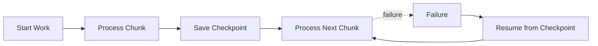
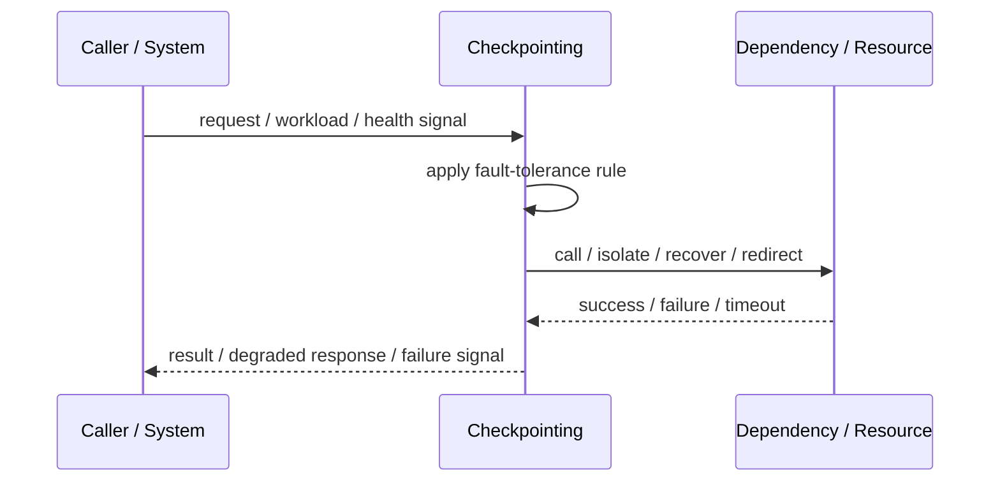
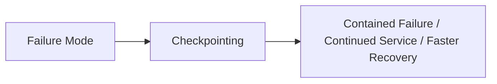

# Checkpointing

## Core Idea

Checkpointing periodically saves progress so work can resume from a known point after failure.

---

## Problem It Solves

Long-running tasks lose too much progress when they fail and must restart from the beginning.

---

## 3 Concrete Examples

### Example 1: Batch Import

A file importer saves the last processed row and resumes after failure.

### Example 2: Machine Learning Training

Training saves model checkpoints after epochs.

### Example 3: Stream Processing

A consumer commits offsets after processing batches.

---

## Architect Questions

- What progress state must be saved?
- How often should checkpoints occur?
- Is checkpointing atomic with output writes?
- How is checkpoint corruption handled?
- How much reprocessing is acceptable?
- Where are checkpoints stored?

---

## Main Diagram



---

## Runtime / Failure Flow



---

## Implementation Shape

```txt
1. Identify the failure mode: timeout, overload, crash, dependency failure, slow consumer, partial outage, or regional failure.
2. Define detection signals: errors, latency, saturation, queue depth, missed heartbeats, health checks, or progress markers.
3. Define the protective action: reject, retry, fallback, isolate, degrade, checkpoint, fail over, or slow producers.
4. Define limits and thresholds.
5. Define user/caller-visible behavior.
6. Add observability: failure rates, timeout counts, open circuits, fallback usage, rejected work, failover events, and recovery time.
7. Test failure modes deliberately. Untested fault tolerance is mostly wishful thinking.
```

---

## When to Use

- Tasks are long-running.
- Restarting from scratch is expensive.
- Progress can be saved reliably.

---

## When Not to Use

- Work is short and cheap to restart.
- Checkpoints cannot be made consistent.
- Checkpoint overhead dominates processing.

---

## Common Smell That Suggests This Pattern

```txt
One dependency failure,
traffic spike,
slow consumer,
hung process,
or node outage can spread and damage unrelated parts of the system.
```

---

## Common Mistakes

```txt
Adding retries without timeouts.

Adding retries without idempotency.

Using fallback that returns misleading data.

Failing over to an untested standby.

Letting queues grow without bounds.

Hiding overload instead of shedding or applying backpressure.

Treating heartbeat as proof of correctness.

Not monitoring degraded mode.
```

---

## Best Visual Summary



## Final Meaning

Checkpointing is useful when it contains failure, limits blast radius, or keeps the system usable under stress. If it is not tested under real failure conditions, assume it does not work.
