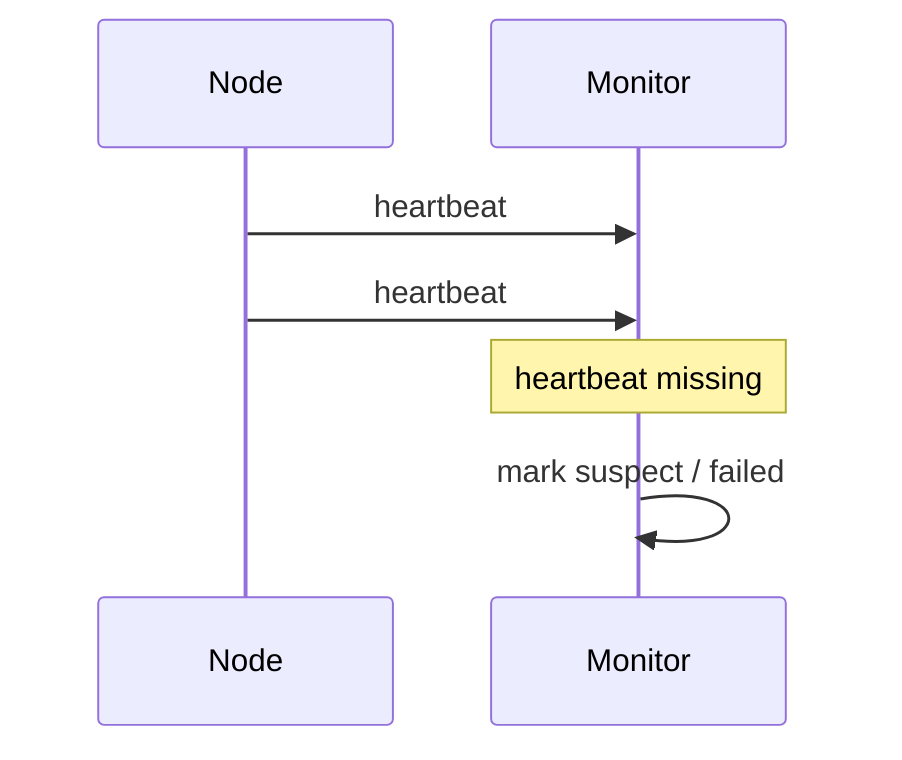
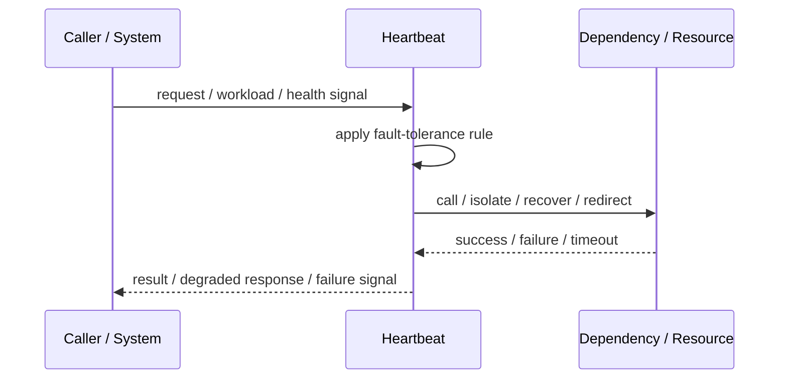
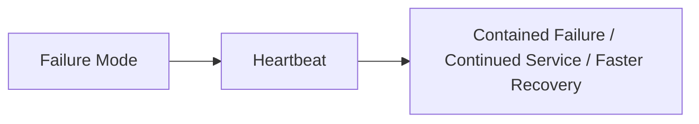

# Heartbeat

## Core Idea

Heartbeat sends periodic liveness signals so other components can detect failure or disconnection.

---

## Problem It Solves

Distributed components need to know whether peers, workers, or devices are still alive.

---

## 3 Concrete Examples

### Example 1: Worker Liveness

Workers send heartbeats to a coordinator while processing jobs.

### Example 2: Cluster Membership

Nodes monitor heartbeats to detect failed members.

### Example 3: IoT Device Monitoring

Devices send periodic heartbeats to show they are online.

---

## Architect Questions

- Who sends heartbeats?
- Who receives them?
- What interval is used?
- How many missed heartbeats indicate failure?
- How are false positives handled?
- What recovery action follows missed heartbeats?

---

## Main Diagram



---

## Runtime / Failure Flow



---

## Implementation Shape

```txt
1. Identify the failure mode: timeout, overload, crash, dependency failure, slow consumer, partial outage, or regional failure.
2. Define detection signals: errors, latency, saturation, queue depth, missed heartbeats, health checks, or progress markers.
3. Define the protective action: reject, retry, fallback, isolate, degrade, checkpoint, fail over, or slow producers.
4. Define limits and thresholds.
5. Define user/caller-visible behavior.
6. Add observability: failure rates, timeout counts, open circuits, fallback usage, rejected work, failover events, and recovery time.
7. Test failure modes deliberately. Untested fault tolerance is mostly wishful thinking.
```

---

## When to Use

- Liveness detection is needed.
- Nodes, workers, or devices can disappear.
- Missed heartbeat actions are defined.

---

## When Not to Use

- Network delays make false failure detection unacceptable.
- Liveness does not prove usefulness.
- No recovery action follows missing heartbeat.

---

## Common Smell That Suggests This Pattern

```txt
One dependency failure,
traffic spike,
slow consumer,
hung process,
or node outage can spread and damage unrelated parts of the system.
```

---

## Common Mistakes

```txt
Adding retries without timeouts.

Adding retries without idempotency.

Using fallback that returns misleading data.

Failing over to an untested standby.

Letting queues grow without bounds.

Hiding overload instead of shedding or applying backpressure.

Treating heartbeat as proof of correctness.

Not monitoring degraded mode.
```

---

## Best Visual Summary



## Final Meaning

Heartbeat is useful when it contains failure, limits blast radius, or keeps the system usable under stress. If it is not tested under real failure conditions, assume it does not work.
