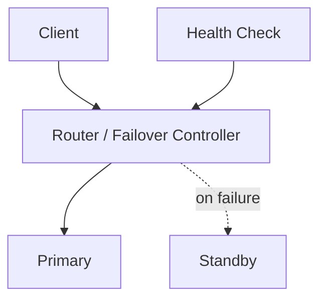
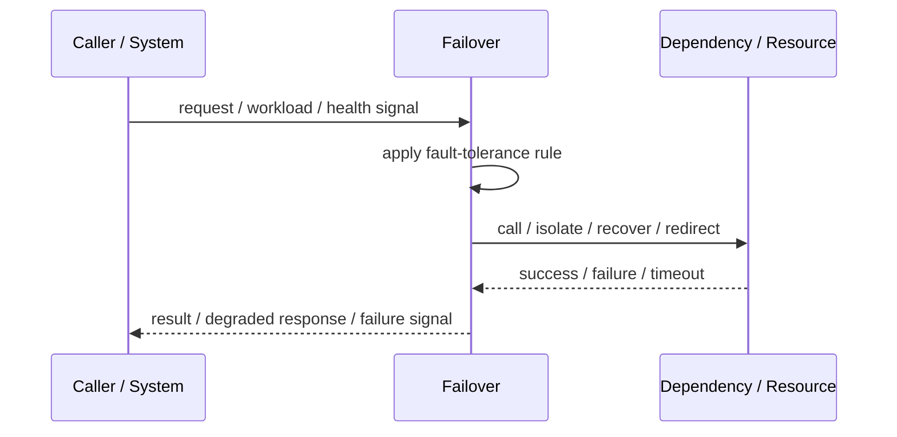
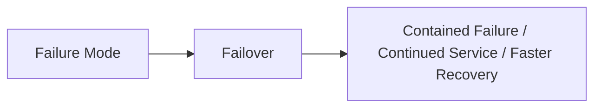

# Failover

## Core Idea

Failover switches traffic or responsibility from a failed component to a standby or alternate component.

---

## Problem It Solves

A failed primary component should not make the whole service unavailable.

---

## 3 Concrete Examples

### Example 1: Database Failover

A standby database is promoted when the primary fails.

### Example 2: Region Failover

Traffic moves to another region during regional outage.

### Example 3: Load Balancer Failover

Traffic stops going to unhealthy instances and shifts to healthy ones.

---

## Architect Questions

- What failure triggers failover?
- What component becomes the replacement?
- Is failover automatic or manual?
- How is data consistency maintained?
- How is split-brain prevented?
- How is failback handled?

---

## Main Diagram



---

## Runtime / Failure Flow



---

## Implementation Shape

```txt
1. Identify the failure mode: timeout, overload, crash, dependency failure, slow consumer, partial outage, or regional failure.
2. Define detection signals: errors, latency, saturation, queue depth, missed heartbeats, health checks, or progress markers.
3. Define the protective action: reject, retry, fallback, isolate, degrade, checkpoint, fail over, or slow producers.
4. Define limits and thresholds.
5. Define user/caller-visible behavior.
6. Add observability: failure rates, timeout counts, open circuits, fallback usage, rejected work, failover events, and recovery time.
7. Test failure modes deliberately. Untested fault tolerance is mostly wishful thinking.
```

---

## When to Use

- A backup component exists.
- Availability matters.
- Failure detection and promotion are designed.

---

## When Not to Use

- Standby is untested.
- Data consistency during promotion is unclear.
- Split-brain prevention is missing.

---

## Common Smell That Suggests This Pattern

```txt
One dependency failure,
traffic spike,
slow consumer,
hung process,
or node outage can spread and damage unrelated parts of the system.
```

---

## Common Mistakes

```txt
Adding retries without timeouts.

Adding retries without idempotency.

Using fallback that returns misleading data.

Failing over to an untested standby.

Letting queues grow without bounds.

Hiding overload instead of shedding or applying backpressure.

Treating heartbeat as proof of correctness.

Not monitoring degraded mode.
```

---

## Best Visual Summary



## Final Meaning

Failover is useful when it contains failure, limits blast radius, or keeps the system usable under stress. If it is not tested under real failure conditions, assume it does not work.
