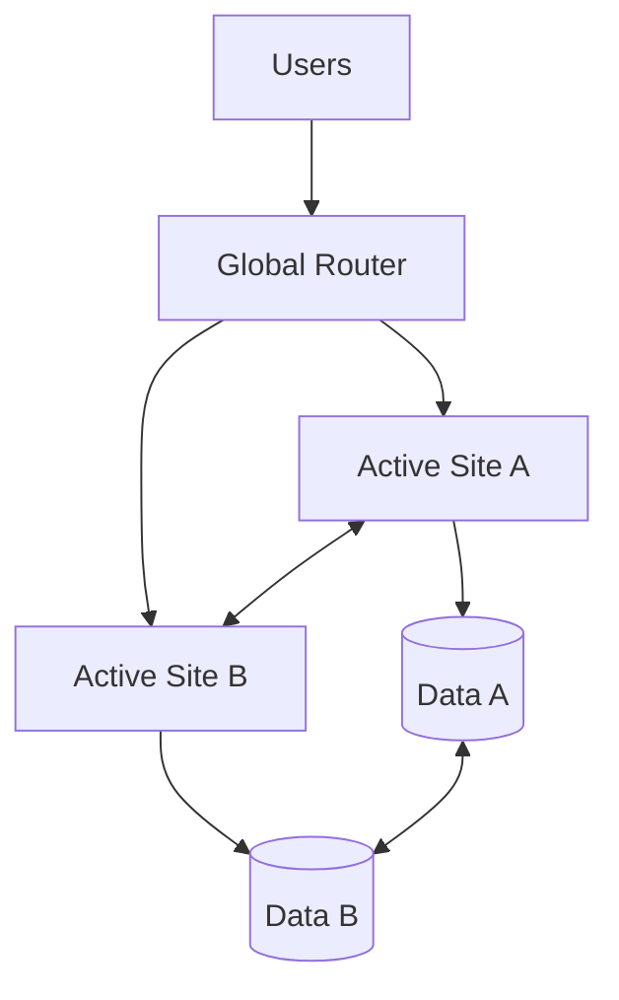
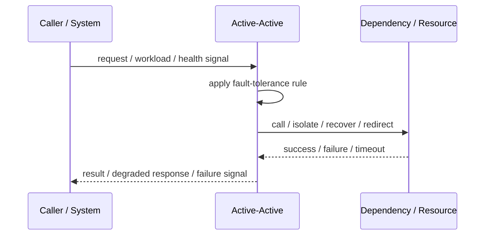
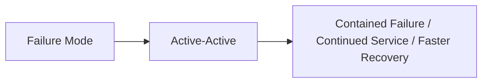

# Active-Active

## Core Idea

Active-Active runs multiple instances, zones, or regions serving traffic at the same time.

---

## Problem It Solves

The system needs high availability, load sharing, and reduced dependence on one active site.

---

## 3 Concrete Examples

### Example 1: Multi-Region Active-Active API

Users are routed to the nearest healthy region, and both regions serve live traffic.

### Example 2: Active-Active Load Balanced Service

All replicas serve requests behind a load balancer.

### Example 3: Multi-Primary Cache

Multiple cache nodes accept traffic and replicate or partition data.

---

## Architect Questions

- How is traffic distributed?
- How is data synchronized or partitioned?
- Can the system handle conflicts?
- What happens under network partition?
- How is user/session affinity handled?
- How is global health monitored?

---

## Main Diagram



---

## Runtime / Failure Flow



---

## Implementation Shape

```txt
1. Identify the failure mode: timeout, overload, crash, dependency failure, slow consumer, partial outage, or regional failure.
2. Define detection signals: errors, latency, saturation, queue depth, missed heartbeats, health checks, or progress markers.
3. Define the protective action: reject, retry, fallback, isolate, degrade, checkpoint, fail over, or slow producers.
4. Define limits and thresholds.
5. Define user/caller-visible behavior.
6. Add observability: failure rates, timeout counts, open circuits, fallback usage, rejected work, failover events, and recovery time.
7. Test failure modes deliberately. Untested fault tolerance is mostly wishful thinking.
```

---

## When to Use

- High availability and load sharing are required.
- Data conflicts can be handled.
- Multiple sites can safely serve traffic.

---

## When Not to Use

- Conflict resolution is not designed.
- Data consistency requirements are strict and immediate.
- Operational complexity is not justified.

---

## Common Smell That Suggests This Pattern

```txt
One dependency failure,
traffic spike,
slow consumer,
hung process,
or node outage can spread and damage unrelated parts of the system.
```

---

## Common Mistakes

```txt
Adding retries without timeouts.

Adding retries without idempotency.

Using fallback that returns misleading data.

Failing over to an untested standby.

Letting queues grow without bounds.

Hiding overload instead of shedding or applying backpressure.

Treating heartbeat as proof of correctness.

Not monitoring degraded mode.
```

---

## Best Visual Summary



## Final Meaning

Active-Active is useful when it contains failure, limits blast radius, or keeps the system usable under stress. If it is not tested under real failure conditions, assume it does not work.
