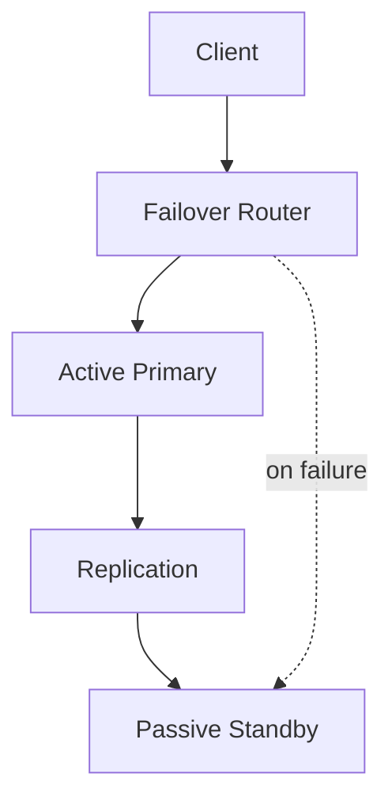
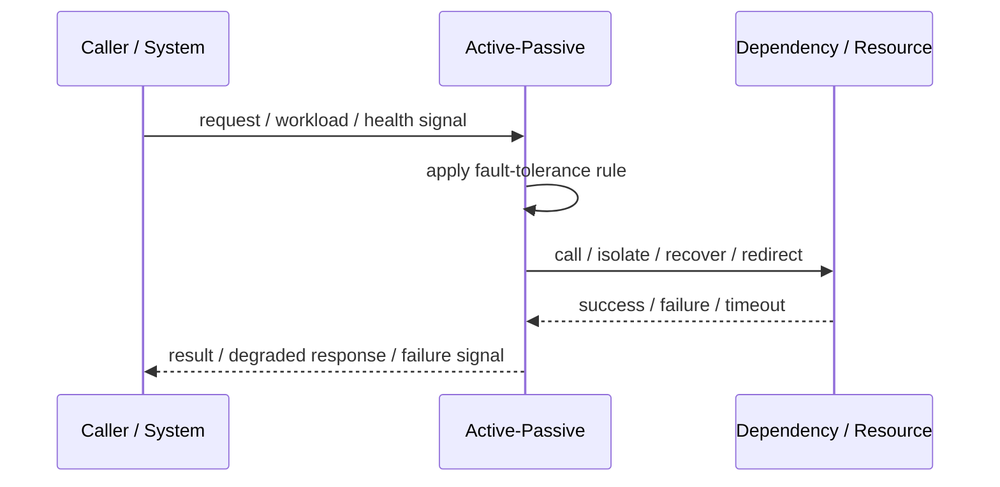
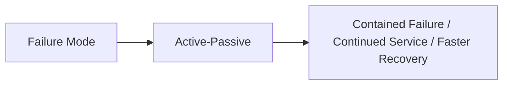

# Active-Passive

## Core Idea

Active-Passive runs one active component while a passive standby waits to take over during failure.

---

## Problem It Solves

The system needs failover capability without the complexity of serving traffic from multiple active sites.

---

## 3 Concrete Examples

### Example 1: Primary-Standby Database

Primary handles writes; standby receives replication and is promoted on failure.

### Example 2: Disaster Recovery Region

A passive region is kept warm and receives traffic only during outage.

### Example 3: Hot Standby Service

A standby instance is ready but does not serve traffic until failover.

---

## Architect Questions

- Is the standby cold, warm, or hot?
- How current is standby data?
- What triggers promotion?
- How long does failover take?
- How is split-brain avoided?
- How is failback performed?

---

## Main Diagram



---

## Runtime / Failure Flow



---

## Implementation Shape

```txt
1. Identify the failure mode: timeout, overload, crash, dependency failure, slow consumer, partial outage, or regional failure.
2. Define detection signals: errors, latency, saturation, queue depth, missed heartbeats, health checks, or progress markers.
3. Define the protective action: reject, retry, fallback, isolate, degrade, checkpoint, fail over, or slow producers.
4. Define limits and thresholds.
5. Define user/caller-visible behavior.
6. Add observability: failure rates, timeout counts, open circuits, fallback usage, rejected work, failover events, and recovery time.
7. Test failure modes deliberately. Untested fault tolerance is mostly wishful thinking.
```

---

## When to Use

- Failover is needed but active-active is too complex.
- Standby data can be kept sufficiently fresh.
- Failover time is acceptable.

---

## When Not to Use

- Failover time is too long.
- Standby is not kept current.
- Manual failover procedures are untested.

---

## Common Smell That Suggests This Pattern

```txt
One dependency failure,
traffic spike,
slow consumer,
hung process,
or node outage can spread and damage unrelated parts of the system.
```

---

## Common Mistakes

```txt
Adding retries without timeouts.

Adding retries without idempotency.

Using fallback that returns misleading data.

Failing over to an untested standby.

Letting queues grow without bounds.

Hiding overload instead of shedding or applying backpressure.

Treating heartbeat as proof of correctness.

Not monitoring degraded mode.
```

---

## Best Visual Summary



## Final Meaning

Active-Passive is useful when it contains failure, limits blast radius, or keeps the system usable under stress. If it is not tested under real failure conditions, assume it does not work.
